# Seznam divokých rostlin ČR pro poznávání - kurátorované obrázky

Sada vznikla porovnáním původních Wikimedia Commons kandidátů, obrázků z prezentace Poznávačka.pptx a cíleného dohledání běžných českých druhů.

## 1. Břečťan _Hedera_

1. [PPTX slide 6: image27.png](/Users/bubak/Downloads/Poznávačka.pptx) - source PPTX (license not specified), Poznávačka.pptx

2. [PPTX slide 6: image31.png](/Users/bubak/Downloads/Poznávačka.pptx) - source PPTX (license not specified), Poznávačka.pptx

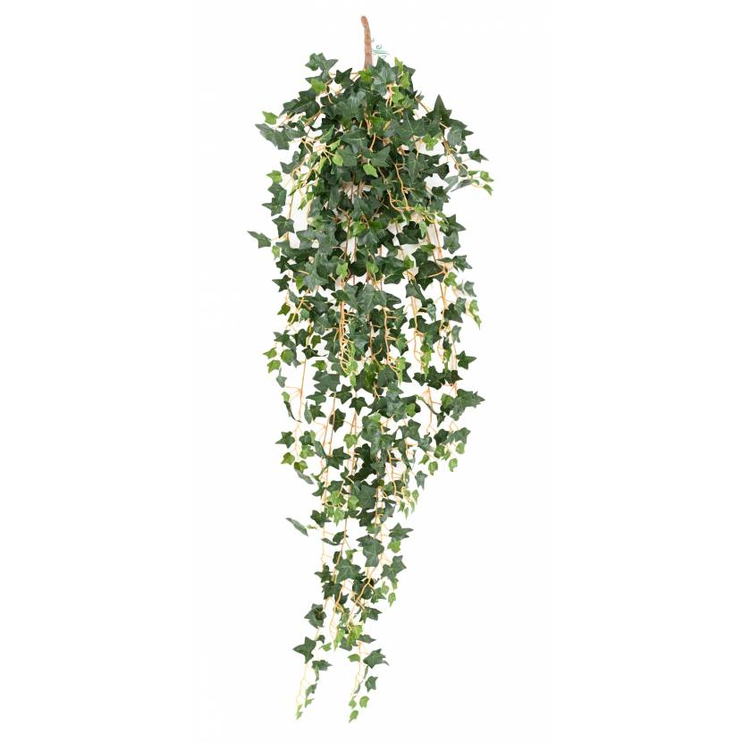
3. [PPTX slide 6: image15.png](/Users/bubak/Downloads/Poznávačka.pptx) - source PPTX (license not specified), Poznávačka.pptx

## 2. Pryskyřník _Ranunculus_

1. [File:Scherpe boterbloem (Ranunculus acris) 01.JPG](https://commons.wikimedia.org/wiki/File:Scherpe_boterbloem_(Ranunculus_acris)_01.JPG) - CC BY-SA 3.0, Dominicus Johannes Bergsma

2. [File:Pryskyřník Prudký (Ranunculus acris).JPG](https://commons.wikimedia.org/wiki/File:Prysky%C5%99n%C3%ADk_Prudk%C3%BD_(Ranunculus_acris).JPG) - CC BY-SA 3.0, Akdam

3. [File:Scherpe boterbloem (Ranunculus acris) 02.JPG](https://commons.wikimedia.org/wiki/File:Scherpe_boterbloem_(Ranunculus_acris)_02.JPG) - CC BY-SA 3.0, Dominicus Johannes Bergsma

## 4. Jaterník _Hepatica_

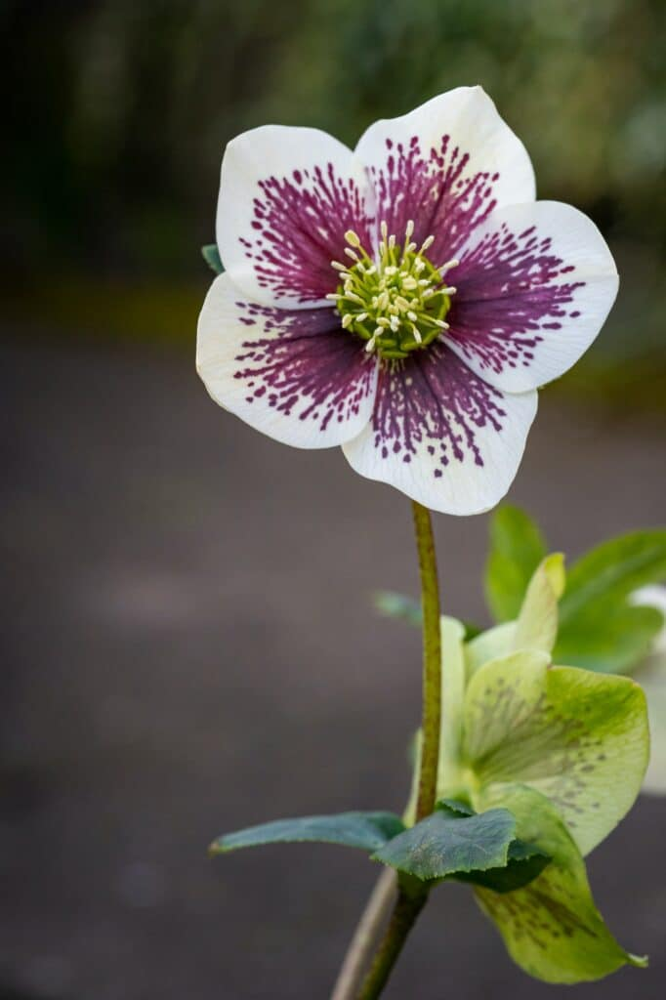
1. [PPTX slide 8: image21.png](/Users/bubak/Downloads/Poznávačka.pptx) - source PPTX (license not specified), Poznávačka.pptx

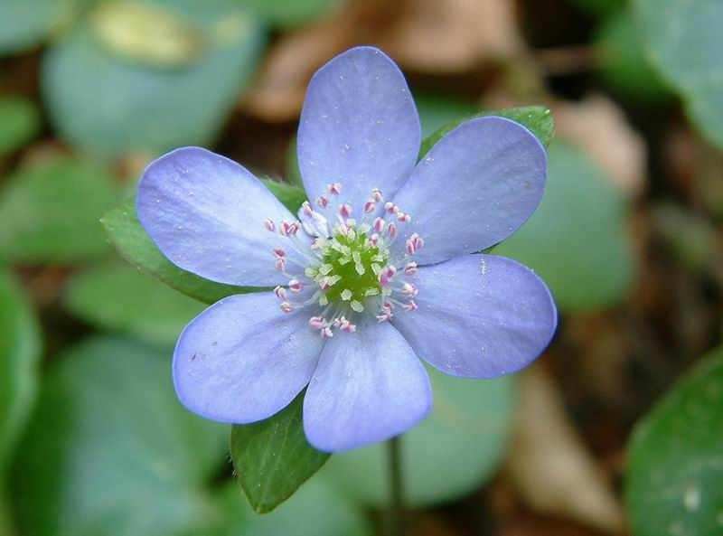
2. [PPTX slide 8: image34.png](/Users/bubak/Downloads/Poznávačka.pptx) - source PPTX (license not specified), Poznávačka.pptx

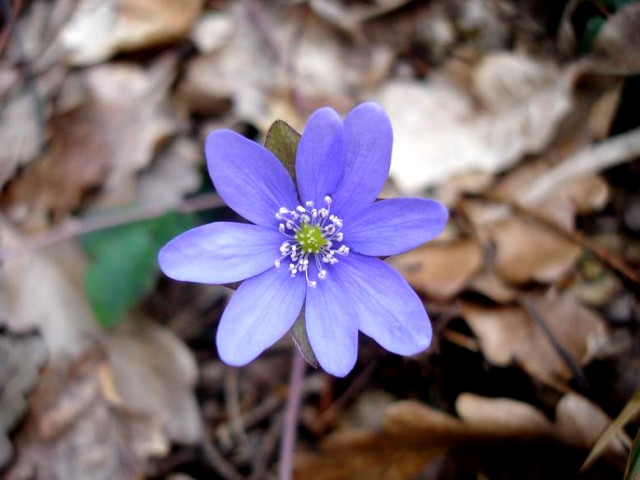
3. [PPTX slide 8: image17.png](/Users/bubak/Downloads/Poznávačka.pptx) - source PPTX (license not specified), Poznávačka.pptx

## 5. Sasanka _Anemone_

1. [PPTX slide 7: image22.jpg](/Users/bubak/Downloads/Poznávačka.pptx) - source PPTX (license not specified), Poznávačka.pptx

2. [PPTX slide 7: image25.jpg](/Users/bubak/Downloads/Poznávačka.pptx) - source PPTX (license not specified), Poznávačka.pptx

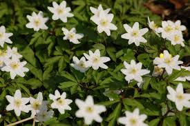
3. [PPTX slide 7: image2.png](/Users/bubak/Downloads/Poznávačka.pptx) - source PPTX (license not specified), Poznávačka.pptx

## 6. Koniklec _Pulsatilla_

1. [PPTX slide 4: image19.png](/Users/bubak/Downloads/Poznávačka.pptx) - source PPTX (license not specified), Poznávačka.pptx

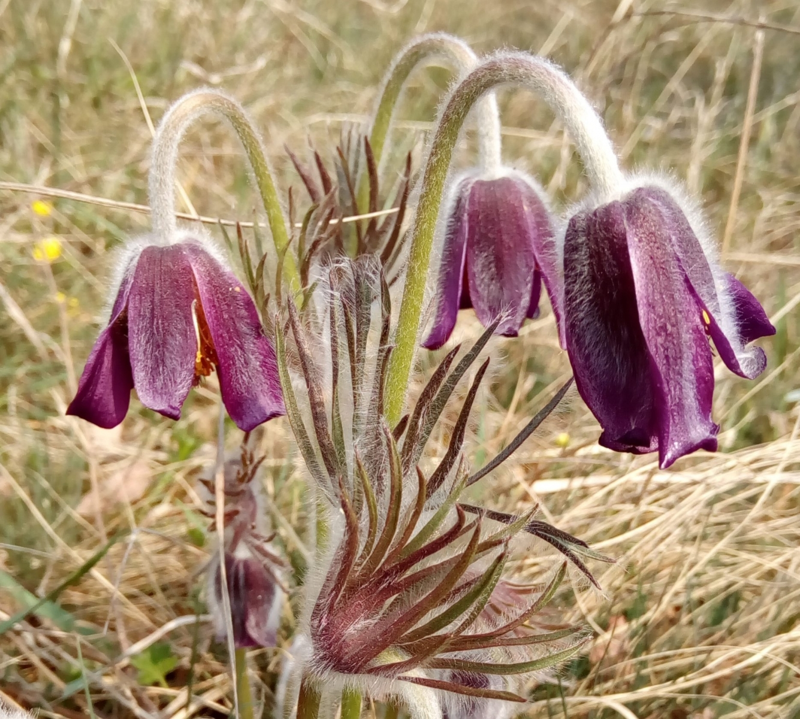
2. [PPTX slide 4: image5.png](/Users/bubak/Downloads/Poznávačka.pptx) - source PPTX (license not specified), Poznávačka.pptx

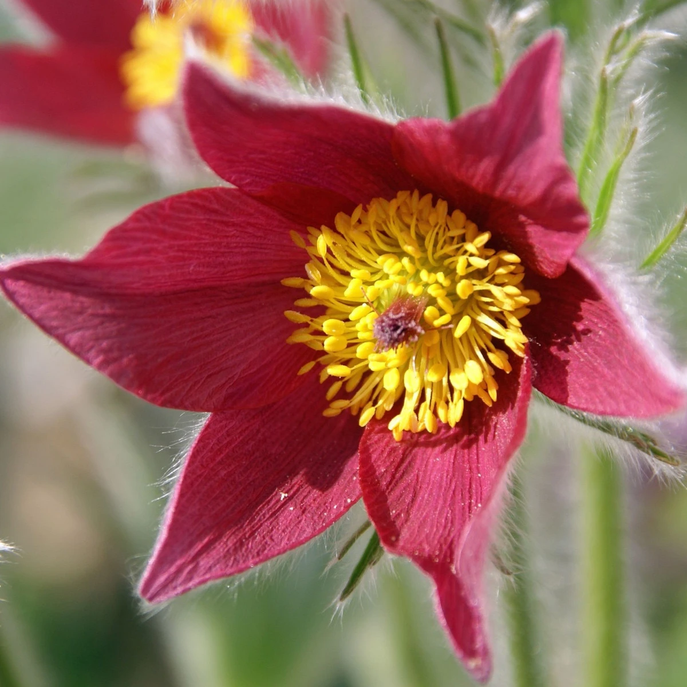
3. [PPTX slide 4: image13.png](/Users/bubak/Downloads/Poznávačka.pptx) - source PPTX (license not specified), Poznávačka.pptx

## 7. Plamének _Clematis_

1. [PPTX slide 10: image68.png](/Users/bubak/Downloads/Poznávačka.pptx) - source PPTX (license not specified), Poznávačka.pptx

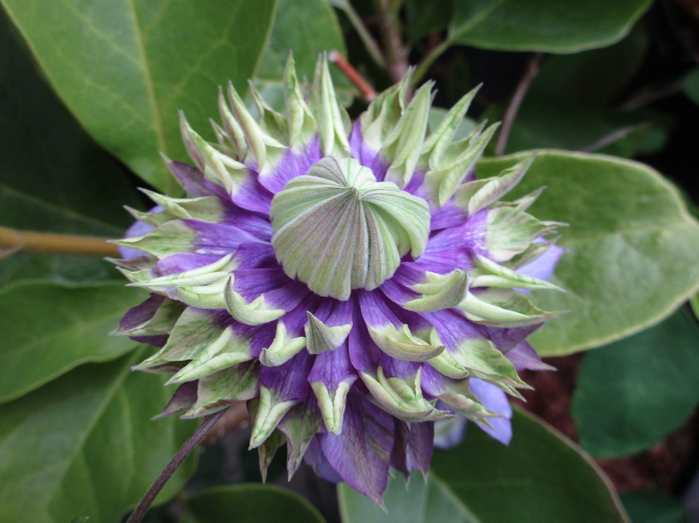
2. [PPTX slide 10: image56.png](/Users/bubak/Downloads/Poznávačka.pptx) - source PPTX (license not specified), Poznávačka.pptx

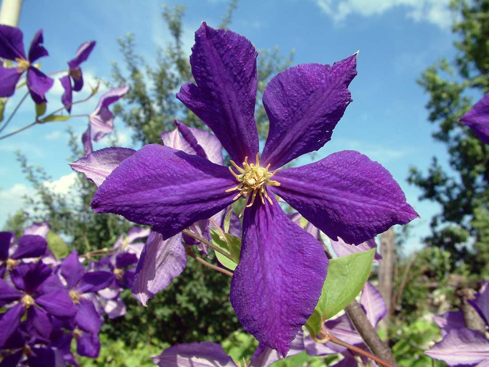
3. [PPTX slide 10: image33.png](/Users/bubak/Downloads/Poznávačka.pptx) - source PPTX (license not specified), Poznávačka.pptx

## 8. Blatouch _Caltha_

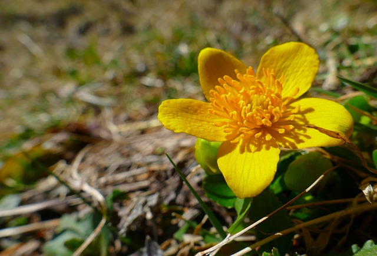
1. [PPTX slide 35: image171.png](/Users/bubak/Downloads/Poznávačka.pptx) - source PPTX (license not specified), Poznávačka.pptx

2. [PPTX slide 35: image170.jpg](/Users/bubak/Downloads/Poznávačka.pptx) - source PPTX (license not specified), Poznávačka.pptx

3. [PPTX slide 35: image159.jpg](/Users/bubak/Downloads/Poznávačka.pptx) - source PPTX (license not specified), Poznávačka.pptx

## 10. Stulík _Nuphar_

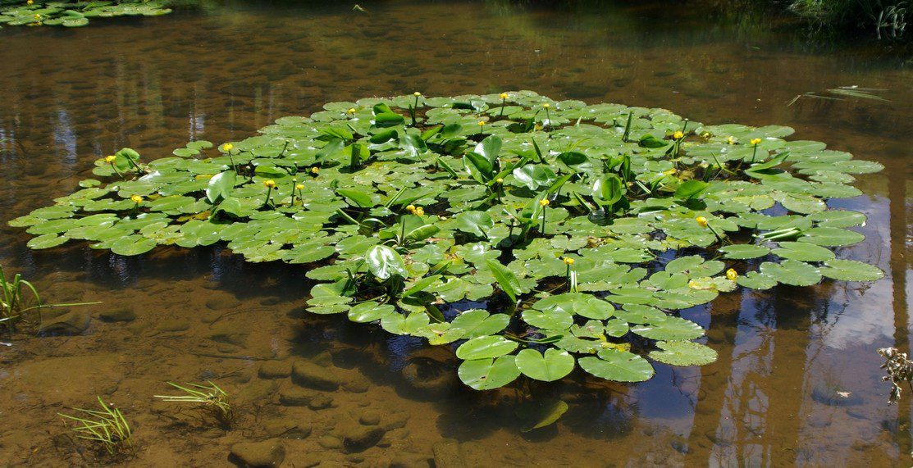
1. [PPTX slide 15: image75.png](/Users/bubak/Downloads/Poznávačka.pptx) - source PPTX (license not specified), Poznávačka.pptx

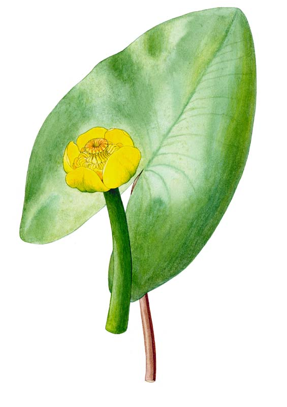
2. [PPTX slide 15: image77.png](/Users/bubak/Downloads/Poznávačka.pptx) - source PPTX (license not specified), Poznávačka.pptx

3. [PPTX slide 15: image60.jpg](/Users/bubak/Downloads/Poznávačka.pptx) - source PPTX (license not specified), Poznávačka.pptx

## 11. Leknín _Nymphaea_

1. [PPTX slide 9: image28.jpg](/Users/bubak/Downloads/Poznávačka.pptx) - source PPTX (license not specified), Poznávačka.pptx

2. [PPTX slide 9: image30.jpg](/Users/bubak/Downloads/Poznávačka.pptx) - source PPTX (license not specified), Poznávačka.pptx

3. [PPTX slide 9: image40.jpg](/Users/bubak/Downloads/Poznávačka.pptx) - source PPTX (license not specified), Poznávačka.pptx

## 12. Rozchodník _Sedum_

1. [PPTX slide 18: image80.jpg](/Users/bubak/Downloads/Poznávačka.pptx) - source PPTX (license not specified), Poznávačka.pptx

2. [PPTX slide 18: image67.jpg](/Users/bubak/Downloads/Poznávačka.pptx) - source PPTX (license not specified), Poznávačka.pptx

3. [PPTX slide 18: image84.jpg](/Users/bubak/Downloads/Poznávačka.pptx) - source PPTX (license not specified), Poznávačka.pptx

## 13. Netřesk _Jovibarba / Sempervivum_

1. [PPTX slide 11: image49.jpg](/Users/bubak/Downloads/Poznávačka.pptx) - source PPTX (license not specified), Poznávačka.pptx

2. [PPTX slide 11: image36.jpg](/Users/bubak/Downloads/Poznávačka.pptx) - source PPTX (license not specified), Poznávačka.pptx

3. [PPTX slide 11: image58.jpg](/Users/bubak/Downloads/Poznávačka.pptx) - source PPTX (license not specified), Poznávačka.pptx

## 14. Krvavec _Sanguisorba_

1. [PPTX slide 34: image166.jpg](/Users/bubak/Downloads/Poznávačka.pptx) - source PPTX (license not specified), Poznávačka.pptx

2. [PPTX slide 34: image175.jpg](/Users/bubak/Downloads/Poznávačka.pptx) - source PPTX (license not specified), Poznávačka.pptx

3. [PPTX slide 34: image164.jpg](/Users/bubak/Downloads/Poznávačka.pptx) - source PPTX (license not specified), Poznávačka.pptx

## 15. Kontryhel _Alchemilla_

1. [PPTX slide 31: image147.jpg](/Users/bubak/Downloads/Poznávačka.pptx) - source PPTX (license not specified), Poznávačka.pptx

2. [PPTX slide 31: image146.jpg](/Users/bubak/Downloads/Poznávačka.pptx) - source PPTX (license not specified), Poznávačka.pptx

3. [PPTX slide 31: image145.jpg](/Users/bubak/Downloads/Poznávačka.pptx) - source PPTX (license not specified), Poznávačka.pptx

## 17. Mochna _Potentilla_

1. [PPTX slide 20: image92.jpg](/Users/bubak/Downloads/Poznávačka.pptx) - source PPTX (license not specified), Poznávačka.pptx

2. [PPTX slide 20: image95.jpg](/Users/bubak/Downloads/Poznávačka.pptx) - source PPTX (license not specified), Poznávačka.pptx

3. [PPTX slide 20: image87.jpg](/Users/bubak/Downloads/Poznávačka.pptx) - source PPTX (license not specified), Poznávačka.pptx

## 18. Kuklík _Geum_

1. [PPTX slide 21: image97.jpg](/Users/bubak/Downloads/Poznávačka.pptx) - source PPTX (license not specified), Poznávačka.pptx

2. [PPTX slide 21: image90.jpg](/Users/bubak/Downloads/Poznávačka.pptx) - source PPTX (license not specified), Poznávačka.pptx

3. [PPTX slide 21: image102.jpg](/Users/bubak/Downloads/Poznávačka.pptx) - source PPTX (license not specified), Poznávačka.pptx

## 19. Jahodník _Fragaria_

1. [PPTX slide 14: image51.jpg](/Users/bubak/Downloads/Poznávačka.pptx) - source PPTX (license not specified), Poznávačka.pptx

2. [PPTX slide 14: image72.jpg](/Users/bubak/Downloads/Poznávačka.pptx) - source PPTX (license not specified), Poznávačka.pptx

3. [PPTX slide 14: image57.jpg](/Users/bubak/Downloads/Poznávačka.pptx) - source PPTX (license not specified), Poznávačka.pptx

## 20. Tužebník _Filipendula_

1. [PPTX slide 22: image107.jpg](/Users/bubak/Downloads/Poznávačka.pptx) - source PPTX (license not specified), Poznávačka.pptx

2. [PPTX slide 22: image108.jpg](/Users/bubak/Downloads/Poznávačka.pptx) - source PPTX (license not specified), Poznávačka.pptx

3. [PPTX slide 22: image89.jpg](/Users/bubak/Downloads/Poznávačka.pptx) - source PPTX (license not specified), Poznávačka.pptx

## 22. Vikev _Vicia_

1. [PPTX slide 23: image96.jpg](/Users/bubak/Downloads/Poznávačka.pptx) - source PPTX (license not specified), Poznávačka.pptx

2. [PPTX slide 23: image98.jpg](/Users/bubak/Downloads/Poznávačka.pptx) - source PPTX (license not specified), Poznávačka.pptx

3. [PPTX slide 23: image99.jpg](/Users/bubak/Downloads/Poznávačka.pptx) - source PPTX (license not specified), Poznávačka.pptx

## 23. Vlčí bob _Lupinus_

1. [PPTX slide 24: image103.jpg](/Users/bubak/Downloads/Poznávačka.pptx) - source PPTX (license not specified), Poznávačka.pptx

2. [PPTX slide 24: image109.jpg](/Users/bubak/Downloads/Poznávačka.pptx) - source PPTX (license not specified), Poznávačka.pptx

3. [PPTX slide 24: image111.jpg](/Users/bubak/Downloads/Poznávačka.pptx) - source PPTX (license not specified), Poznávačka.pptx

## 24. Jetel _Trifolium_

1. [PPTX slide 16: image79.jpg](/Users/bubak/Downloads/Poznávačka.pptx) - source PPTX (license not specified), Poznávačka.pptx

2. [PPTX slide 16: image65.jpg](/Users/bubak/Downloads/Poznávačka.pptx) - source PPTX (license not specified), Poznávačka.pptx

3. [PPTX slide 16: image63.jpg](/Users/bubak/Downloads/Poznávačka.pptx) - source PPTX (license not specified), Poznávačka.pptx

## 26. Čičorka _Securigera_

1. [PPTX slide 25: image127.jpg](/Users/bubak/Downloads/Poznávačka.pptx) - source PPTX (license not specified), Poznávačka.pptx

2. [PPTX slide 25: image126.jpg](/Users/bubak/Downloads/Poznávačka.pptx) - source PPTX (license not specified), Poznávačka.pptx

3. [PPTX slide 25: image120.jpg](/Users/bubak/Downloads/Poznávačka.pptx) - source PPTX (license not specified), Poznávačka.pptx

## 28. Vrbovka _Epilobium_

1. [PPTX slide 26: image118.jpg](/Users/bubak/Downloads/Poznávačka.pptx) - source PPTX (license not specified), Poznávačka.pptx

2. [PPTX slide 26: image121.jpg](/Users/bubak/Downloads/Poznávačka.pptx) - source PPTX (license not specified), Poznávačka.pptx

3. [PPTX slide 26: image124.jpg](/Users/bubak/Downloads/Poznávačka.pptx) - source PPTX (license not specified), Poznávačka.pptx

## 29. Mák _Papaver_

1. [PPTX slide 12: image35.jpg](/Users/bubak/Downloads/Poznávačka.pptx) - source PPTX (license not specified), Poznávačka.pptx

2. [PPTX slide 12: image47.jpg](/Users/bubak/Downloads/Poznávačka.pptx) - source PPTX (license not specified), Poznávačka.pptx

3. [PPTX slide 12: image37.jpg](/Users/bubak/Downloads/Poznávačka.pptx) - source PPTX (license not specified), Poznávačka.pptx

## 30. Vlaštovičník _Chelidonium_

1. [PPTX slide 27: image135.jpg](/Users/bubak/Downloads/Poznávačka.pptx) - source PPTX (license not specified), Poznávačka.pptx

2. [PPTX slide 27: image140.jpg](/Users/bubak/Downloads/Poznávačka.pptx) - source PPTX (license not specified), Poznávačka.pptx

3. [PPTX slide 27: image122.jpg](/Users/bubak/Downloads/Poznávačka.pptx) - source PPTX (license not specified), Poznávačka.pptx

## 32. Česnáček _Alliaria_

1. [PPTX slide 28: image133.jpg](/Users/bubak/Downloads/Poznávačka.pptx) - source PPTX (license not specified), Poznávačka.pptx

2. [PPTX slide 28: image143.jpg](/Users/bubak/Downloads/Poznávačka.pptx) - source PPTX (license not specified), Poznávačka.pptx

3. [PPTX slide 28: image129.jpg](/Users/bubak/Downloads/Poznávačka.pptx) - source PPTX (license not specified), Poznávačka.pptx

## 33. Křen _Armoracia_

1. [PPTX slide 17: image81.jpg](/Users/bubak/Downloads/Poznávačka.pptx) - source PPTX (license not specified), Poznávačka.pptx

2. [PPTX slide 17: image78.jpg](/Users/bubak/Downloads/Poznávačka.pptx) - source PPTX (license not specified), Poznávačka.pptx

3. [PPTX slide 17: image69.jpg](/Users/bubak/Downloads/Poznávačka.pptx) - source PPTX (license not specified), Poznávačka.pptx

## 34. Penízek _Thlaspi_

1. [PPTX slide 5: image20.jpg](/Users/bubak/Downloads/Poznávačka.pptx) - source PPTX (license not specified), Poznávačka.pptx

2. [PPTX slide 5: image9.jpg](/Users/bubak/Downloads/Poznávačka.pptx) - source PPTX (license not specified), Poznávačka.pptx

3. [PPTX slide 5: image18.jpg](/Users/bubak/Downloads/Poznávačka.pptx) - source PPTX (license not specified), Poznávačka.pptx

## 35. Kokoška _Capsella_

1. [PPTX slide 13: image61.jpg](/Users/bubak/Downloads/Poznávačka.pptx) - source PPTX (license not specified), Poznávačka.pptx

2. [PPTX slide 13: image44.jpg](/Users/bubak/Downloads/Poznávačka.pptx) - source PPTX (license not specified), Poznávačka.pptx

3. [PPTX slide 13: image46.jpg](/Users/bubak/Downloads/Poznávačka.pptx) - source PPTX (license not specified), Poznávačka.pptx

## 36. Violka _Viola_

1. [PPTX slide 19: image93.jpg](/Users/bubak/Downloads/Poznávačka.pptx) - source PPTX (license not specified), Poznávačka.pptx

2. [PPTX slide 19: image86.jpg](/Users/bubak/Downloads/Poznávačka.pptx) - source PPTX (license not specified), Poznávačka.pptx

3. [PPTX slide 19: image114.jpg](/Users/bubak/Downloads/Poznávačka.pptx) - source PPTX (license not specified), Poznávačka.pptx

## 37. Třezalka _Hypericum_

1. [PPTX slide 29: image130.jpg](/Users/bubak/Downloads/Poznávačka.pptx) - source PPTX (license not specified), Poznávačka.pptx

2. [PPTX slide 29: image141.jpg](/Users/bubak/Downloads/Poznávačka.pptx) - source PPTX (license not specified), Poznávačka.pptx

3. [PPTX slide 29: image153.jpg](/Users/bubak/Downloads/Poznávačka.pptx) - source PPTX (license not specified), Poznávačka.pptx

## 38. Sléz _Malva_

1. [PPTX slide 30: image148.jpg](/Users/bubak/Downloads/Poznávačka.pptx) - source PPTX (license not specified), Poznávačka.pptx

2. [PPTX slide 30: image149.jpg](/Users/bubak/Downloads/Poznávačka.pptx) - source PPTX (license not specified), Poznávačka.pptx

3. [PPTX slide 30: image139.jpg](/Users/bubak/Downloads/Poznávačka.pptx) - source PPTX (license not specified), Poznávačka.pptx

## 39. Šťavel _Oxalis_

1. [PPTX slide 32: image160.jpg](/Users/bubak/Downloads/Poznávačka.pptx) - source PPTX (license not specified), Poznávačka.pptx

2. [PPTX slide 32: image154.jpg](/Users/bubak/Downloads/Poznávačka.pptx) - source PPTX (license not specified), Poznávačka.pptx

3. [PPTX slide 32: image158.jpg](/Users/bubak/Downloads/Poznávačka.pptx) - source PPTX (license not specified), Poznávačka.pptx

## 40. Kakost _Geranium_

1. [PPTX slide 33: image169.jpg](/Users/bubak/Downloads/Poznávačka.pptx) - source PPTX (license not specified), Poznávačka.pptx

2. [PPTX slide 33: image162.jpg](/Users/bubak/Downloads/Poznávačka.pptx) - source PPTX (license not specified), Poznávačka.pptx

3. [PPTX slide 33: image165.jpg](/Users/bubak/Downloads/Poznávačka.pptx) - source PPTX (license not specified), Poznávačka.pptx

## 41. Netýkavka _Impatiens_

1. [PPTX slide 37: image177.png](/Users/bubak/Downloads/Poznávačka.pptx) - source PPTX (license not specified), Poznávačka.pptx

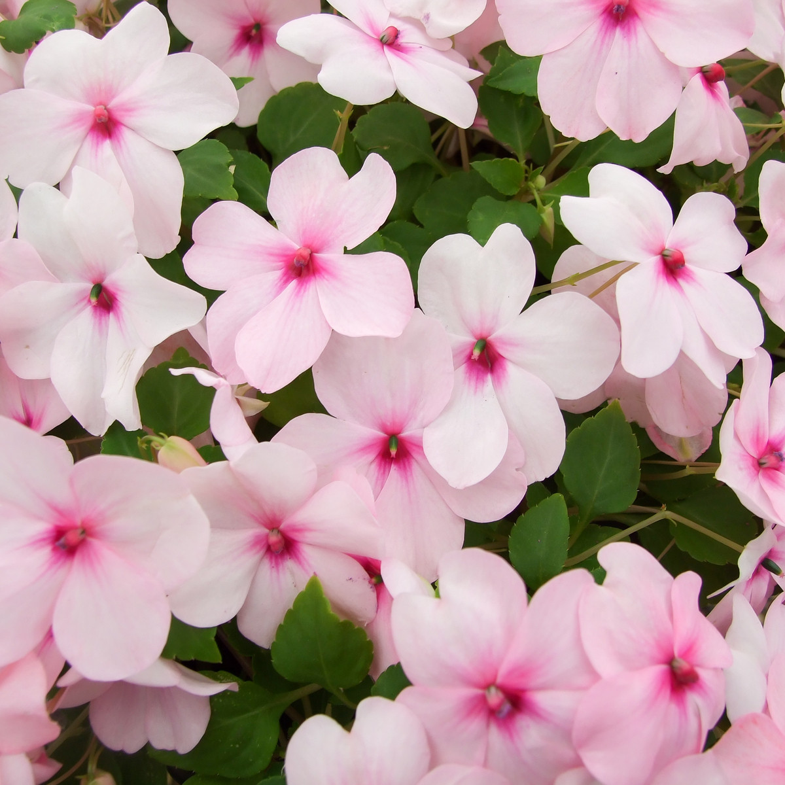
2. [PPTX slide 37: image173.png](/Users/bubak/Downloads/Poznávačka.pptx) - source PPTX (license not specified), Poznávačka.pptx

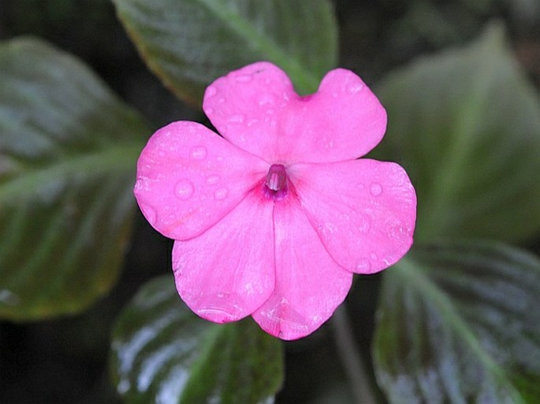
3. [PPTX slide 37: image190.png](/Users/bubak/Downloads/Poznávačka.pptx) - source PPTX (license not specified), Poznávačka.pptx

## 42. Bršlice _Aegopodium_

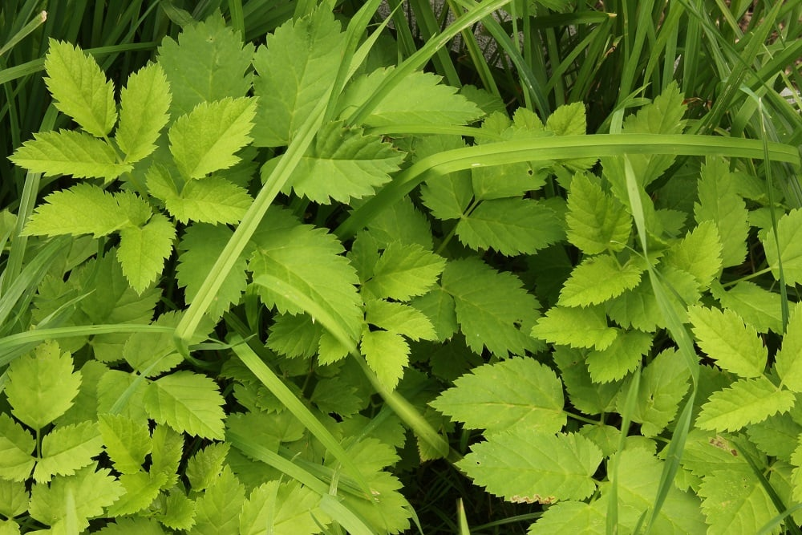
1. [PPTX slide 38: image189.png](/Users/bubak/Downloads/Poznávačka.pptx) - source PPTX (license not specified), Poznávačka.pptx

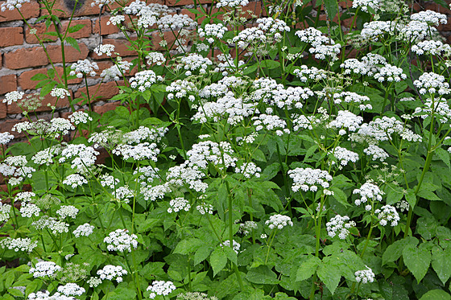
2. [PPTX slide 38: image186.png](/Users/bubak/Downloads/Poznávačka.pptx) - source PPTX (license not specified), Poznávačka.pptx

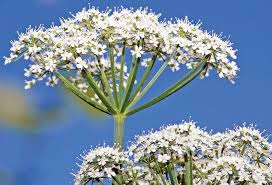
3. [PPTX slide 38: image179.png](/Users/bubak/Downloads/Poznávačka.pptx) - source PPTX (license not specified), Poznávačka.pptx

## 43. Bolševník _Heracleum_

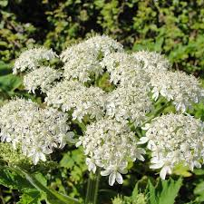
1. [PPTX slide 39: image185.png](/Users/bubak/Downloads/Poznávačka.pptx) - source PPTX (license not specified), Poznávačka.pptx

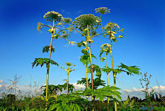
2. [PPTX slide 39: image187.png](/Users/bubak/Downloads/Poznávačka.pptx) - source PPTX (license not specified), Poznávačka.pptx

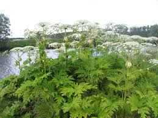
3. [PPTX slide 39: image176.png](/Users/bubak/Downloads/Poznávačka.pptx) - source PPTX (license not specified), Poznávačka.pptx

## 44. Mrkev _Daucus_

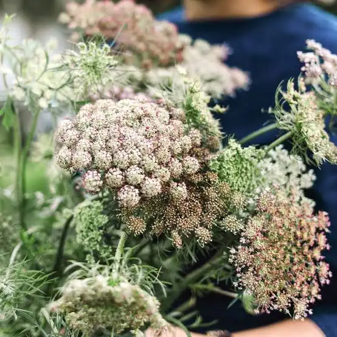
1. [PPTX slide 40: image224.png](/Users/bubak/Downloads/Poznávačka.pptx) - source PPTX (license not specified), Poznávačka.pptx

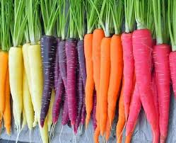
2. [PPTX slide 40: image195.png](/Users/bubak/Downloads/Poznávačka.pptx) - source PPTX (license not specified), Poznávačka.pptx

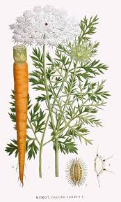
3. [PPTX slide 40: image188.png](/Users/bubak/Downloads/Poznávačka.pptx) - source PPTX (license not specified), Poznávačka.pptx

## 45. Chmel _Humulus_

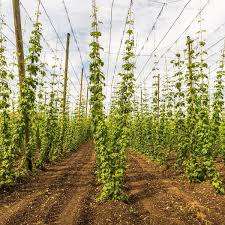
1. [PPTX slide 41: image203.png](/Users/bubak/Downloads/Poznávačka.pptx) - source PPTX (license not specified), Poznávačka.pptx

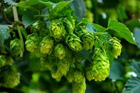
2. [PPTX slide 41: image213.png](/Users/bubak/Downloads/Poznávačka.pptx) - source PPTX (license not specified), Poznávačka.pptx

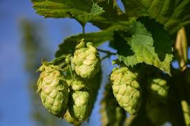
3. [PPTX slide 41: image197.png](/Users/bubak/Downloads/Poznávačka.pptx) - source PPTX (license not specified), Poznávačka.pptx

## 46. Kopřiva _Urtica_

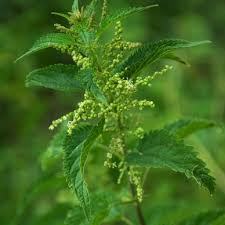
1. [PPTX slide 42: image193.png](/Users/bubak/Downloads/Poznávačka.pptx) - source PPTX (license not specified), Poznávačka.pptx

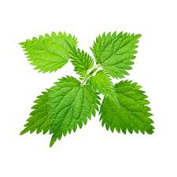
2. [PPTX slide 42: image196.png](/Users/bubak/Downloads/Poznávačka.pptx) - source PPTX (license not specified), Poznávačka.pptx

3. [PPTX slide 42: image198.png](/Users/bubak/Downloads/Poznávačka.pptx) - source PPTX (license not specified), Poznávačka.pptx

## 47. Pryšec _Euphorbia_

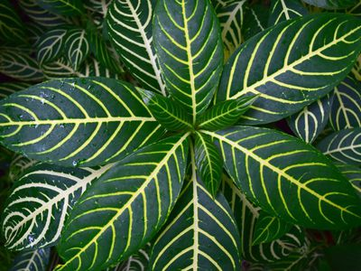
1. [PPTX slide 43: image227.png](/Users/bubak/Downloads/Poznávačka.pptx) - source PPTX (license not specified), Poznávačka.pptx

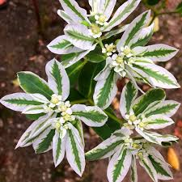
2. [PPTX slide 43: image219.png](/Users/bubak/Downloads/Poznávačka.pptx) - source PPTX (license not specified), Poznávačka.pptx

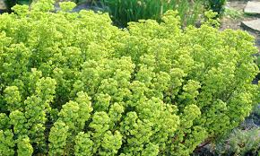
3. [PPTX slide 43: image220.png](/Users/bubak/Downloads/Poznávačka.pptx) - source PPTX (license not specified), Poznávačka.pptx

## 48. Jmelí _Viscum_

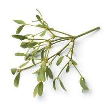
1. [PPTX slide 44: image205.png](/Users/bubak/Downloads/Poznávačka.pptx) - source PPTX (license not specified), Poznávačka.pptx

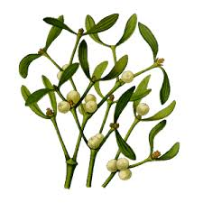
2. [PPTX slide 44: image214.png](/Users/bubak/Downloads/Poznávačka.pptx) - source PPTX (license not specified), Poznávačka.pptx

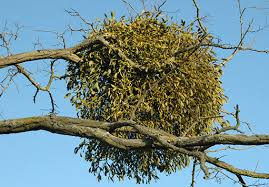
3. [PPTX slide 44: image208.png](/Users/bubak/Downloads/Poznávačka.pptx) - source PPTX (license not specified), Poznávačka.pptx

## 49. Rdesno _Bistorta / Persicaria_

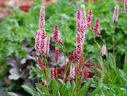
1. [PPTX slide 45: image207.png](/Users/bubak/Downloads/Poznávačka.pptx) - source PPTX (license not specified), Poznávačka.pptx

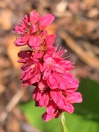
2. [PPTX slide 45: image217.png](/Users/bubak/Downloads/Poznávačka.pptx) - source PPTX (license not specified), Poznávačka.pptx

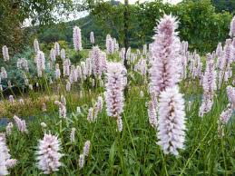
3. [PPTX slide 45: image222.png](/Users/bubak/Downloads/Poznávačka.pptx) - source PPTX (license not specified), Poznávačka.pptx

## 50. Šťovík _Rumex_

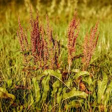
1. [PPTX slide 46: image243.png](/Users/bubak/Downloads/Poznávačka.pptx) - source PPTX (license not specified), Poznávačka.pptx

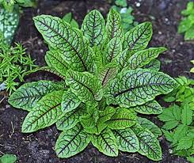
2. [PPTX slide 46: image215.png](/Users/bubak/Downloads/Poznávačka.pptx) - source PPTX (license not specified), Poznávačka.pptx

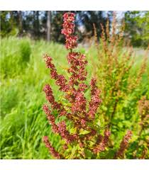
3. [PPTX slide 46: image223.png](/Users/bubak/Downloads/Poznávačka.pptx) - source PPTX (license not specified), Poznávačka.pptx

## 51. Kohoutek _Lychnis_

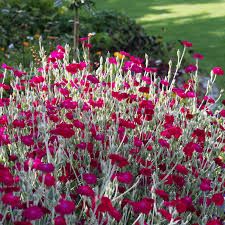
1. [PPTX slide 47: image244.png](/Users/bubak/Downloads/Poznávačka.pptx) - source PPTX (license not specified), Poznávačka.pptx

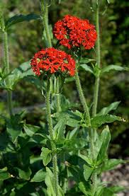
2. [PPTX slide 47: image221.png](/Users/bubak/Downloads/Poznávačka.pptx) - source PPTX (license not specified), Poznávačka.pptx

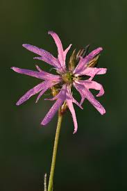
3. [PPTX slide 47: image218.png](/Users/bubak/Downloads/Poznávačka.pptx) - source PPTX (license not specified), Poznávačka.pptx

## 52. Silenka _Silene_

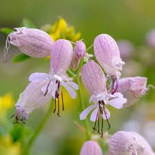
1. [PPTX slide 50: image235.png](/Users/bubak/Downloads/Poznávačka.pptx) - source PPTX (license not specified), Poznávačka.pptx

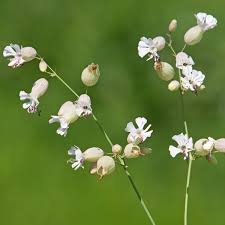
2. [PPTX slide 50: image260.png](/Users/bubak/Downloads/Poznávačka.pptx) - source PPTX (license not specified), Poznávačka.pptx

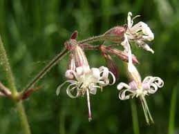
3. [PPTX slide 50: image240.png](/Users/bubak/Downloads/Poznávačka.pptx) - source PPTX (license not specified), Poznávačka.pptx

## 53. Hvozdík _Dianthus_

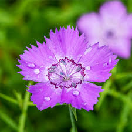
1. [PPTX slide 48: image231.png](/Users/bubak/Downloads/Poznávačka.pptx) - source PPTX (license not specified), Poznávačka.pptx

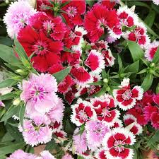
2. [PPTX slide 48: image245.png](/Users/bubak/Downloads/Poznávačka.pptx) - source PPTX (license not specified), Poznávačka.pptx

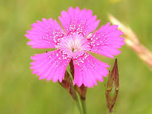
3. [PPTX slide 48: image225.png](/Users/bubak/Downloads/Poznávačka.pptx) - source PPTX (license not specified), Poznávačka.pptx

## 54. Ptačinec _Stellaria_

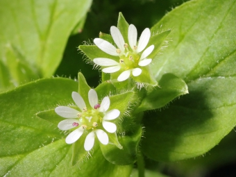
1. [PPTX slide 49: image236.png](/Users/bubak/Downloads/Poznávačka.pptx) - source PPTX (license not specified), Poznávačka.pptx

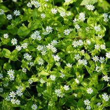
2. [PPTX slide 49: image234.png](/Users/bubak/Downloads/Poznávačka.pptx) - source PPTX (license not specified), Poznávačka.pptx

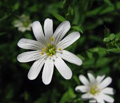
3. [PPTX slide 49: image251.png](/Users/bubak/Downloads/Poznávačka.pptx) - source PPTX (license not specified), Poznávačka.pptx

## 55. Merlík _Chenopodium_

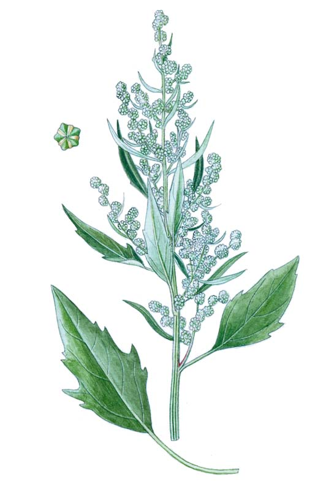
1. [PPTX slide 51: image247.png](/Users/bubak/Downloads/Poznávačka.pptx) - source PPTX (license not specified), Poznávačka.pptx

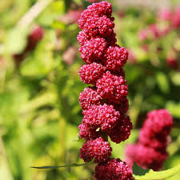
2. [PPTX slide 51: image241.png](/Users/bubak/Downloads/Poznávačka.pptx) - source PPTX (license not specified), Poznávačka.pptx

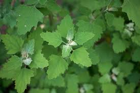
3. [PPTX slide 51: image242.png](/Users/bubak/Downloads/Poznávačka.pptx) - source PPTX (license not specified), Poznávačka.pptx

## 56. Vřes _Calluna_

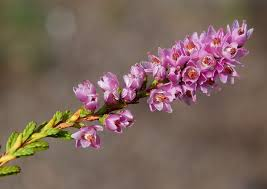
1. [PPTX slide 52: image261.png](/Users/bubak/Downloads/Poznávačka.pptx) - source PPTX (license not specified), Poznávačka.pptx

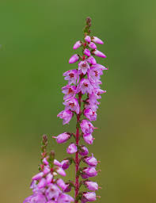
2. [PPTX slide 52: image249.png](/Users/bubak/Downloads/Poznávačka.pptx) - source PPTX (license not specified), Poznávačka.pptx

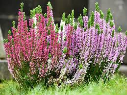
3. [PPTX slide 52: image257.png](/Users/bubak/Downloads/Poznávačka.pptx) - source PPTX (license not specified), Poznávačka.pptx

## 57. Brusnice _Vaccinium_

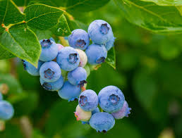
1. [PPTX slide 53: image267.png](/Users/bubak/Downloads/Poznávačka.pptx) - source PPTX (license not specified), Poznávačka.pptx

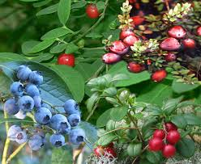
2. [PPTX slide 53: image256.png](/Users/bubak/Downloads/Poznávačka.pptx) - source PPTX (license not specified), Poznávačka.pptx

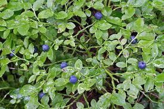
3. [PPTX slide 53: image255.png](/Users/bubak/Downloads/Poznávačka.pptx) - source PPTX (license not specified), Poznávačka.pptx

## 58. Prvosenka _Primula_

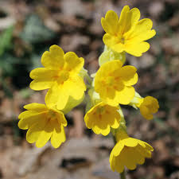
1. [PPTX slide 54: image275.png](/Users/bubak/Downloads/Poznávačka.pptx) - source PPTX (license not specified), Poznávačka.pptx

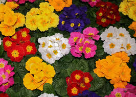
2. [PPTX slide 54: image252.png](/Users/bubak/Downloads/Poznávačka.pptx) - source PPTX (license not specified), Poznávačka.pptx

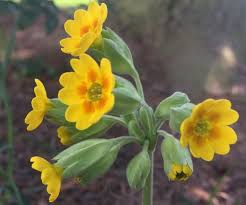
3. [PPTX slide 54: image274.png](/Users/bubak/Downloads/Poznávačka.pptx) - source PPTX (license not specified), Poznávačka.pptx

## 60. Brčál _Vinca_

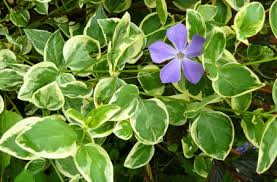
1. [PPTX slide 55: image270.png](/Users/bubak/Downloads/Poznávačka.pptx) - source PPTX (license not specified), Poznávačka.pptx

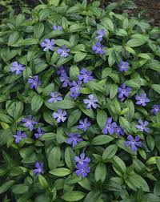
2. [PPTX slide 55: image263.png](/Users/bubak/Downloads/Poznávačka.pptx) - source PPTX (license not specified), Poznávačka.pptx

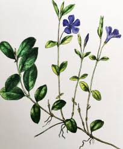
3. [PPTX slide 55: image287.png](/Users/bubak/Downloads/Poznávačka.pptx) - source PPTX (license not specified), Poznávačka.pptx

## 61. Kopytník _Asarum_

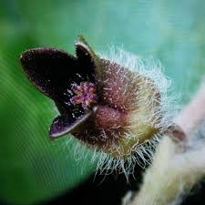
1. [PPTX slide 56: image269.png](/Users/bubak/Downloads/Poznávačka.pptx) - source PPTX (license not specified), Poznávačka.pptx

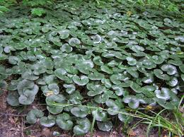
2. [PPTX slide 56: image268.png](/Users/bubak/Downloads/Poznávačka.pptx) - source PPTX (license not specified), Poznávačka.pptx

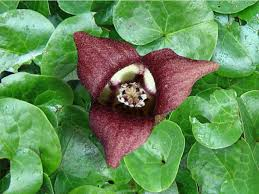
3. [PPTX slide 56: image272.png](/Users/bubak/Downloads/Poznávačka.pptx) - source PPTX (license not specified), Poznávačka.pptx

## 62. Opletník _Calystegia_

Poznámka: (neplést se svlačcem)

1. [PPTX slide 57: image301.jpg](/Users/bubak/Downloads/Poznávačka.pptx) - source PPTX (license not specified), Poznávačka.pptx

2. [PPTX slide 57: image300.jpg](/Users/bubak/Downloads/Poznávačka.pptx) - source PPTX (license not specified), Poznávačka.pptx

3. [PPTX slide 57: image282.jpg](/Users/bubak/Downloads/Poznávačka.pptx) - source PPTX (license not specified), Poznávačka.pptx

## 63. Kostival _Symphytum_

1. [PPTX slide 58: image290.jpg](/Users/bubak/Downloads/Poznávačka.pptx) - source PPTX (license not specified), Poznávačka.pptx

2. [PPTX slide 58: image289.jpg](/Users/bubak/Downloads/Poznávačka.pptx) - source PPTX (license not specified), Poznávačka.pptx

3. [PPTX slide 58: image297.jpg](/Users/bubak/Downloads/Poznávačka.pptx) - source PPTX (license not specified), Poznávačka.pptx

## 64. Plicník _Pulmonaria_

1. [PPTX slide 59: image285.jpg](/Users/bubak/Downloads/Poznávačka.pptx) - source PPTX (license not specified), Poznávačka.pptx

2. [PPTX slide 59: image304.jpg](/Users/bubak/Downloads/Poznávačka.pptx) - source PPTX (license not specified), Poznávačka.pptx

3. [PPTX slide 59: image280.jpg](/Users/bubak/Downloads/Poznávačka.pptx) - source PPTX (license not specified), Poznávačka.pptx

## 65. Pomněnka _Myosotis_

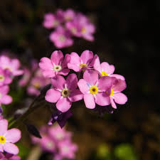
1. [PPTX slide 60: image293.png](/Users/bubak/Downloads/Poznávačka.pptx) - source PPTX (license not specified), Poznávačka.pptx

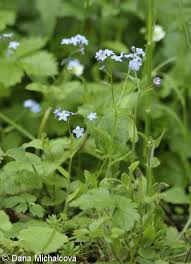
2. [PPTX slide 60: image302.png](/Users/bubak/Downloads/Poznávačka.pptx) - source PPTX (license not specified), Poznávačka.pptx

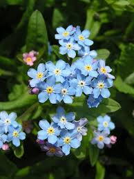
3. [PPTX slide 60: image284.png](/Users/bubak/Downloads/Poznávačka.pptx) - source PPTX (license not specified), Poznávačka.pptx

## 66. Hadinec _Echium_

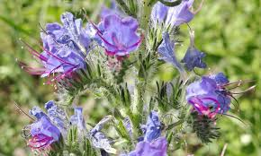
1. [PPTX slide 61: image299.png](/Users/bubak/Downloads/Poznávačka.pptx) - source PPTX (license not specified), Poznávačka.pptx

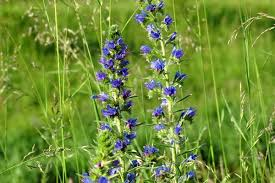
2. [PPTX slide 61: image295.png](/Users/bubak/Downloads/Poznávačka.pptx) - source PPTX (license not specified), Poznávačka.pptx

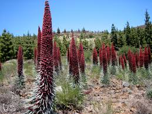
3. [PPTX slide 61: image294.png](/Users/bubak/Downloads/Poznávačka.pptx) - source PPTX (license not specified), Poznávačka.pptx

## 67. Hluchavka _Lamium_

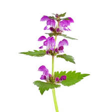
1. [PPTX slide 62: image307.png](/Users/bubak/Downloads/Poznávačka.pptx) - source PPTX (license not specified), Poznávačka.pptx

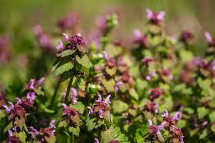
2. [PPTX slide 62: image313.png](/Users/bubak/Downloads/Poznávačka.pptx) - source PPTX (license not specified), Poznávačka.pptx

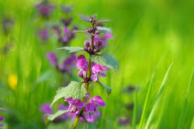
3. [PPTX slide 62: image317.png](/Users/bubak/Downloads/Poznávačka.pptx) - source PPTX (license not specified), Poznávačka.pptx

## 68. Mateřídouška _Thymus_

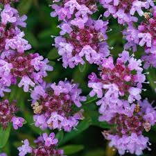
1. [PPTX slide 63: image303.png](/Users/bubak/Downloads/Poznávačka.pptx) - source PPTX (license not specified), Poznávačka.pptx

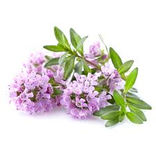
2. [PPTX slide 63: image310.png](/Users/bubak/Downloads/Poznávačka.pptx) - source PPTX (license not specified), Poznávačka.pptx

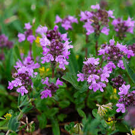
3. [PPTX slide 63: image316.png](/Users/bubak/Downloads/Poznávačka.pptx) - source PPTX (license not specified), Poznávačka.pptx

## 69. Šalvěj _Salvia_

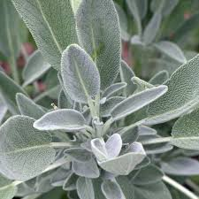
1. [PPTX slide 64: image314.png](/Users/bubak/Downloads/Poznávačka.pptx) - source PPTX (license not specified), Poznávačka.pptx

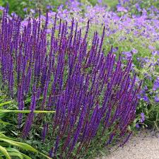
2. [PPTX slide 64: image323.png](/Users/bubak/Downloads/Poznávačka.pptx) - source PPTX (license not specified), Poznávačka.pptx

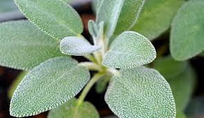
3. [PPTX slide 64: image312.png](/Users/bubak/Downloads/Poznávačka.pptx) - source PPTX (license not specified), Poznávačka.pptx

## 70. Lilek _Solanum_

1. [PPTX slide 65: image345.png](/Users/bubak/Downloads/Poznávačka.pptx) - source PPTX (license not specified), Poznávačka.pptx

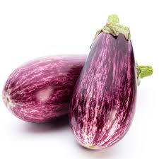
2. [PPTX slide 65: image324.png](/Users/bubak/Downloads/Poznávačka.pptx) - source PPTX (license not specified), Poznávačka.pptx

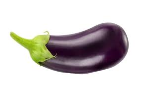
3. [PPTX slide 65: image318.png](/Users/bubak/Downloads/Poznávačka.pptx) - source PPTX (license not specified), Poznávačka.pptx

## 71. Rulík _Atropa_

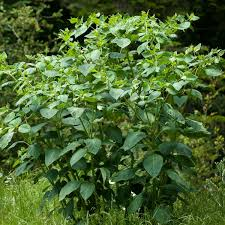
1. [PPTX slide 66: image328.png](/Users/bubak/Downloads/Poznávačka.pptx) - source PPTX (license not specified), Poznávačka.pptx

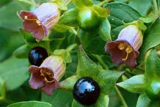
2. [PPTX slide 66: image325.png](/Users/bubak/Downloads/Poznávačka.pptx) - source PPTX (license not specified), Poznávačka.pptx

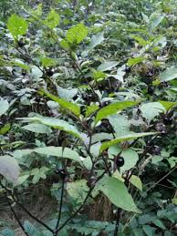
3. [PPTX slide 66: image329.png](/Users/bubak/Downloads/Poznávačka.pptx) - source PPTX (license not specified), Poznávačka.pptx

## 73. Divizna _Verbascum_

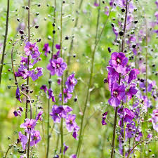
1. [PPTX slide 67: image327.png](/Users/bubak/Downloads/Poznávačka.pptx) - source PPTX (license not specified), Poznávačka.pptx

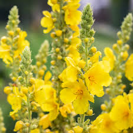
2. [PPTX slide 67: image333.png](/Users/bubak/Downloads/Poznávačka.pptx) - source PPTX (license not specified), Poznávačka.pptx

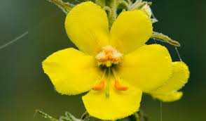
3. [PPTX slide 67: image341.png](/Users/bubak/Downloads/Poznávačka.pptx) - source PPTX (license not specified), Poznávačka.pptx

## 74. Rozrazil _Veronica_

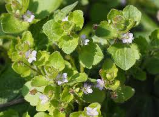
1. [PPTX slide 68: image334.png](/Users/bubak/Downloads/Poznávačka.pptx) - source PPTX (license not specified), Poznávačka.pptx

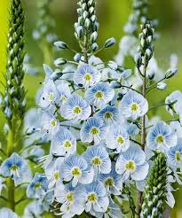
2. [PPTX slide 68: image332.png](/Users/bubak/Downloads/Poznávačka.pptx) - source PPTX (license not specified), Poznávačka.pptx

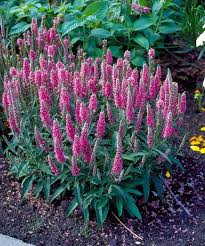
3. [PPTX slide 68: image343.png](/Users/bubak/Downloads/Poznávačka.pptx) - source PPTX (license not specified), Poznávačka.pptx

## 75. Lnice _Linaria_

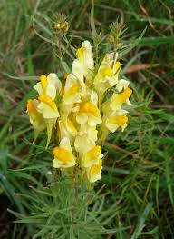
1. [PPTX slide 69: image337.png](/Users/bubak/Downloads/Poznávačka.pptx) - source PPTX (license not specified), Poznávačka.pptx

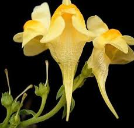
2. [PPTX slide 69: image336.png](/Users/bubak/Downloads/Poznávačka.pptx) - source PPTX (license not specified), Poznávačka.pptx

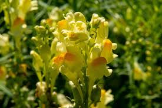
3. [PPTX slide 69: image347.png](/Users/bubak/Downloads/Poznávačka.pptx) - source PPTX (license not specified), Poznávačka.pptx

## 76. Náprstník _Digitalis_

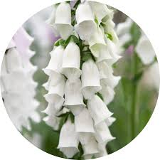
1. [PPTX slide 70: image339.png](/Users/bubak/Downloads/Poznávačka.pptx) - source PPTX (license not specified), Poznávačka.pptx

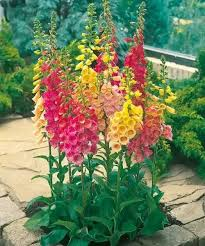
2. [PPTX slide 70: image357.png](/Users/bubak/Downloads/Poznávačka.pptx) - source PPTX (license not specified), Poznávačka.pptx

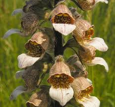
3. [PPTX slide 70: image365.png](/Users/bubak/Downloads/Poznávačka.pptx) - source PPTX (license not specified), Poznávačka.pptx

## 77. Jitrocel _Plantago_

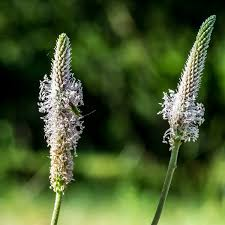
1. [PPTX slide 71: image344.png](/Users/bubak/Downloads/Poznávačka.pptx) - source PPTX (license not specified), Poznávačka.pptx

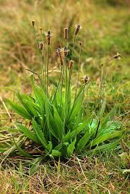
2. [PPTX slide 71: image351.png](/Users/bubak/Downloads/Poznávačka.pptx) - source PPTX (license not specified), Poznávačka.pptx

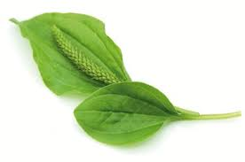
3. [PPTX slide 71: image346.png](/Users/bubak/Downloads/Poznávačka.pptx) - source PPTX (license not specified), Poznávačka.pptx

## 78. Svízel _Galium_

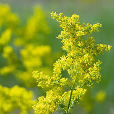
1. [PPTX slide 72: image349.png](/Users/bubak/Downloads/Poznávačka.pptx) - source PPTX (license not specified), Poznávačka.pptx

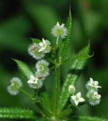
2. [PPTX slide 72: image350.png](/Users/bubak/Downloads/Poznávačka.pptx) - source PPTX (license not specified), Poznávačka.pptx

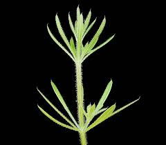
3. [PPTX slide 72: image366.png](/Users/bubak/Downloads/Poznávačka.pptx) - source PPTX (license not specified), Poznávačka.pptx

## 79. Bez _Sambucus_

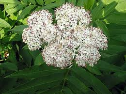
1. [PPTX slide 73: image363.png](/Users/bubak/Downloads/Poznávačka.pptx) - source PPTX (license not specified), Poznávačka.pptx

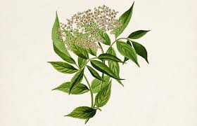
2. [PPTX slide 73: image364.png](/Users/bubak/Downloads/Poznávačka.pptx) - source PPTX (license not specified), Poznávačka.pptx

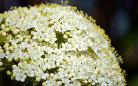
3. [PPTX slide 73: image360.png](/Users/bubak/Downloads/Poznávačka.pptx) - source PPTX (license not specified), Poznávačka.pptx

## 81. Zvonek _Campanula_

1. [File:Campanula rotundifolia LC0321.jpg](https://commons.wikimedia.org/wiki/File:Campanula_rotundifolia_LC0321.jpg) - CC BY-SA 3.0 de, Jörg Hempel

2. [File:Campanula rotundifolia (plant).jpg](https://commons.wikimedia.org/wiki/File:Campanula_rotundifolia_(plant).jpg) - CC BY-SA 3.0, Hans Hillewaert

3. [File:Campanula rotundifolia - bellflower - bluebell - Glockenblume 03.jpg](https://commons.wikimedia.org/wiki/File:Campanula_rotundifolia_-_bellflower_-_bluebell_-_Glockenblume_03.jpg) - CC BY-SA 3.0, Norbert Nagel, Mörfelden-Walldorf, Germany

## 82. Čekanka _Cichorium_

1. [File:Cichorium intybus-alvesgaspar1.jpg](https://commons.wikimedia.org/wiki/File:Cichorium_intybus-alvesgaspar1.jpg) - CC BY 2.5, Alvesgaspar

2. [File:Pied hoverfly (Scaeva pyrastri) on chicory (Cichorium intybus).jpg](https://commons.wikimedia.org/wiki/File:Pied_hoverfly_(Scaeva_pyrastri)_on_chicory_(Cichorium_intybus).jpg) - CC BY-SA 4.0, Charles J. Sharp

3. [File:Cichorium intybus RF.jpg](https://commons.wikimedia.org/wiki/File:Cichorium_intybus_RF.jpg) - CC BY 4.0, Robert Flogaus-Faust

## 83. Kapustka _Lapsana_

1. [File:(MHNT) Tipula lunata male on Lapsana communis.jpg](https://commons.wikimedia.org/wiki/File:(MHNT)_Tipula_lunata_male_on_Lapsana_communis.jpg) - CC BY-SA 4.0, Didier Descouens

2. [File:Lapsana communis Sturm29.jpg](https://commons.wikimedia.org/wiki/File:Lapsana_communis_Sturm29.jpg) - Public domain, Johann Georg Sturm (Painter: Jacob Sturm)

3. [File:Lapsana communis kz16.jpg](https://commons.wikimedia.org/wiki/File:Lapsana_communis_kz16.jpg) - CC BY-SA 4.0, Krzysztof Ziarnek, Kenraiz

## 84. Jestřábník _Hieracium_

1. [File:Hieracium umbellatum–IMG 5860.jpg](https://commons.wikimedia.org/wiki/File:Hieracium_umbellatum%E2%80%93IMG_5860.jpg) - CC BY-SA 4.0, Kızıl

2. [File:Hieracium umbellatum–IMG 6009.jpg](https://commons.wikimedia.org/wiki/File:Hieracium_umbellatum%E2%80%93IMG_6009.jpg) - CC BY-SA 4.0, Kızıl

3. [File:Hieracium umbellatum–IMG 6030.jpg](https://commons.wikimedia.org/wiki/File:Hieracium_umbellatum%E2%80%93IMG_6030.jpg) - CC BY-SA 4.0, Kızıl

## 85. Pampeliška _Taraxacum_

1. [File:Gesloten bloem van de paardenbloem (Taraxacum officinale) 09-05-2021. (d.j.b) 02.jpg](https://commons.wikimedia.org/wiki/File:Gesloten_bloem_van_de_paardenbloem_(Taraxacum_officinale)_09-05-2021._(d.j.b)_02.jpg) - CC BY-SA 4.0, Dominicus Johannes Bergsma

2. [File:Dwarsdoorsnede van een gesloten bloem van een paardenbloem (Taraxacum officinale) 08-05-2022. (d.j.b).jpg](https://commons.wikimedia.org/wiki/File:Dwarsdoorsnede_van_een_gesloten_bloem_van_een_paardenbloem_(Taraxacum_officinale)_08-05-2022._(d.j.b).jpg) - CC BY-SA 4.0, Dominicus Johannes Bergsma

3. [File:Bombus ruderarius - Taraxacum officinale - Keila.jpg](https://commons.wikimedia.org/wiki/File:Bombus_ruderarius_-_Taraxacum_officinale_-_Keila.jpg) - CC BY-SA 4.0, Ivar Leidus

## 86. Řebříček _Achillea_

1. [File:Yarrow (Achillea millefolium).jpg](https://commons.wikimedia.org/wiki/File:Yarrow_(Achillea_millefolium).jpg) - CC BY-SA 4.0, Petar Milošević

2. [File:Misumena vatia on Achillea millefolium qtl2.jpg](https://commons.wikimedia.org/wiki/File:Misumena_vatia_on_Achillea_millefolium_qtl2.jpg) - CC BY-SA 3.0, Quartl

3. [File:Atylotus rusticus (male) - Achillea millefolium - Valingu.jpg](https://commons.wikimedia.org/wiki/File:Atylotus_rusticus_(male)_-_Achillea_millefolium_-_Valingu.jpg) - CC BY-SA 4.0, Ivar Leidus

## 87. Heřmánek _Matricaria_

1. [File:RO TL Macin Mountains Argynnis paphia on Matricaria chamomilla 02.jpg](https://commons.wikimedia.org/wiki/File:RO_TL_Macin_Mountains_Argynnis_paphia_on_Matricaria_chamomilla_02.jpg) - CC BY-SA 4.0, Andrei Stroe

2. [File:Kamomillasaunio (Matricaria recutita).JPG](https://commons.wikimedia.org/wiki/File:Kamomillasaunio_(Matricaria_recutita).JPG) - CC BY-SA 3.0, kallerna

3. [File:Matricaria chamomilla kz13.jpg](https://commons.wikimedia.org/wiki/File:Matricaria_chamomilla_kz13.jpg) - CC BY-SA 4.0, Krzysztof Ziarnek, Kenraiz

## 88. Kopretina _Leucanthemum_

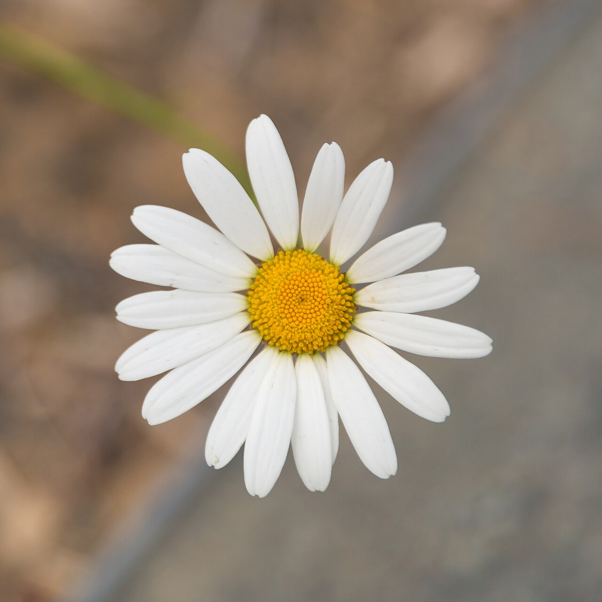
1. [File:Leucanthemum vulgare (Marguerite commune) - 111.jpg](https://commons.wikimedia.org/wiki/File:Leucanthemum_vulgare_(Marguerite_commune)_-_111.jpg) - CC BY-SA 4.0, Another one of my pictures:

This photograph was taken by Medium69 (William Crochot) and released under the license stated below. You are free to use it for any purpose as long as you credit the author (William Crochot), the Source (Wikimedia Commons) and the license (CC-BY-SA 4.0) in close relation to the image.

Please do not upload an updated image here without consultation with the Author. The author would like to make corrections only at his own source RAW. This ensures that the changes are preserved.Please if you think that any changes should be required, please inform the author.Otherwise you can upload a new image with a new name. Please use one of the templates derivative or extract.

2. [File:Leucanthemum vulgare, the ox-eye daisy from Kanthalloor, Idukki district, Kerala 06.jpg](https://commons.wikimedia.org/wiki/File:Leucanthemum_vulgare,_the_ox-eye_daisy_from_Kanthalloor,_Idukki_district,_Kerala_06.jpg) - CC BY-SA 4.0, Navaneeth Krishnan S

3. [File:Leucanthemum vulgare.jpeg](https://commons.wikimedia.org/wiki/File:Leucanthemum_vulgare.jpeg) - CC BY-SA 2.5 ca, The Cosmonaut

## 89. Vratič _Tanacetum_

1. [File:Bloemen van Boerenwormkruid (Tanacetum vulgare). 17-08-2025. (actm.) 01.jpg](https://commons.wikimedia.org/wiki/File:Bloemen_van_Boerenwormkruid_(Tanacetum_vulgare)._17-08-2025._(actm.)_01.jpg) - CC BY-SA 4.0, Agnes Monkelbaan

2. [File:Tanacetum vulgare 4 RF.jpg](https://commons.wikimedia.org/wiki/File:Tanacetum_vulgare_4_RF.jpg) - CC BY 4.0, Robert Flogaus-Faust

3. [File:Tanacetum vulgare 5 RF.jpg](https://commons.wikimedia.org/wiki/File:Tanacetum_vulgare_5_RF.jpg) - CC BY 4.0, Robert Flogaus-Faust

## 90. Pelyněk _Artemisia_

1. [File:Artemisia vulgaris RF.jpg](https://commons.wikimedia.org/wiki/File:Artemisia_vulgaris_RF.jpg) - CC BY 4.0, Robert Flogaus-Faust

2. [File:Artemisia vulgaris - Köhler–s Medizinal-Pflanzen-016.jpg](https://commons.wikimedia.org/wiki/File:Artemisia_vulgaris_-_K%C3%B6hler%E2%80%93s_Medizinal-Pflanzen-016.jpg) - Public domain, Franz Eugen Köhler, Köhler's Medizinal-Pflanzen

3. [File:Artemisia vulgaris SCA-181108.jpg](https://commons.wikimedia.org/wiki/File:Artemisia_vulgaris_SCA-181108.jpg) - CC BY-SA 4.0, R.A.Nonenmacher

## 91. Sedmikráska _Bellis_

1. [File:Bellis perennis full plant.jpg](https://commons.wikimedia.org/wiki/File:Bellis_perennis_full_plant.jpg) - CC BY-SA 3.0 de, Grand-Duc

2. [File:Five daisies (Bellis perennis).jpg](https://commons.wikimedia.org/wiki/File:Five_daisies_(Bellis_perennis).jpg) - CC BY-SA 4.0, Friedrich Haag

3. [File:20200325 Bellis perennis 01.jpg](https://commons.wikimedia.org/wiki/File:20200325_Bellis_perennis_01.jpg) - CC BY 4.0, Flocci Nivis

## 92. Podběl _Tussilago_

1. [File:Tussilago farfara - Rouge Park.jpg](https://commons.wikimedia.org/wiki/File:Tussilago_farfara_-_Rouge_Park.jpg) - CC BY-SA 2.5 ca, The Cosmonaut

2. [File:Tussilago farfara 4 RF.jpg](https://commons.wikimedia.org/wiki/File:Tussilago_farfara_4_RF.jpg) - CC BY 4.0, Robert Flogaus-Faust

3. [File:Tussilago farfara 20160403 03.JPG](https://commons.wikimedia.org/wiki/File:Tussilago_farfara_20160403_03.JPG) - CC BY-SA 4.0, Uoaei1

## 93. Devětsil _Petasites_

1. [File:Petasites hybridus inflorescence - Keila.jpg](https://commons.wikimedia.org/wiki/File:Petasites_hybridus_inflorescence_-_Keila.jpg) - CC BY-SA 4.0, Ivar Leidus

2. [File:Gewoehnliche Pestwurz Common Butterbur (Petasites hybridus).jpg](https://commons.wikimedia.org/wiki/File:Gewoehnliche_Pestwurz_Common_Butterbur_(Petasites_hybridus).jpg) - CC BY-SA 2.5, Richard Bartz, Munich aka Makro Freak

3. [File:2026. Petasites hybridus. Parque da Alameda de Santiago de Compostela. Galiza.jpg](https://commons.wikimedia.org/wiki/File:2026._Petasites_hybridus._Parque_da_Alameda_de_Santiago_de_Compostela._Galiza.jpg) - CC BY-SA 4.0, Luis Miguel Bugallo Sánchez

## 94. Lopuch _Arctium_

1. [File:Grote klit of grote klis (Arctium lappa) 19-01-2026. (d.j.b.).jpg](https://commons.wikimedia.org/wiki/File:Grote_klit_of_grote_klis_(Arctium_lappa)_19-01-2026._(d.j.b.).jpg) - CC BY-SA 4.0, Famberhorst

2. [File:Arctium lappa MHNT.BOT.2004.0.16.jpg](https://commons.wikimedia.org/wiki/File:Arctium_lappa_MHNT.BOT.2004.0.16.jpg) - CC BY-SA 3.0, Roger Culos

3. [File:Arctium lappa involucre.jpg](https://commons.wikimedia.org/wiki/File:Arctium_lappa_involucre.jpg) - CC BY 4.0, Alex Abair

## 95. Chrpa _Centaurea_

1. [File:Centaurea cyanus - Keila.jpg](https://commons.wikimedia.org/wiki/File:Centaurea_cyanus_-_Keila.jpg) - CC BY-SA 4.0, Ivar Leidus

2. [File:Cornflowers Centaurea cyanus.jpg](https://commons.wikimedia.org/wiki/File:Cornflowers_Centaurea_cyanus.jpg) - CC BY-SA 4.0, Petr Vodička

3. [File:Centaurea cyanus RF.jpg](https://commons.wikimedia.org/wiki/File:Centaurea_cyanus_RF.jpg) - CC BY 4.0, Robert Flogaus-Faust

## 96. Pcháč _Cirsium_

Poznámka: (neplést s bodlákem)

1. [File:Cirsium arvense with Bees Richard Bartz.jpg](https://commons.wikimedia.org/wiki/File:Cirsium_arvense_with_Bees_Richard_Bartz.jpg) - CC BY-SA 2.5, Richard Bartz, Munich aka Makro Freak

2. [File:Cirsium arvense - põldohakas.jpg](https://commons.wikimedia.org/wiki/File:Cirsium_arvense_-_p%C3%B5ldohakas.jpg) - CC BY-SA 3.0, Ivar Leidus

3. [File:Yponomeuta evonymella - Cirsium arvense - Keila.jpg](https://commons.wikimedia.org/wiki/File:Yponomeuta_evonymella_-_Cirsium_arvense_-_Keila.jpg) - CC BY-SA 4.0, Ivar Leidus

## 97. Lilie _Lilium_

1. [File:Türkenbund Lilie, Lilium martagon 2.JPG](https://commons.wikimedia.org/wiki/File:T%C3%BCrkenbund_Lilie,_Lilium_martagon_2.JPG) - CC BY-SA 2.5, böhringer friedrich

2. [File:Lilium martagon Tauerntal 01.jpg](https://commons.wikimedia.org/wiki/File:Lilium_martagon_Tauerntal_01.jpg) - CC BY-SA 4.0, Uoaei1

3. [File:Lilium martagon mit Rutpela maculata 01.JPG](https://commons.wikimedia.org/wiki/File:Lilium_martagon_mit_Rutpela_maculata_01.JPG) - CC BY-SA 3.0, Uoaei1

## 98. Česnek _Allium_

1. [File:Daslook. Allium ursinum, zwellende bloemknop. 18-04-2022 (actm.) 04.jpg](https://commons.wikimedia.org/wiki/File:Daslook._Allium_ursinum,_zwellende_bloemknop._18-04-2022_(actm.)_04.jpg) - CC BY-SA 4.0, Agnes Monkelbaan

2. [File:Daslook. Allium ursinum, zwellende bloemknop. 18-04-2022 (actm.) 02.jpg](https://commons.wikimedia.org/wiki/File:Daslook._Allium_ursinum,_zwellende_bloemknop._18-04-2022_(actm.)_02.jpg) - CC BY-SA 4.0, Agnes Monkelbaan

3. [File:Daslook (Allium ursinum) d.j.b 02.jpg](https://commons.wikimedia.org/wiki/File:Daslook_(Allium_ursinum)_d.j.b_02.jpg) - CC BY-SA 4.0, Dominicus Johannes Bergsma

## 99. Konvalinka _Convallaria_

1. [File:Lelietje-van-dalen of meiklokje (Convallaria majalis). 14-05-2021 (actm.) 01.jpg](https://commons.wikimedia.org/wiki/File:Lelietje-van-dalen_of_meiklokje_(Convallaria_majalis)._14-05-2021_(actm.)_01.jpg) - CC BY-SA 4.0, Agnes Monkelbaan

2. [File:Convallaria majalis inflorescence - Keila.jpg](https://commons.wikimedia.org/wiki/File:Convallaria_majalis_inflorescence_-_Keila.jpg) - CC BY-SA 4.0, Ivar Leidus

3. [File:Lelietje-van-dalen (Convallaria majalis). d.j.b.jpg](https://commons.wikimedia.org/wiki/File:Lelietje-van-dalen_(Convallaria_majalis)._d.j.b.jpg) - CC BY-SA 4.0, Dominicus Johannes Bergsma

## 100. Vraní oko _Paris_

1. [File:Paris quadrifolia flower - Keila.jpg](https://commons.wikimedia.org/wiki/File:Paris_quadrifolia_flower_-_Keila.jpg) - CC BY-SA 4.0, Ivar Leidus

2. [File:Paris quadrifolia fruit - Keila.jpg](https://commons.wikimedia.org/wiki/File:Paris_quadrifolia_fruit_-_Keila.jpg) - CC BY-SA 4.0, Ivar Leidus

3. [File:Paris quadrifolia 2011 G2.jpg](https://commons.wikimedia.org/wiki/File:Paris_quadrifolia_2011_G2.jpg) - Public domain, George Chernilevsky

## 101. Sněženka _Galanthus_

1. [File:Galanthus nivalis close-up aka.jpg](https://commons.wikimedia.org/wiki/File:Galanthus_nivalis_close-up_aka.jpg) - CC BY-SA 2.5, André Karwath aka Aka

2. [File:Galanthus Nivalis, sneeuwklokje. 12-02-2024. (d.j.b.).jpg](https://commons.wikimedia.org/wiki/File:Galanthus_Nivalis,_sneeuwklokje._12-02-2024._(d.j.b.).jpg) - CC BY-SA 4.0, Dominicus Johannes Bergsma

3. [File:Galanthus nivalis mit Aphididae--20210301-RM-153708.jpg](https://commons.wikimedia.org/wiki/File:Galanthus_nivalis_mit_Aphididae--20210301-RM-153708.jpg) - CC BY-SA 4.0, Ermell

## 102. Bledule _Leucojum_

1. [File:Lenteklokje (Leucojum vernum), 05-03-2026. (d.j.b.).jpg](https://commons.wikimedia.org/wiki/File:Lenteklokje_(Leucojum_vernum),_05-03-2026._(d.j.b.).jpg) - CC BY-SA 4.0, Dominicus Johannes Bergsma.

2. [File:Frühlings-Knotenblume (Leucojum vernum)-20230220-RM-161056.jpg](https://commons.wikimedia.org/wiki/File:Fr%C3%BChlings-Knotenblume_(Leucojum_vernum)-20230220-RM-161056.jpg) - CC BY-SA 4.0, Ermell

3. [File:Leucojum vernum close up.jpg](https://commons.wikimedia.org/wiki/File:Leucojum_vernum_close_up.jpg) - CC BY-SA 3.0, Smihael

## 103. Kosatec _Iris_

1. [File:Zaden van een Gele lis (Iris pseudacorus). 06-03-2024. (d.j.b.).jpg](https://commons.wikimedia.org/wiki/File:Zaden_van_een_Gele_lis_(Iris_pseudacorus)._06-03-2024._(d.j.b.).jpg) - CC BY-SA 4.0, Dominicus Johannes Bergsma

2. [File:Iris pseudacorus LC0338.jpg](https://commons.wikimedia.org/wiki/File:Iris_pseudacorus_LC0338.jpg) - CC BY-SA 3.0 de, Jörg Hempel

3. [File:Iris pseudacorus 3 RF.jpg](https://commons.wikimedia.org/wiki/File:Iris_pseudacorus_3_RF.jpg) - CC BY 4.0, Robert Flogaus-Faust

## 104. Prstnatec _Dactylorhiza_

1. [File:Dactylorhiza majalis Spechtensee 01.JPG](https://commons.wikimedia.org/wiki/File:Dactylorhiza_majalis_Spechtensee_01.JPG) - CC BY-SA 4.0, Uoaei1

2. [File:Dactylorhiza majalis LC0269.jpg](https://commons.wikimedia.org/wiki/File:Dactylorhiza_majalis_LC0269.jpg) - CC BY-SA 3.0 de, Jörg Hempel

3. [File:Dactylorhiza majalis RF.jpg](https://commons.wikimedia.org/wiki/File:Dactylorhiza_majalis_RF.jpg) - CC BY 4.0, Robert Flogaus-Faust

## 105. Sítina _Juncus_

1. [File:Pitrus (Juncus effusus) 06.JPG](https://commons.wikimedia.org/wiki/File:Pitrus_(Juncus_effusus)_06.JPG) - CC BY-SA 3.0, Dominicus Johannes Bergsma

2. [File:Afvoer pitrus (Juncus effusus).JPG](https://commons.wikimedia.org/wiki/File:Afvoer_pitrus_(Juncus_effusus).JPG) - CC BY-SA 3.0, Dominicus Johannes Bergsma

3. [File:Pitrus (Juncus effusus) 07.JPG](https://commons.wikimedia.org/wiki/File:Pitrus_(Juncus_effusus)_07.JPG) - CC BY-SA 3.0, Dominicus Johannes Bergsma

## 106. Ostřice _Carex_

1. [File:Carex hirta utricles.jpg](https://commons.wikimedia.org/wiki/File:Carex_hirta_utricles.jpg) - CC BY-SA 3.0, Stemonitis

2. [File:Carex hirta kz08.jpg](https://commons.wikimedia.org/wiki/File:Carex_hirta_kz08.jpg) - CC BY-SA 4.0, Krzysztof Ziarnek, Kenraiz

3. [File:Carex hirta kz07.jpg](https://commons.wikimedia.org/wiki/File:Carex_hirta_kz07.jpg) - CC BY-SA 4.0, Krzysztof Ziarnek, Kenraiz

## 108. Psárka _Alopecurus_

1. [File:Alopecurus pratensis Grote vossenstaart (1).jpg](https://commons.wikimedia.org/wiki/File:Alopecurus_pratensis_Grote_vossenstaart_(1).jpg) - CC BY-SA 3.0, Rasbak

2. [File:Alopecurus pratensis kz07.jpg](https://commons.wikimedia.org/wiki/File:Alopecurus_pratensis_kz07.jpg) - CC BY-SA 4.0, Krzysztof Ziarnek, Kenraiz

3. [File:Alopecurus pratensis kz03.jpg](https://commons.wikimedia.org/wiki/File:Alopecurus_pratensis_kz03.jpg) - CC BY-SA 4.0, Krzysztof Ziarnek, Kenraiz

## 110. Lipnice _Poa_

1. [File:Veldbeemdgras Poa pratensis.jpg](https://commons.wikimedia.org/wiki/File:Veldbeemdgras_Poa_pratensis.jpg) - CC BY-SA 3.0, Rasbak

2. [File:Poa pratensis kz01.jpg](https://commons.wikimedia.org/wiki/File:Poa_pratensis_kz01.jpg) - CC BY-SA 4.0, Krzysztof Ziarnek, Kenraiz

3. [File:Poa pratensis kz03.jpg](https://commons.wikimedia.org/wiki/File:Poa_pratensis_kz03.jpg) - CC BY-SA 4.0, Krzysztof Ziarnek, Kenraiz

## 112. Okřehek _Lemna_

1. [File:Lemna minor plants.jpg](https://commons.wikimedia.org/wiki/File:Lemna_minor_plants.jpg) - CC0, Kostka Martin

2. [File:Lemna minor1.jpg](https://commons.wikimedia.org/wiki/File:Lemna_minor1.jpg) - CC BY-SA 3.0, Kurt Stüber [1]

3. [File:Lemna minor Schubert.jpg](https://commons.wikimedia.org/wiki/File:Lemna_minor_Schubert.jpg) - Public domain, Naturgeschichte_des_Pflanzenreichs_Tafel_I.jpg: Gotthilf Heinrich von Schubert (?)
derivative work: Borealis55 (talk)

## 113. Orobinec _Typha_

1. [File:Zaadpluizen grote lisdodde (Typha latifolia). (d.j.b.).jpg](https://commons.wikimedia.org/wiki/File:Zaadpluizen_grote_lisdodde_(Typha_latifolia)._(d.j.b.).jpg) - CC BY-SA 4.0, Dominicus Johannes Bergsma

2. [File:Typha latifolia Seehof Winter-20160122-RM-092833.jpg](https://commons.wikimedia.org/wiki/File:Typha_latifolia_Seehof_Winter-20160122-RM-092833.jpg) - CC BY-SA 4.0, Ermell

3. [File:Zaadpluizen grote lisdodde (Typha latifolia). Locatie, De Famberhorst 04.JPG](https://commons.wikimedia.org/wiki/File:Zaadpluizen_grote_lisdodde_(Typha_latifolia)._Locatie,_De_Famberhorst_04.JPG) - CC BY-SA 4.0, Dominicus Johannes Bergsma

## 114. Rákos _Phragmites_

1. [File:Phragmites australis Vikmanshyttesjön.jpg](https://commons.wikimedia.org/wiki/File:Phragmites_australis_Vikmanshyttesj%C3%B6n.jpg) - CC BY 3.0, Calle Eklund/V-wolf

2. [File:Phragmites australis, Neuss (DE) -- 2022 -- 2994.jpg](https://commons.wikimedia.org/wiki/File:Phragmites_australis,_Neuss_(DE)_--_2022_--_2994.jpg) - CC BY-SA 4.0, Anil Öztas

3. [File:Phragmites australis, Neuss (DE) -- 2022 -- 2998.jpg](https://commons.wikimedia.org/wiki/File:Phragmites_australis,_Neuss_(DE)_--_2022_--_2998.jpg) - CC BY-SA 4.0, Anil Öztas

## 115. Javor _Acer_

1. [File:Knop van een esdoorn (Acer platanoides). 03-04-2023 (d.j.b.).jpg](https://commons.wikimedia.org/wiki/File:Knop_van_een_esdoorn_(Acer_platanoides)._03-04-2023_(d.j.b.).jpg) - CC BY-SA 4.0, Dominicus Johannes Bergsma

2. [File:Uitlopende knoppen van een esdoorn (Acer platanoides). 12-04-2026 (d.j.b.).jpg](https://commons.wikimedia.org/wiki/File:Uitlopende_knoppen_van_een_esdoorn_(Acer_platanoides)._12-04-2026_(d.j.b.).jpg) - CC BY-SA 4.0, Dominicus Johannes Bergsma.

3. [File:Knoppen van een esdoorn (Acer platanoides). 03-04-2023 (d.j.b.).jpg](https://commons.wikimedia.org/wiki/File:Knoppen_van_een_esdoorn_(Acer_platanoides)._03-04-2023_(d.j.b.).jpg) - CC BY-SA 4.0, Dominicus Johannes Bergsma

## 116. Lípa _Tilia_

1. [File:Bombus hypnorum - Tilia cordata - Keila.jpg](https://commons.wikimedia.org/wiki/File:Bombus_hypnorum_-_Tilia_cordata_-_Keila.jpg) - CC BY-SA 4.0, Ivar Leidus

2. [File:Bombus terrestris queen - Tilia cordata - Keila.jpg](https://commons.wikimedia.org/wiki/File:Bombus_terrestris_queen_-_Tilia_cordata_-_Keila.jpg) - CC BY-SA 4.0, Ivar Leidus

3. [File:Tilia cordata MHNT.BOT.2004.0.780.jpg](https://commons.wikimedia.org/wiki/File:Tilia_cordata_MHNT.BOT.2004.0.780.jpg) - CC BY-SA 4.0, Didier Descouens

## 117. Buk _Fagus_

1. [File:Fagus sylvatica Purpurea JPG4a.jpg](https://commons.wikimedia.org/wiki/File:Fagus_sylvatica_Purpurea_JPG4a.jpg) - CC BY 3.0, Jean-Pol GRANDMONT

2. [File:Vrucht van een beuk (Fagus sylvatica) 21-07-2023 (d.j.b.).jpg](https://commons.wikimedia.org/wiki/File:Vrucht_van_een_beuk_(Fagus_sylvatica)_21-07-2023_(d.j.b.).jpg) - CC BY-SA 4.0, Dominicus Johannes Bergsma

3. [File:Copper Beech Fagus sylvatica f. purpurea Autumn Leaves Closeup 3008px.jpg](https://commons.wikimedia.org/wiki/File:Copper_Beech_Fagus_sylvatica_f._purpurea_Autumn_Leaves_Closeup_3008px.jpg) - GFDL 1.2, Photo (c)2007 Derek Ramsey (Ram-Man)

## 118. Habr _Carpinus_

1. [File:Carpinus betulus MHNT.BOT.2004.0.494.jpg](https://commons.wikimedia.org/wiki/File:Carpinus_betulus_MHNT.BOT.2004.0.494.jpg) - CC BY-SA 3.0, Roger Culos

2. [File:Carpinus betulus bud.jpg](https://commons.wikimedia.org/wiki/File:Carpinus_betulus_bud.jpg) - CC BY-SA 3.0, El Grafo

3. [File:Carpinus betulus leaf with frost RF.jpg](https://commons.wikimedia.org/wiki/File:Carpinus_betulus_leaf_with_frost_RF.jpg) - CC BY 4.0, Robert Flogaus-Faust

## 119. Bříza _Betula_

1. [File:Betula pendula in Sedovo 1.jpg](https://commons.wikimedia.org/wiki/File:Betula_pendula_in_Sedovo_1.jpg) - CC BY-SA 3.0, Andrey Butko

2. [File:Efremov - 2025 - Betula pendula at Kurgan.jpg](https://commons.wikimedia.org/wiki/File:Efremov_-_2025_-_Betula_pendula_at_Kurgan.jpg) - CC BY 4.0, Юрий Д.К.

3. [File:Efremov - 2026 - Betula pendula on Khimik Stadium3.jpg](https://commons.wikimedia.org/wiki/File:Efremov_-_2026_-_Betula_pendula_on_Khimik_Stadium3.jpg) - CC BY 4.0, Юрий Д.К.

## 120. Líska _Corylus_

1. [File:Hazelnuts (Corylus avellana).jpg](https://commons.wikimedia.org/wiki/File:Hazelnuts_(Corylus_avellana).jpg) - CC BY-SA 4.0, Ivar Leidus

2. [File:Hazelnuts (Corylus avellana) - whole with kernels.jpg](https://commons.wikimedia.org/wiki/File:Hazelnuts_(Corylus_avellana)_-_whole_with_kernels.jpg) - CC BY-SA 4.0, Ivar Leidus

3. [File:Katjes van een hazelaar (Corylus avellana). 26-01-2021. (actm.) 02.jpg](https://commons.wikimedia.org/wiki/File:Katjes_van_een_hazelaar_(Corylus_avellana)._26-01-2021._(actm.)_02.jpg) - CC BY-SA 4.0, Agnes Monkelbaan

## 121. Dub _Quercus_

1. [File:Quercus robur acorn - Keila.jpg](https://commons.wikimedia.org/wiki/File:Quercus_robur_acorn_-_Keila.jpg) - CC BY-SA 4.0, Ivar Leidus

2. [File:Quercus robur acorns in Tuntorp 1.jpg](https://commons.wikimedia.org/wiki/File:Quercus_robur_acorns_in_Tuntorp_1.jpg) - CC BY-SA 4.0, W.carter

3. [File:Eikels van een zomereik met wortelkiem (Quercus robur) 04.jpg](https://commons.wikimedia.org/wiki/File:Eikels_van_een_zomereik_met_wortelkiem_(Quercus_robur)_04.jpg) - CC BY-SA 4.0, Dominicus Johannes Bergsma

## 122. Jeřáb _Sorbus_

1. [File:Sorbus aucuparia 2022 G1.jpg](https://commons.wikimedia.org/wiki/File:Sorbus_aucuparia_2022_G1.jpg) - CC BY-SA 4.0, George Chernilevsky

2. [File:Sorbus aucuparia Tauerntal 20220824.jpg](https://commons.wikimedia.org/wiki/File:Sorbus_aucuparia_Tauerntal_20220824.jpg) - CC BY-SA 4.0, Uoaei1

3. [File:Sorbus aucuparia RF.jpg](https://commons.wikimedia.org/wiki/File:Sorbus_aucuparia_RF.jpg) - CC BY 4.0, Robert Flogaus-Faust

## 123. Jasan _Fraxinus_

1. [File:Knoppen van een es (Fraxinus excelsior). 03-03-2026. (actm.) 01.jpg](https://commons.wikimedia.org/wiki/File:Knoppen_van_een_es_(Fraxinus_excelsior)._03-03-2026._(actm.)_01.jpg) - CC BY-SA 4.0, Agnes Monkelbaan

2. [File:Buds of Fraxinus excelsior 03.jpg](https://commons.wikimedia.org/wiki/File:Buds_of_Fraxinus_excelsior_03.jpg) - CC BY-SA 3.0, El Grafo

3. [File:Fraxinus excelsior coupe MHNT.jpg](https://commons.wikimedia.org/wiki/File:Fraxinus_excelsior_coupe_MHNT.jpg) - CC BY-SA 4.0, Roger Culos

## 124. Olše _Alnus_

1. [File:Alnus glutinosa 02 by-dpc.jpg](https://commons.wikimedia.org/wiki/File:Alnus_glutinosa_02_by-dpc.jpg) - CC BY 3.0, David Perez

2. [File:Alnus glutinosa MHNT.BOT.2004.0.10a.jpg](https://commons.wikimedia.org/wiki/File:Alnus_glutinosa_MHNT.BOT.2004.0.10a.jpg) - CC BY-SA 4.0, Didier Descouens

3. [File:Luxemb Kockelscheuer Alnus glutinosa.jpg](https://commons.wikimedia.org/wiki/File:Luxemb_Kockelscheuer_Alnus_glutinosa.jpg) - CC BY-SA 3.0, Cayambe

## 125. Vrba _Salix_

1. [File:Salix caprea Male.jpg](https://commons.wikimedia.org/wiki/File:Salix_caprea_Male.jpg) - CC BY-SA 4.0, Didier Descouens

2. [File:Salix caprea 02.jpg](https://commons.wikimedia.org/wiki/File:Salix_caprea_02.jpg) - Public domain, Bernie

3. [File:Inachis io on Salix caprea.jpg](https://commons.wikimedia.org/wiki/File:Inachis_io_on_Salix_caprea.jpg) - CC BY-SA 2.5, Richard Bartz

## 126. Trnovník _Robinia_

1. [File:Robinia pseudoacacia coupe MHNT.jpg](https://commons.wikimedia.org/wiki/File:Robinia_pseudoacacia_coupe_MHNT.jpg) - CC BY-SA 4.0, Roger Culos

2. [File:Robinia pseudoacacia fruits.jpg](https://commons.wikimedia.org/wiki/File:Robinia_pseudoacacia_fruits.jpg) - CC BY-SA 3.0, Andrey Butko

3. [File:Robinia pseudoacacia blossom.jpg](https://commons.wikimedia.org/wiki/File:Robinia_pseudoacacia_blossom.jpg) - CC BY-SA 3.0, Ввласенко

## 127. Topol _Populus_

1. [File:Populus tremula bark Siemianowice.jpg](https://commons.wikimedia.org/wiki/File:Populus_tremula_bark_Siemianowice.jpg) - CC BY-SA 4.0, Adrian Tync

2. [File:Populus tremula - Eurasian Aspen 01.jpg](https://commons.wikimedia.org/wiki/File:Populus_tremula_-_Eurasian_Aspen_01.jpg) - CC BY-SA 4.0, Zeynel Cebeci

3. [File:Populus tremula(male)20150407 2846.jpg](https://commons.wikimedia.org/wiki/File:Populus_tremula(male)20150407_2846.jpg) - CC BY-SA 4.0, Bff

## 128. Ořešák _Juglans_

1. [File:Juglans regia 2009 G2.jpg](https://commons.wikimedia.org/wiki/File:Juglans_regia_2009_G2.jpg) - Public domain, George Chernilevsky

2. [File:2026-03-07 D500-2006 Achim-Lammerts Juglans-regia.jpg](https://commons.wikimedia.org/wiki/File:2026-03-07_D500-2006_Achim-Lammerts_Juglans-regia.jpg) - CC BY-SA 4.0, Achim Lammerts (Syntaxys)

3. [File:Juglans regia autumn 2009.jpg](https://commons.wikimedia.org/wiki/File:Juglans_regia_autumn_2009.jpg) - CC BY-SA 3.0, JLPC

## 129. Smrk _Picea_

1. [File:Picea abies young female cone - Keila.jpg](https://commons.wikimedia.org/wiki/File:Picea_abies_young_female_cone_-_Keila.jpg) - CC BY-SA 4.0, Ivar Leidus

2. [File:Picea abies Pollen 20220527.jpg](https://commons.wikimedia.org/wiki/File:Picea_abies_Pollen_20220527.jpg) - CC BY-SA 4.0, Uoaei1

3. [File:Norway Spruce cones (Picea abies).jpg](https://commons.wikimedia.org/wiki/File:Norway_Spruce_cones_(Picea_abies).jpg) - CC BY-SA 3.0, MrPanyGoff

## 130. Borovice _Pinus_

1. [File:Vliegdennen (Pinus sylvestris) in een imponerend landschap. Locatie, natuurgebied Delleboersterheide – Catspoele 01.jpg](https://commons.wikimedia.org/wiki/File:Vliegdennen_(Pinus_sylvestris)_in_een_imponerend_landschap._Locatie,_natuurgebied_Delleboersterheide_%E2%80%93_Catspoele_01.jpg) - CC BY-SA 4.0, Dominicus Johannes Bergsma

2. [File:Vliegdennen (Pinus sylvestris) in een imponerend landschap. Locatie, natuurgebied Delleboersterheide – Catspoele 02.jpg](https://commons.wikimedia.org/wiki/File:Vliegdennen_(Pinus_sylvestris)_in_een_imponerend_landschap._Locatie,_natuurgebied_Delleboersterheide_%E2%80%93_Catspoele_02.jpg) - CC BY-SA 4.0, Dominicus Johannes Bergsma

3. [File:Windgestriemde vliegdennen (Pinus sylvestris). Locatie, Schaopedobbe (Schapenpoel) 01.jpg](https://commons.wikimedia.org/wiki/File:Windgestriemde_vliegdennen_(Pinus_sylvestris)._Locatie,_Schaopedobbe_(Schapenpoel)_01.jpg) - CC BY-SA 4.0, Dominicus Johannes Bergsma

## 131. Modřín _Larix_

1. [File:Bergtocht van Peio Paese naar Lago Covel in het Nationaal park Stelvio (Italië). Wond van een afgebroken tak. Europese larix (Larix decidua) 02.jpg](https://commons.wikimedia.org/wiki/File:Bergtocht_van_Peio_Paese_naar_Lago_Covel_in_het_Nationaal_park_Stelvio_(Itali%C3%AB)._Wond_van_een_afgebroken_tak._Europese_larix_(Larix_decidua)_02.jpg) - CC BY-SA 4.0, Dominicus Johannes Bergsma

2. [File:Larix decidua Seckau 20151024 02.JPG](https://commons.wikimedia.org/wiki/File:Larix_decidua_Seckau_20151024_02.JPG) - CC BY-SA 4.0, Uoaei1

3. [File:Larix decidua Seckau 20151024 03.JPG](https://commons.wikimedia.org/wiki/File:Larix_decidua_Seckau_20151024_03.JPG) - CC BY-SA 4.0, Uoaei1

## 132. Jedle _Abies_

1. [File:Abies alba cross section Beskid Żywiecki.JPG](https://commons.wikimedia.org/wiki/File:Abies_alba_cross_section_Beskid_%C5%BBywiecki.JPG) - CC BY-SA 3.0, Crusier

2. [File:Abies alba bark Silesian Beskids.jpg](https://commons.wikimedia.org/wiki/File:Abies_alba_bark_Silesian_Beskids.jpg) - CC BY-SA 3.0, Crusier

3. [File:Abies alba Pieniny.jpg](https://commons.wikimedia.org/wiki/File:Abies_alba_Pieniny.jpg) - CC BY-SA 3.0, Crusier

## 133. Tis _Taxus_

1. [File:Taxus baccata MHNT.jpg](https://commons.wikimedia.org/wiki/File:Taxus_baccata_MHNT.jpg) - CC BY-SA 4.0, Didier Descouens

2. [File:Taxus baccata (If commun) - 20150731 08h56 (10473).jpg](https://commons.wikimedia.org/wiki/File:Taxus_baccata_(If_commun)_-_20150731_08h56_(10473).jpg) - CC BY-SA 4.0, Another one of my pictures:[[File:|150x150px]]

This photograph was taken by Medium69 (William Crochot) and released under the license stated below. You are free to use it for any purpose as long as you credit the author (William Crochot), the Source (Wikimedia Commons) and the license (CC-BY-SA 4.0) in close relation to the image.

Please do not upload an updated image here without consultation with the Author. The author would like to make corrections only at his own source RAW. This ensures that the changes are preserved.Please if you think that any changes should be required, please inform the author.Otherwise you can upload a new image with a new name. Please use one of the templates derivative or extract.

3. [File:Taxus baccata (If commun) - 454.jpg](https://commons.wikimedia.org/wiki/File:Taxus_baccata_(If_commun)_-_454.jpg) - CC BY-SA 4.0, Another one of my pictures:

This photograph was taken by Medium69 (William Crochot) and released under the license stated below. You are free to use it for any purpose as long as you credit the author (William Crochot), the Source (Wikimedia Commons) and the license (CC-BY-SA 4.0) in close relation to the image.

Please do not upload an updated image here without consultation with the Author. The author would like to make corrections only at his own source RAW. This ensures that the changes are preserved.Please if you think that any changes should be required, please inform the author.Otherwise you can upload a new image with a new name. Please use one of the templates derivative or extract.

## 134. Jalovec _Juniperus_

1. [File:Juniperus communis fruits - Keila.jpg](https://commons.wikimedia.org/wiki/File:Juniperus_communis_fruits_-_Keila.jpg) - CC BY-SA 4.0, Ivar Leidus

2. [File:Juniperus communis in Yyteri 2.jpg](https://commons.wikimedia.org/wiki/File:Juniperus_communis_in_Yyteri_2.jpg) - CC BY-SA 3.0, kallerna

3. [File:Juniperus communis Quarry island Mingan.jpg](https://commons.wikimedia.org/wiki/File:Juniperus_communis_Quarry_island_Mingan.jpg) - CC BY-SA 3.0, Cephas
