# Seznam divokých rostlin ČR pro poznávání - obrázky

Obrázky jsou stažené nebo odkazované z Wikimedia Commons. U každého obrázku je uveden původní soubor a licence.

## 1. Břečťan _Hedera_

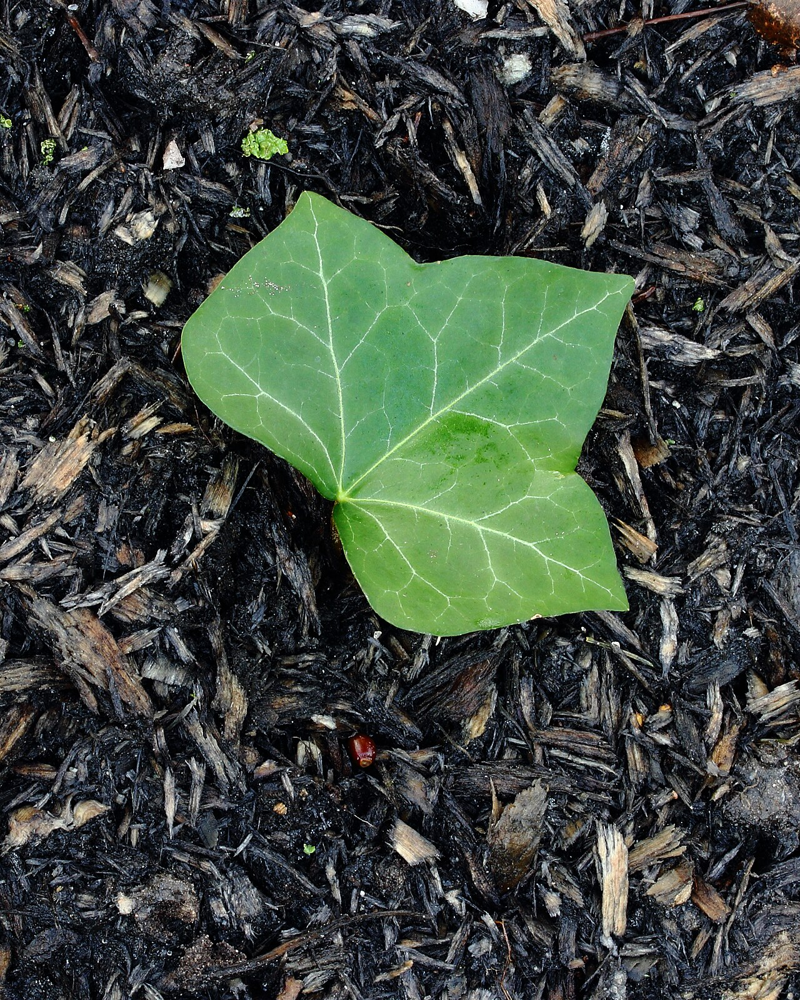
1. [File:Blad van klimop (Hedera helix) 02.JPG](https://commons.wikimedia.org/wiki/File:Blad_van_klimop_(Hedera_helix)_02.JPG) - CC BY-SA 3.0, Dominicus Johannes Bergsma

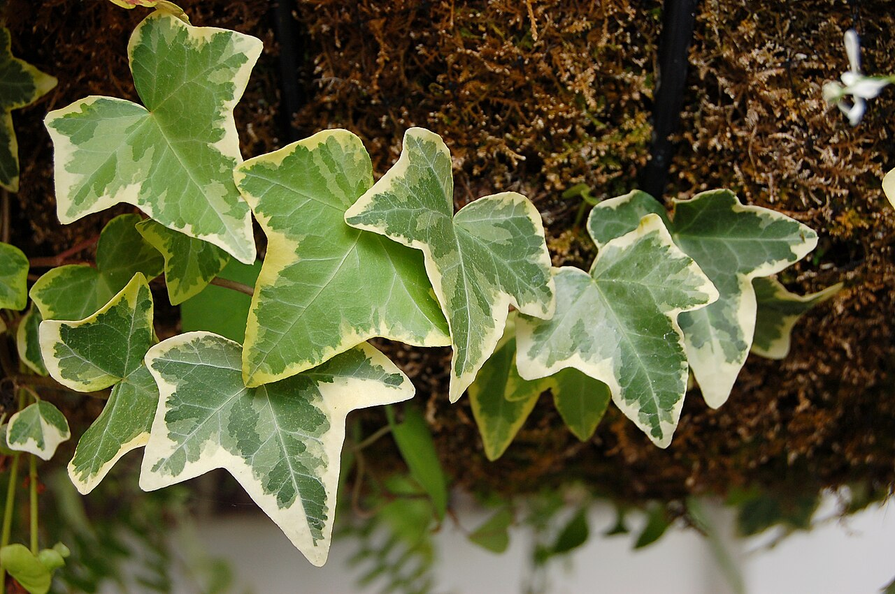
2. [File:Hedera helix Leaves 3008px.jpg](https://commons.wikimedia.org/wiki/File:Hedera_helix_Leaves_3008px.jpg) - CC BY-SA 3.0, Photo by and (c)2006 Derek Ramsey (Ram-Man).  Location credit to the Chanticleer Garden.

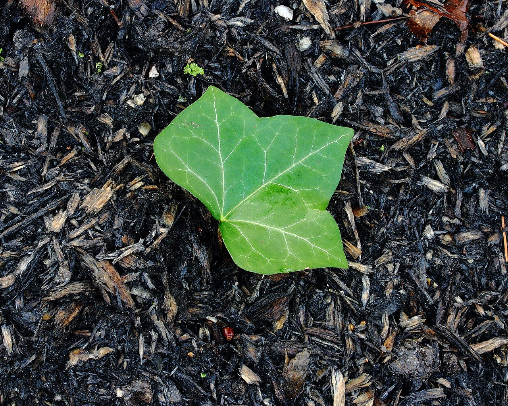
3. [File:Blad van klimop (Hedera helix) 01.JPG](https://commons.wikimedia.org/wiki/File:Blad_van_klimop_(Hedera_helix)_01.JPG) - CC BY-SA 3.0, Dominicus Johannes Bergsma

## 2. Pryskyřník _Ranunculus_

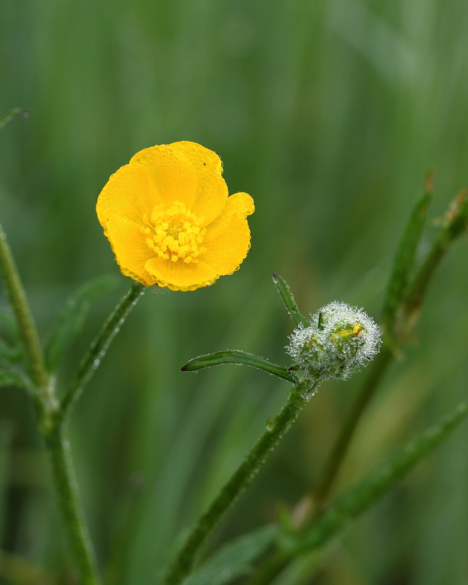
1. [File:Scherpe boterbloem (Ranunculus acris) 01.JPG](https://commons.wikimedia.org/wiki/File:Scherpe_boterbloem_(Ranunculus_acris)_01.JPG) - CC BY-SA 3.0, Dominicus Johannes Bergsma

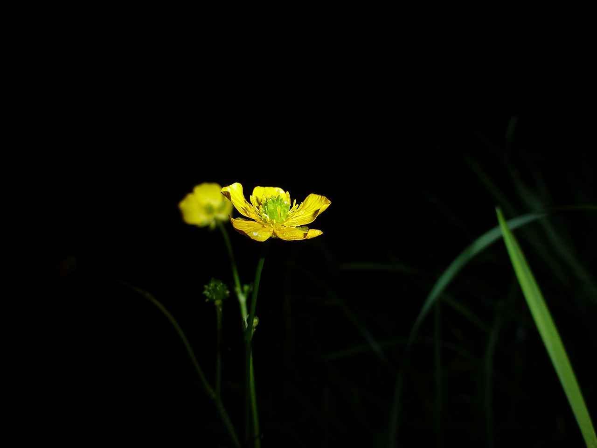
2. [File:Pryskyřník Prudký (Ranunculus acris).JPG](https://commons.wikimedia.org/wiki/File:Prysky%C5%99n%C3%ADk_Prudk%C3%BD_(Ranunculus_acris).JPG) - CC BY-SA 3.0, Akdam

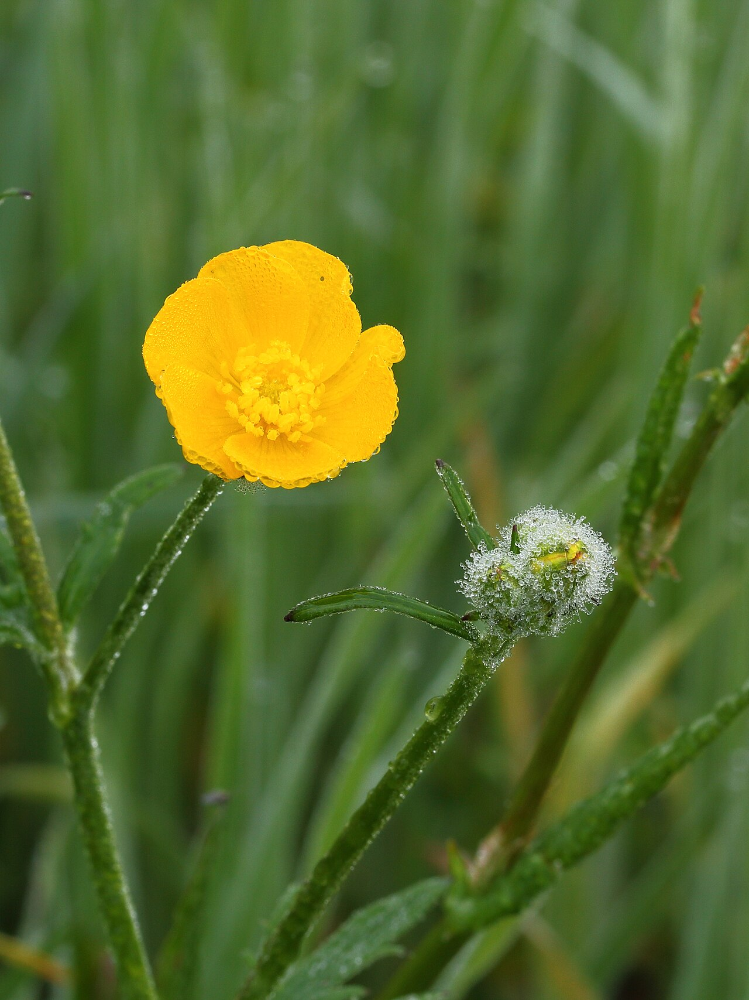
3. [File:Fiori Gialli Del Ranuncolo - Fiori di campo gialli.jpg](https://commons.wikimedia.org/wiki/File:Fiori_Gialli_Del_Ranuncolo_-_Fiori_di_campo_gialli.jpg) - CC BY-SA 4.0, PROPOLI87

## 4. Jaterník _Hepatica_

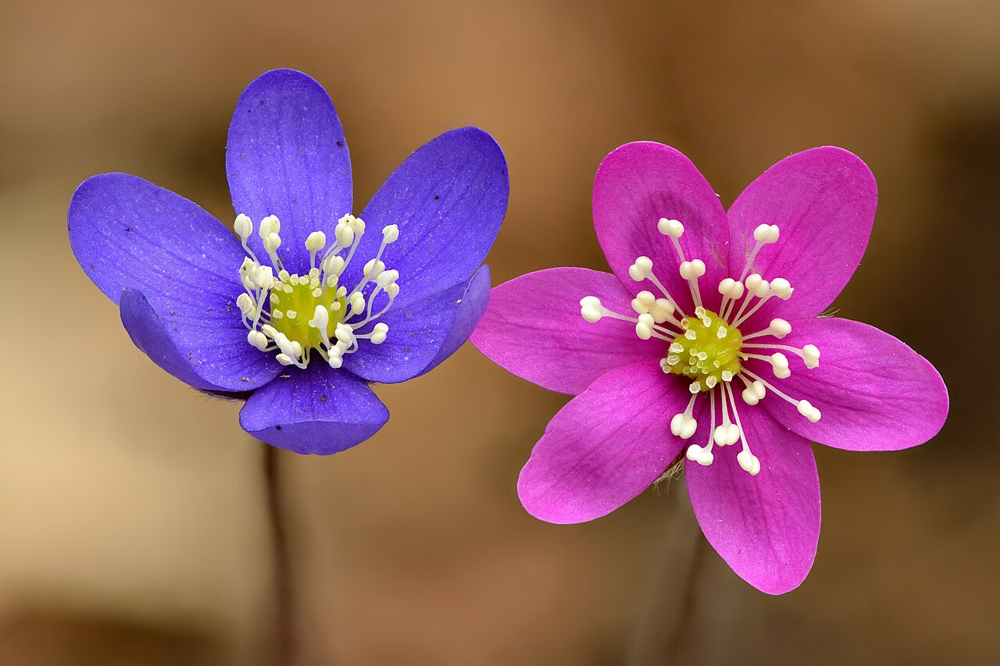
1. [File:Hepatica nobilis flowers - blue and pink - Keila.jpg](https://commons.wikimedia.org/wiki/File:Hepatica_nobilis_flowers_-_blue_and_pink_-_Keila.jpg) - CC BY-SA 4.0, Ivar Leidus

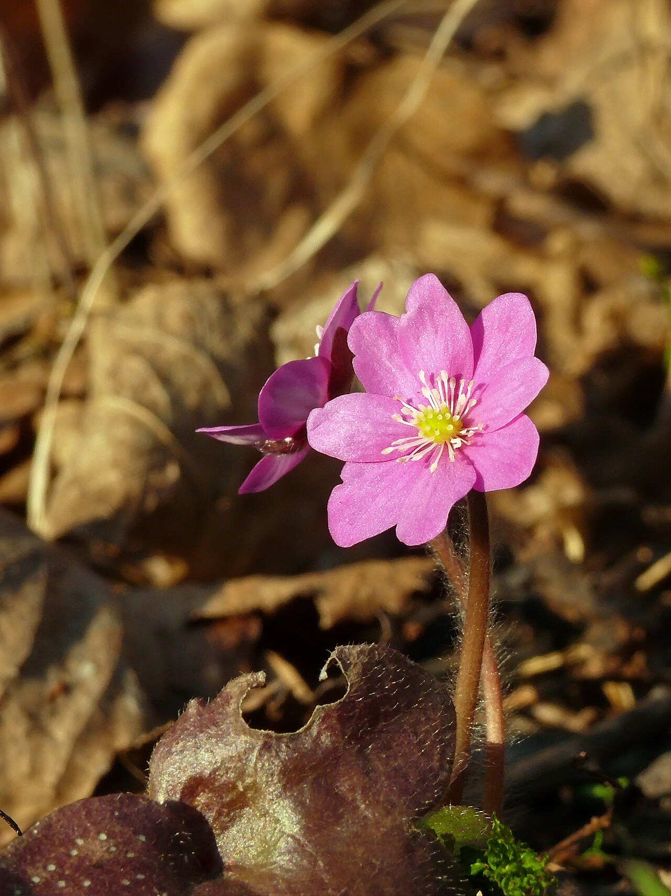
2. [File:P1140409 Hepatica nobilis.jpg](https://commons.wikimedia.org/wiki/File:P1140409_Hepatica_nobilis.jpg) - CC BY 3.0, Darius Baužys

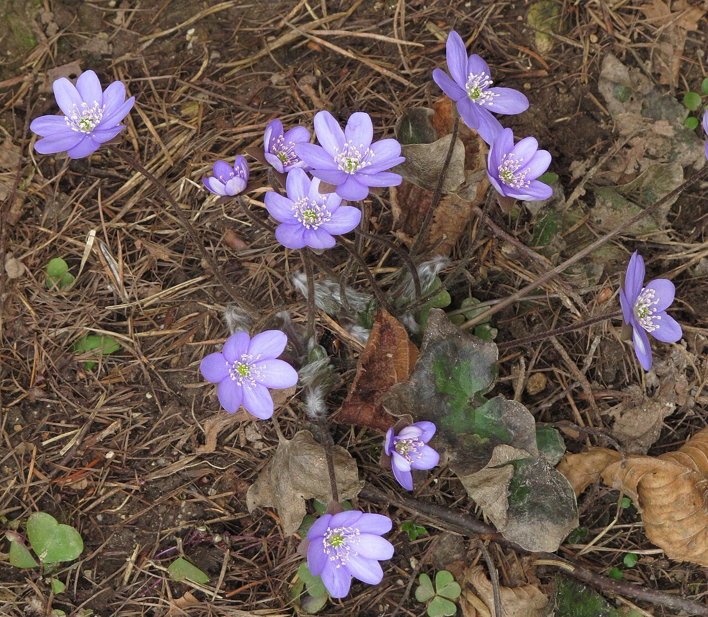
3. [File:Hepatica nobilis 2 RF.jpg](https://commons.wikimedia.org/wiki/File:Hepatica_nobilis_2_RF.jpg) - CC BY 4.0, Robert Flogaus-Faust

## 5. Sasanka _Anemone_

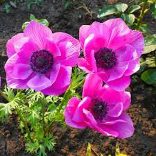
1. [File:Bosanemoon (Anemone nemorosa) 18-03-2024 (d.j.b.).jpg](https://commons.wikimedia.org/wiki/File:Bosanemoon_(Anemone_nemorosa)_18-03-2024_(d.j.b.).jpg) - CC BY-SA 4.0, Dominicus Johannes Bergsma

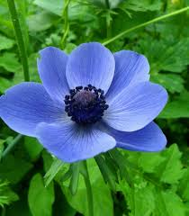
2. [File:Bosanemoon (Anemone nemorosa) (d.j.b.).jpg](https://commons.wikimedia.org/wiki/File:Bosanemoon_(Anemone_nemorosa)_(d.j.b.).jpg) - CC BY-SA 4.0, Dominicus Johannes Bergsma

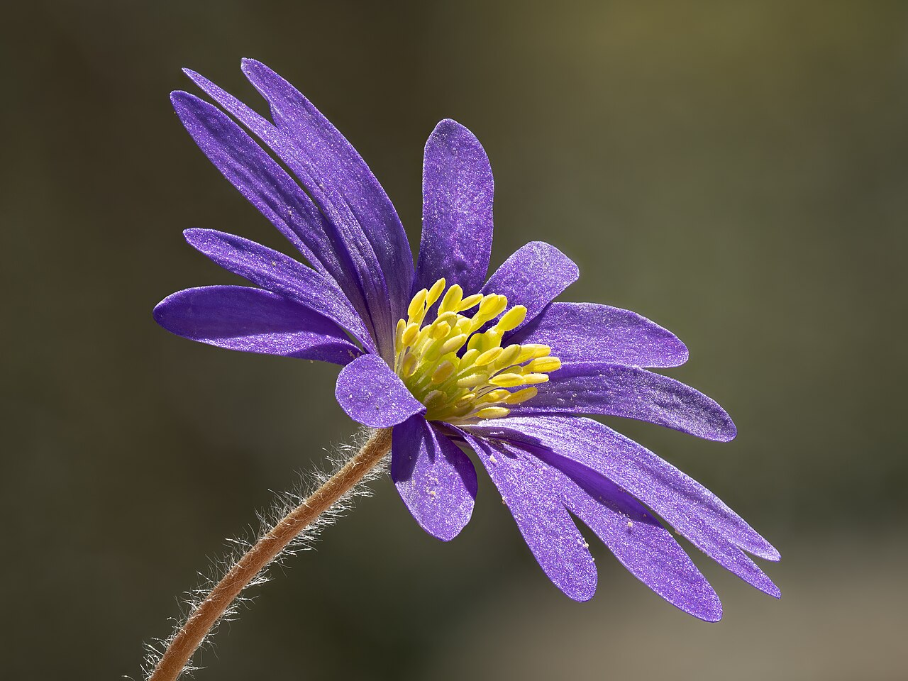
3. [File:Balkan Windröschen (Anemone blanda)-20230407-RM-124525.jpg](https://commons.wikimedia.org/wiki/File:Balkan_Windr%C3%B6schen_(Anemone_blanda)-20230407-RM-124525.jpg) - CC BY-SA 4.0, Ermell

## 6. Koniklec _Pulsatilla_

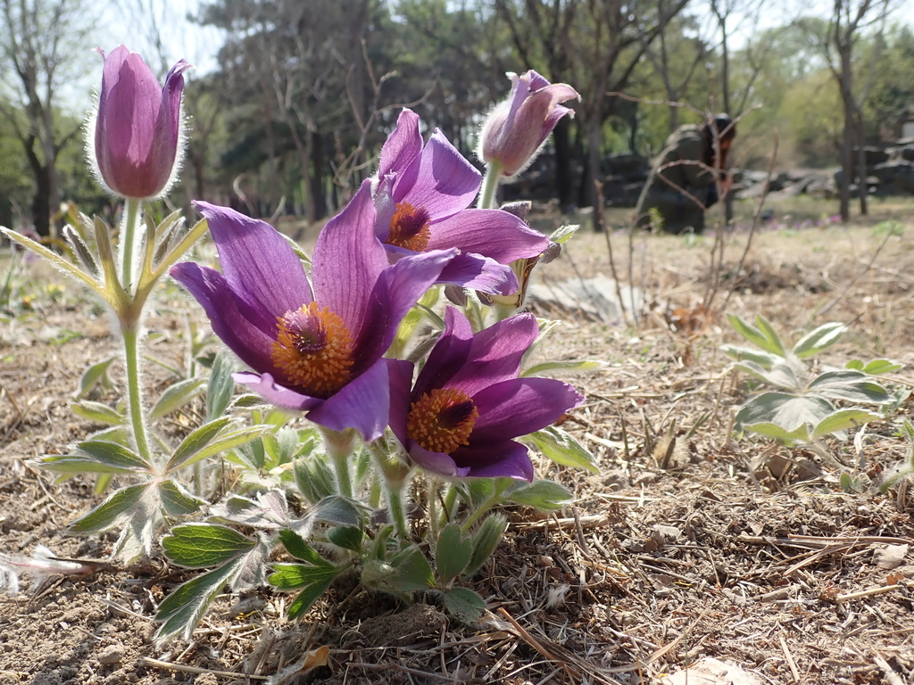
1. [File:Pulsatilla chinensis.jpg](https://commons.wikimedia.org/wiki/File:Pulsatilla_chinensis.jpg) - CC BY 4.0, zhangshen

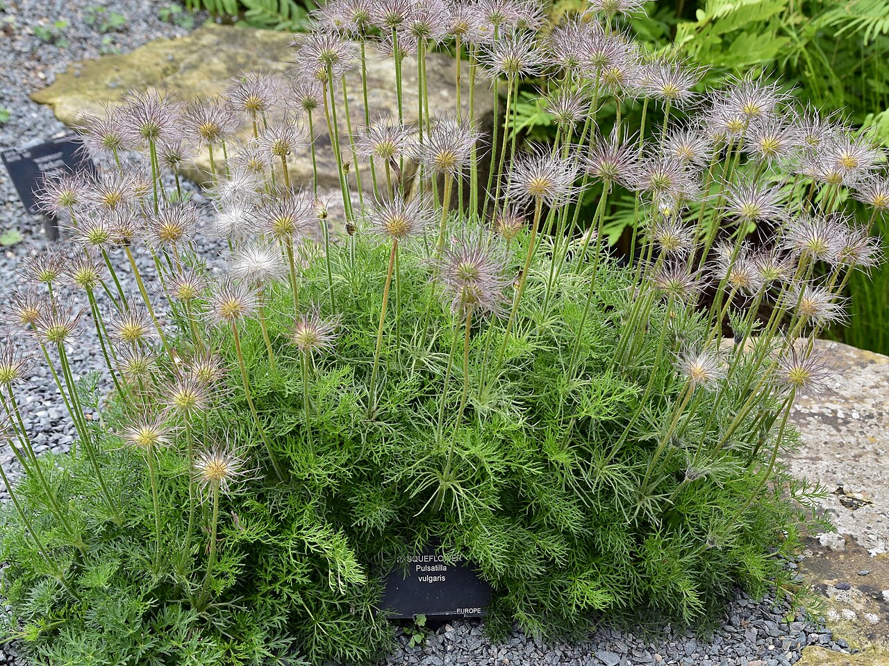
2. [File:Ranunculaceae Pulsatilla vulgaris 1.jpg](https://commons.wikimedia.org/wiki/File:Ranunculaceae_Pulsatilla_vulgaris_1.jpg) - CC BY-SA 4.0, NasserHalaweh

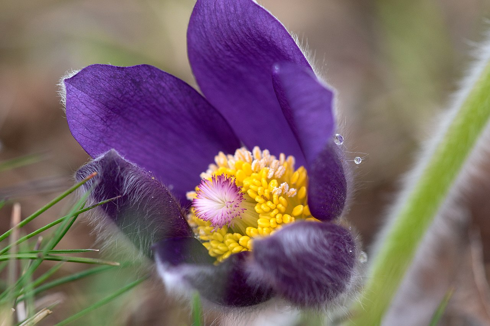
3. [File:Koniklec na Holem vrchu u Hlinné.jpg](https://commons.wikimedia.org/wiki/File:Koniklec_na_Holem_vrchu_u_Hlinn%C3%A9.jpg) - CC BY-SA 4.0, Topi Pigula

## 7. Plamének _Clematis_

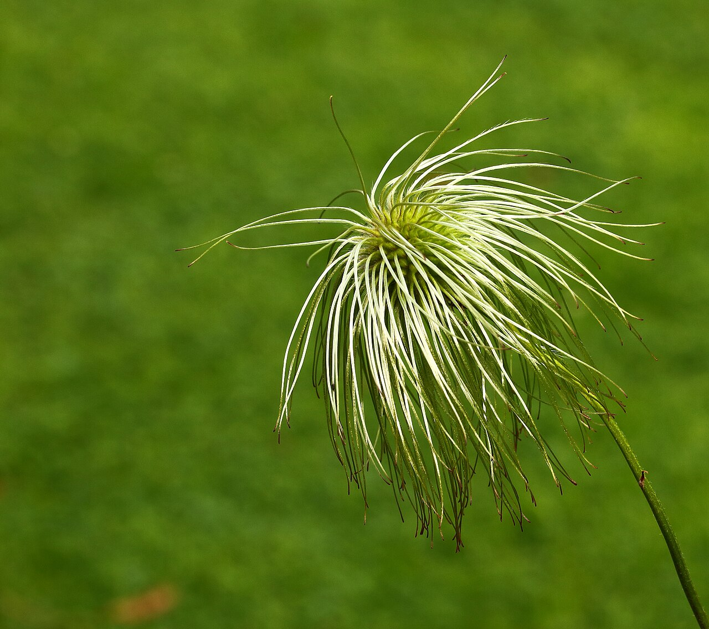
1. [File:Clematis tangutica (zaadpluis).JPG](https://commons.wikimedia.org/wiki/File:Clematis_tangutica_(zaadpluis).JPG) - CC BY-SA 4.0, Dominicus Johannes Bergsma

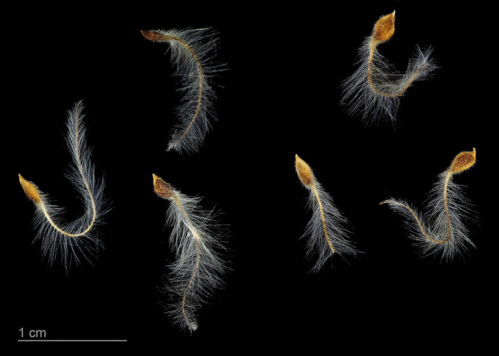
2. [File:Clematis vitalba MHNT.BOT.2006.70.1.jpg](https://commons.wikimedia.org/wiki/File:Clematis_vitalba_MHNT.BOT.2006.70.1.jpg) - CC BY-SA 3.0, Roger Culos

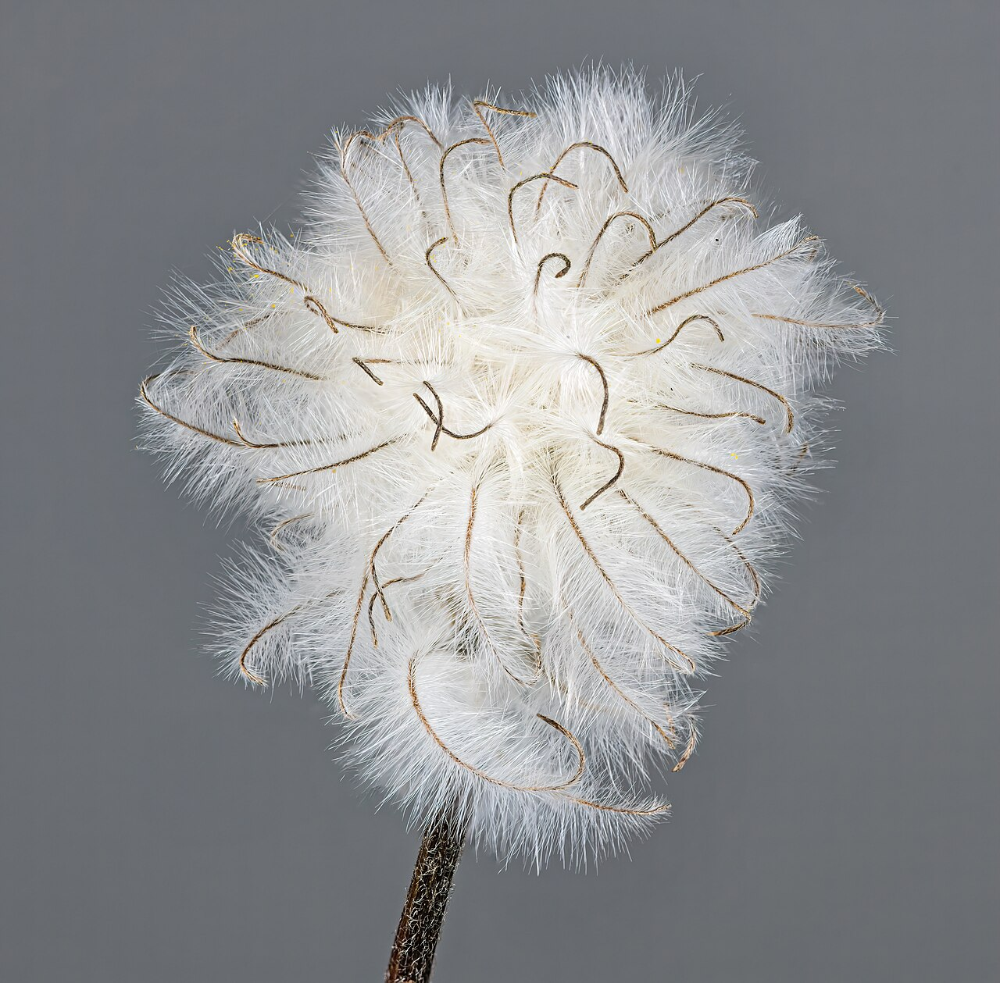
3. [File:(MHNT) Clematis integrifolia - mature fruit.jpg](https://commons.wikimedia.org/wiki/File:(MHNT)_Clematis_integrifolia_-_mature_fruit.jpg) - CC BY-SA 4.0, Didier Descouens

## 8. Blatouch _Caltha_

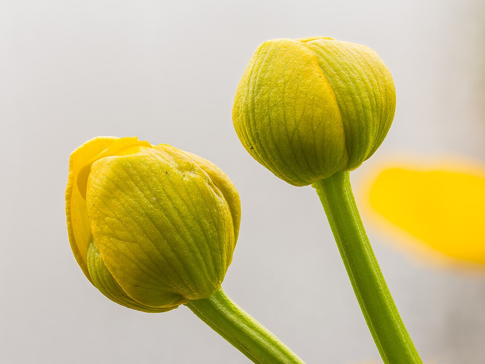
1. [File:Bloemknoppen van een gewone dotterbloem (Caltha palustris subsp. palustris). 17-03-2024. (d.j.b.).jpg](https://commons.wikimedia.org/wiki/File:Bloemknoppen_van_een_gewone_dotterbloem_(Caltha_palustris_subsp._palustris)._17-03-2024._(d.j.b.).jpg) - CC BY-SA 4.0, Dominicus Johannes Bergsma

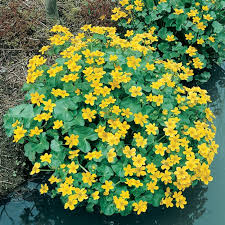
2. [File:Caltha palustris 001.JPG](https://commons.wikimedia.org/wiki/File:Caltha_palustris_001.JPG) - CC BY-SA 3.0, H. Zell

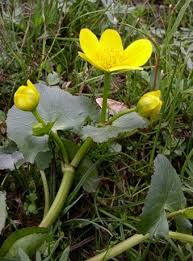
3. [File:Caltha palustris 003.JPG](https://commons.wikimedia.org/wiki/File:Caltha_palustris_003.JPG) - CC BY-SA 3.0, H. Zell

## 10. Stulík _Nuphar_

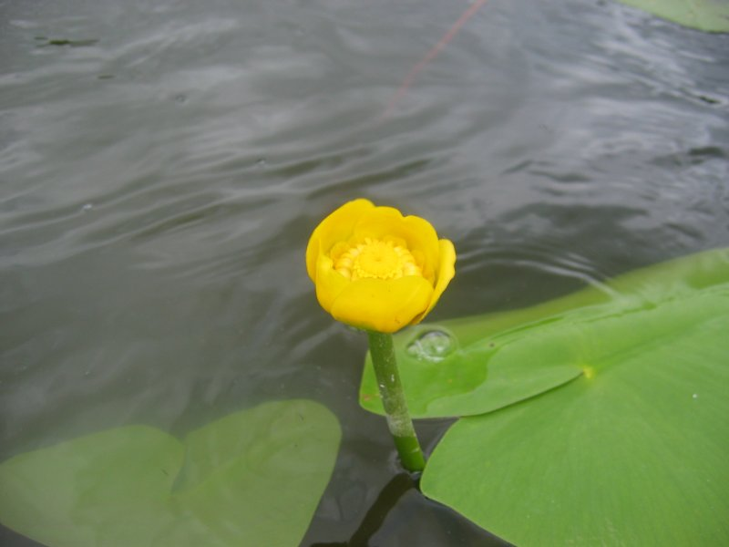
1. [File:Nuphar lutea.jpeg](https://commons.wikimedia.org/wiki/File:Nuphar_lutea.jpeg) - CC BY-SA 3.0, Kristian Peters -- Fabelfroh 15:38, 1 October 2006 (UTC)

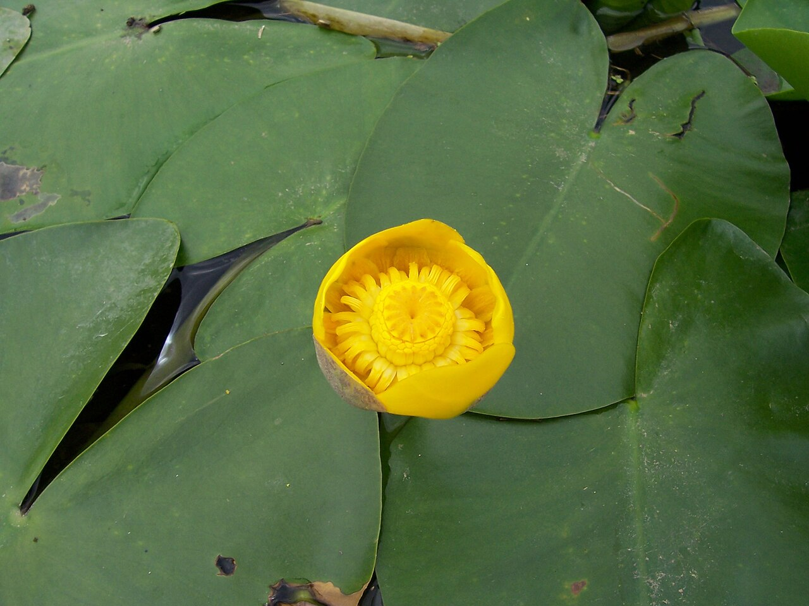
2. [File:Nuphar lutea (Detail) 24072005-1.jpg](https://commons.wikimedia.org/wiki/File:Nuphar_lutea_(Detail)_24072005-1.jpg) - CC BY-SA 2.0 de, autor neuveden

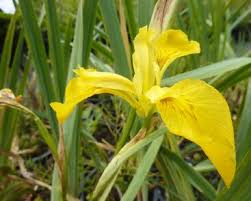
3. [File:Nuphar lutea Krumpendorf 01.jpg](https://commons.wikimedia.org/wiki/File:Nuphar_lutea_Krumpendorf_01.jpg) - CC BY-SA 4.0, Uoaei1

## 11. Leknín _Nymphaea_

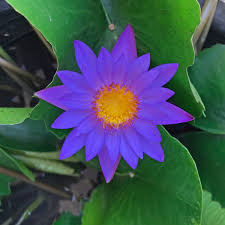
1. [File:Nymphaea alba in Duisburg.jpg](https://commons.wikimedia.org/wiki/File:Nymphaea_alba_in_Duisburg.jpg) - CC BY-SA 3.0, DerHexer

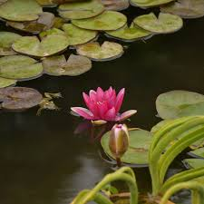
2. [File:Nymphaea caerulea-20091014-RM-115245.jpg](https://commons.wikimedia.org/wiki/File:Nymphaea_caerulea-20091014-RM-115245.jpg) - CC BY-SA 4.0, Ermell

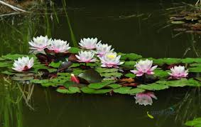
3. [File:Nymphaea sp.jpg](https://commons.wikimedia.org/wiki/File:Nymphaea_sp.jpg) - CC BY-SA 3.0, Joydeep

## 12. Rozchodník _Sedum_

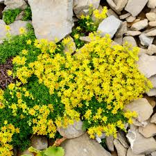
1. [File:Sedum acre single - Niitvälja.jpg](https://commons.wikimedia.org/wiki/File:Sedum_acre_single_-_Niitv%C3%A4lja.jpg) - CC BY-SA 4.0, Ivar Leidus

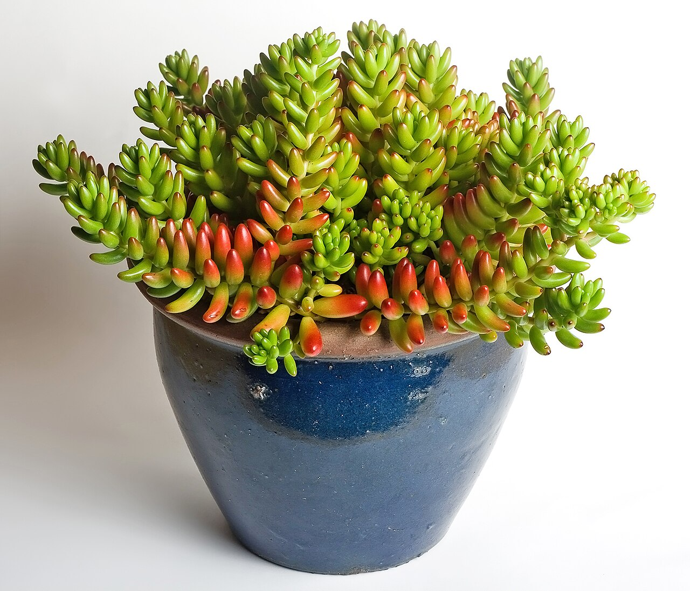
2. [File:Sedum rubrotinctum.jpg](https://commons.wikimedia.org/wiki/File:Sedum_rubrotinctum.jpg) - CC BY-SA 2.5, JJ Harrison (https://www.jjharrison.com.au/)

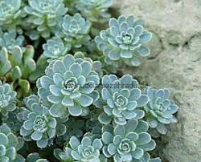
3. [File:(MHNT) Sedum liebmannianum - infloresence.jpg](https://commons.wikimedia.org/wiki/File:(MHNT)_Sedum_liebmannianum_-_infloresence.jpg) - CC BY-SA 4.0, Didier Descouens

## 13. Netřesk _Jovibarba / Sempervivum_

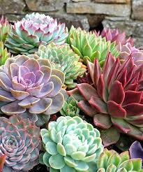
1. [File:Jovibarba globifera subsp hirta.jpg](https://commons.wikimedia.org/wiki/File:Jovibarba_globifera_subsp_hirta.jpg) - CC BY 2.5, User:Tigerente

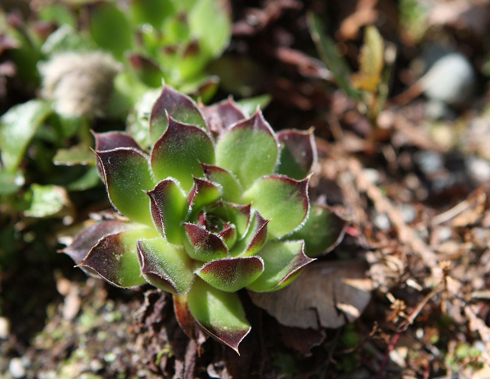
2. [File:Flickr - brewbooks - Jovibarba (1).jpg](https://commons.wikimedia.org/wiki/File:Flickr_-_brewbooks_-_Jovibarba_(1).jpg) - CC BY-SA 2.0, brewbooks from near Seattle, USA

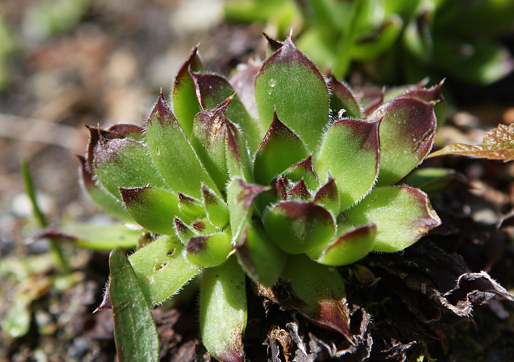
3. [File:Flickr - brewbooks - Jovibarba (2).jpg](https://commons.wikimedia.org/wiki/File:Flickr_-_brewbooks_-_Jovibarba_(2).jpg) - CC BY-SA 2.0, brewbooks from near Seattle, USA

## 14. Krvavec _Sanguisorba_

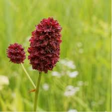
1. [File:Sanguisorba officinalis RF.jpg](https://commons.wikimedia.org/wiki/File:Sanguisorba_officinalis_RF.jpg) - CC BY 4.0, Robert Flogaus-Faust

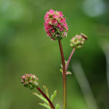
2. [File:Sanguisorba officinalis.jpg](https://commons.wikimedia.org/wiki/File:Sanguisorba_officinalis.jpg) - Public domain, Carl Axel Magnus Lindman

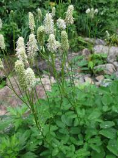
3. [File:Sanguisorba officinalis kz01.jpg](https://commons.wikimedia.org/wiki/File:Sanguisorba_officinalis_kz01.jpg) - CC BY-SA 4.0, Krzysztof Ziarnek, Kenraiz

## 15. Kontryhel _Alchemilla_

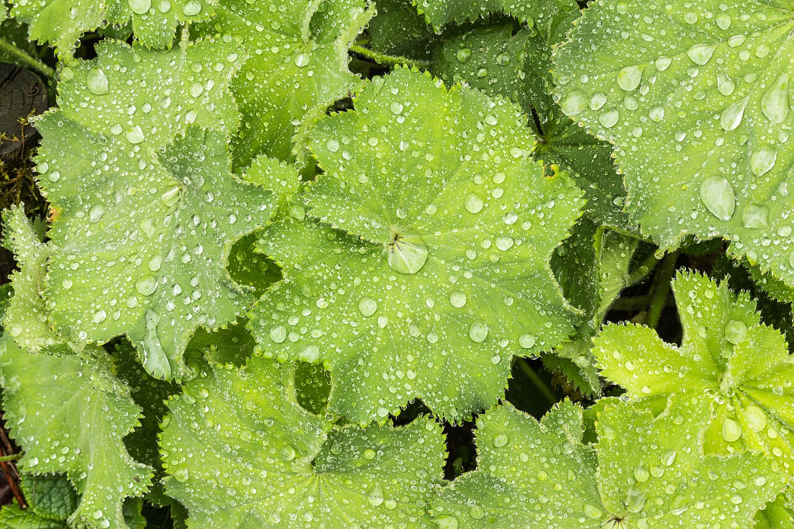
1. [File:Vrouwenmantel (Alchemilla mollis) d.j.b 02.jpg](https://commons.wikimedia.org/wiki/File:Vrouwenmantel_(Alchemilla_mollis)_d.j.b_02.jpg) - CC BY-SA 4.0, Dominicus Johannes Bergsma

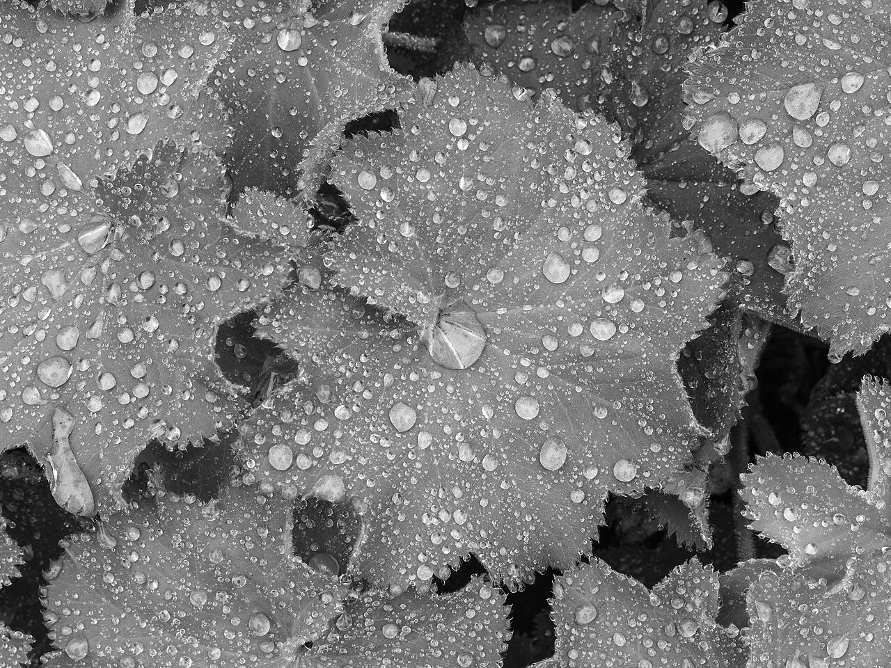
2. [File:Vrouwenmantel (Alchemilla mollis) d.j.b 04.jpg](https://commons.wikimedia.org/wiki/File:Vrouwenmantel_(Alchemilla_mollis)_d.j.b_04.jpg) - CC BY-SA 4.0, Dominicus Johannes Bergsma

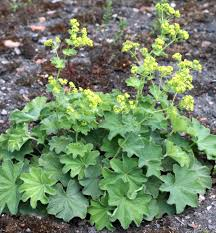
3. [File:Nordens flora Alchemilla vulgaris.jpg](https://commons.wikimedia.org/wiki/File:Nordens_flora_Alchemilla_vulgaris.jpg) - Public domain, Carl Axel Magnus Lindman

## 17. Mochna _Potentilla_

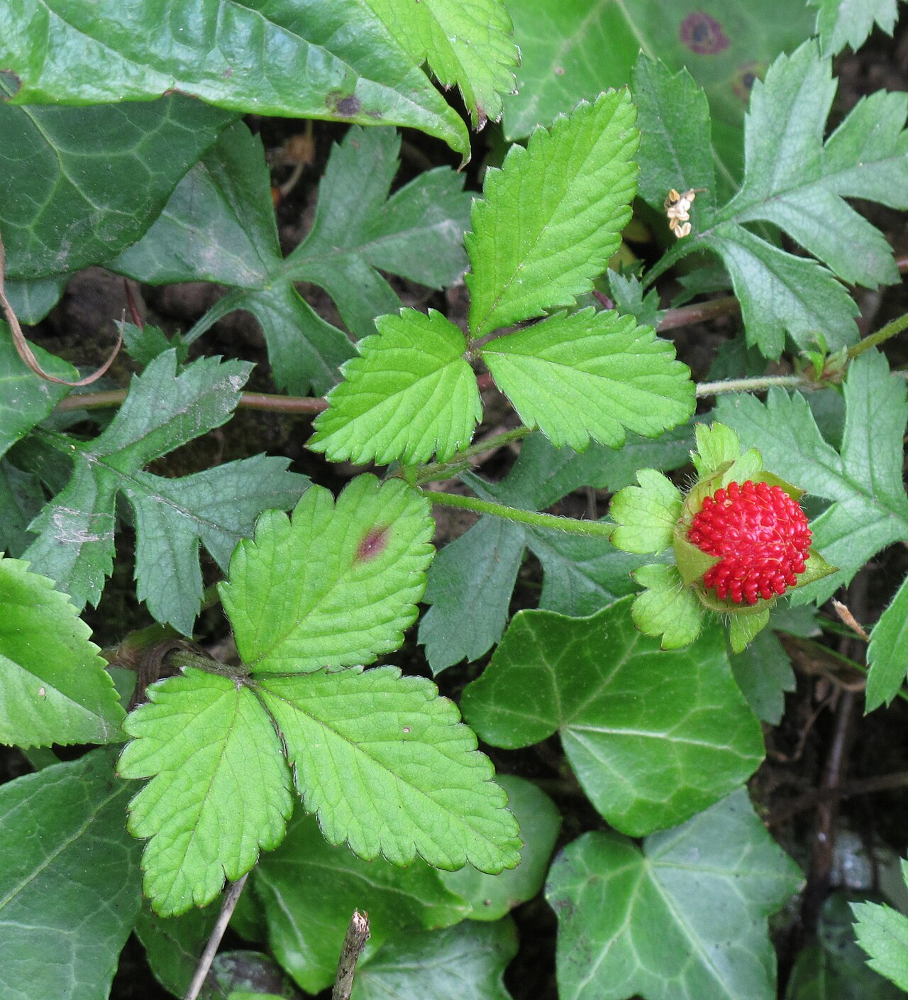
1. [File:Potentilla indica RF.jpg](https://commons.wikimedia.org/wiki/File:Potentilla_indica_RF.jpg) - CC BY 4.0, Robert Flogaus-Faust

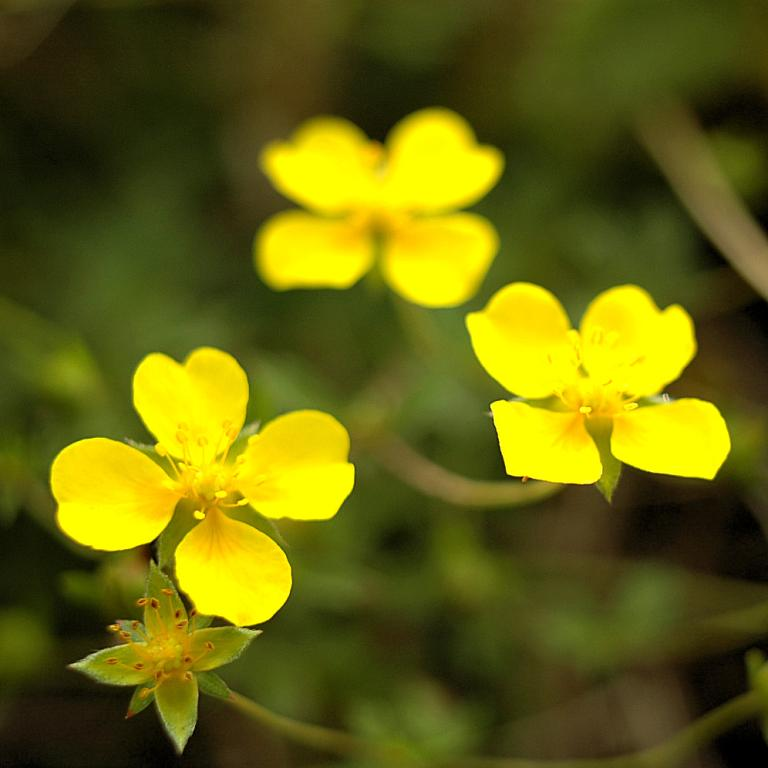
2. [File:Potentilla erecta (trebol-a).jpg](https://commons.wikimedia.org/wiki/File:Potentilla_erecta_(trebol-a).jpg) - CC BY-SA 2.0, Alberto Garcia Quesada

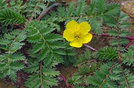
3. [File:Potentilla erecta01.jpg](https://commons.wikimedia.org/wiki/File:Potentilla_erecta01.jpg) - CC BY 2.5, User:Tigerente

## 18. Kuklík _Geum_

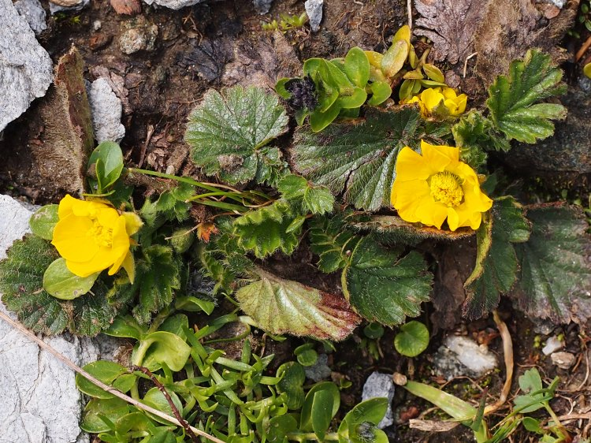
1. [File:(MHNT) Geum urbanum - flower.jpg](https://commons.wikimedia.org/wiki/File:(MHNT)_Geum_urbanum_-_flower.jpg) - CC BY-SA 4.0, Didier Descouens

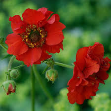
2. [File:(MHNT) Geum urbanum - Habit.jpg](https://commons.wikimedia.org/wiki/File:(MHNT)_Geum_urbanum_-_Habit.jpg) - CC BY-SA 4.0, Didier Descouens

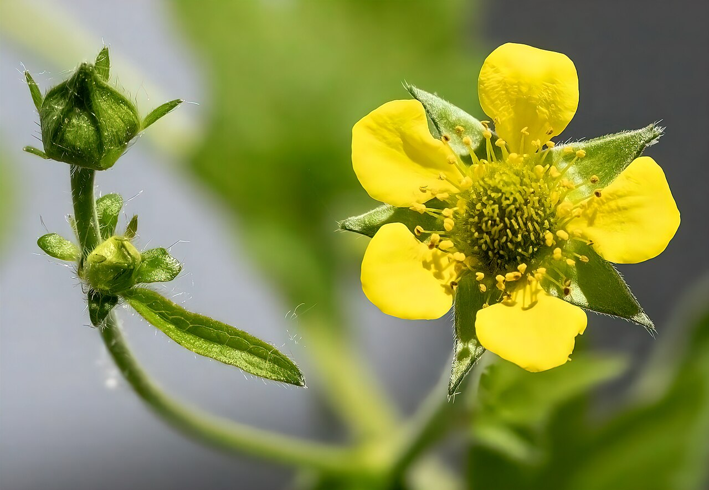
3. [File:(MHNT) Geum urbanum - Buds and flower.jpg](https://commons.wikimedia.org/wiki/File:(MHNT)_Geum_urbanum_-_Buds_and_flower.jpg) - CC BY-SA 4.0, Didier Descouens

## 19. Jahodník _Fragaria_

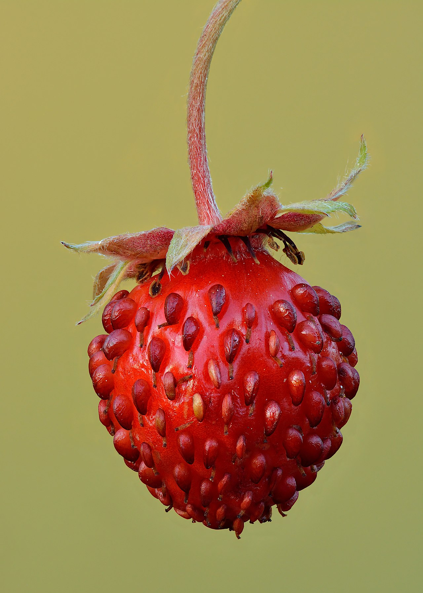
1. [File:Fragaria vesca fruit - Keila.jpg](https://commons.wikimedia.org/wiki/File:Fragaria_vesca_fruit_-_Keila.jpg) - CC BY-SA 4.0, Ivar Leidus

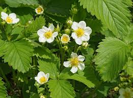
2. [File:Garden strawberry (Fragaria × ananassa) single2.jpg](https://commons.wikimedia.org/wiki/File:Garden_strawberry_(Fragaria_%C3%97_ananassa)_single2.jpg) - CC BY-SA 4.0, Ivar Leidus

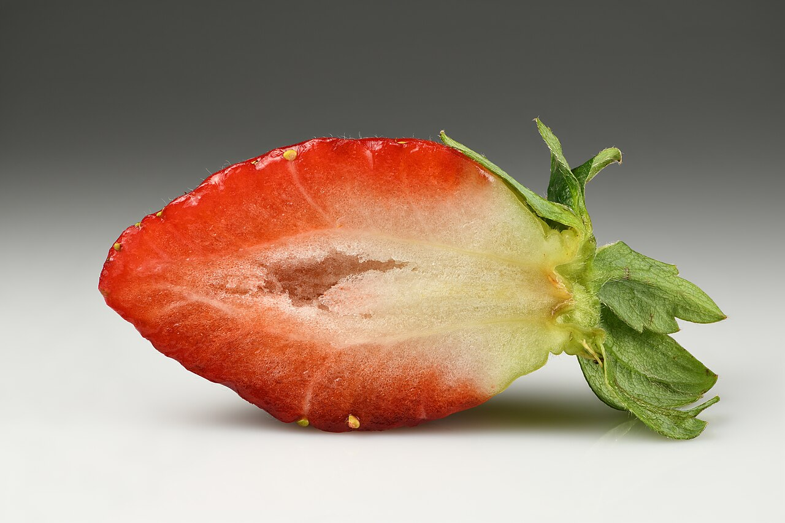
3. [File:Garden strawberry (Fragaria × ananassa) halved.jpg](https://commons.wikimedia.org/wiki/File:Garden_strawberry_(Fragaria_%C3%97_ananassa)_halved.jpg) - CC BY-SA 4.0, Ivar Leidus

## 20. Tužebník _Filipendula_

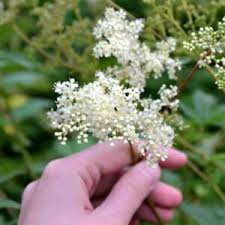
1. [File:Filipendula vulgaris - inflorescence - Kulna.jpg](https://commons.wikimedia.org/wiki/File:Filipendula_vulgaris_-_inflorescence_-_Kulna.jpg) - CC BY-SA 4.0, Ivar Leidus

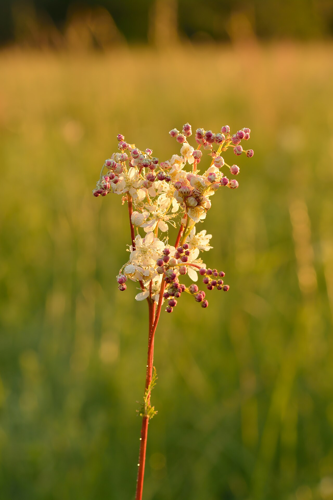
2. [File:Filipendula vulgaris - angerpist.jpg](https://commons.wikimedia.org/wiki/File:Filipendula_vulgaris_-_angerpist.jpg) - CC BY-SA 3.0, Ivar Leidus


3. [File:.00 7237 Echte Mädesüß (Filipendula ulmaria).jpg](https://commons.wikimedia.org/wiki/File:.00_7237_Echte_M%C3%A4des%C3%BC%C3%9F_(Filipendula_ulmaria).jpg) - CC BY-SA 4.0, W. Bulach

## 22. Vikev _Vicia_


1. [File:(MHNT) Vicia lutea - plant habit.jpg](https://commons.wikimedia.org/wiki/File:(MHNT)_Vicia_lutea_-_plant_habit.jpg) - CC BY-SA 4.0, Didier Descouens


2. [File:(MHNT) Vicia hirsuta - Plant habit.jpg](https://commons.wikimedia.org/wiki/File:(MHNT)_Vicia_hirsuta_-_Plant_habit.jpg) - CC BY-SA 4.0, Didier Descouens


3. [File:(MHNT) Vicia sativa.jpg](https://commons.wikimedia.org/wiki/File:(MHNT)_Vicia_sativa.jpg) - CC BY-SA 4.0, Didier Descouens

## 23. Vlčí bob _Lupinus_


1. [File:Lupinus polyphyllus UA 2015 G5.jpg](https://commons.wikimedia.org/wiki/File:Lupinus_polyphyllus_UA_2015_G5.jpg) - Public domain, George Chernilevsky


2. [File:Lupinus polyphyllus MHNT.BOT.2004.0.463.jpg](https://commons.wikimedia.org/wiki/File:Lupinus_polyphyllus_MHNT.BOT.2004.0.463.jpg) - CC BY-SA 4.0, Didier Descouens

3. [File:Lupinus albus MHNT.BOT.2021.17.6.jpg](https://commons.wikimedia.org/wiki/File:Lupinus_albus_MHNT.BOT.2021.17.6.jpg) - CC BY-SA 4.0, Roger Culos

## 24. Jetel _Trifolium_


1. [File:Trifolium pratense - Keila.jpg](https://commons.wikimedia.org/wiki/File:Trifolium_pratense_-_Keila.jpg) - CC BY-SA 4.0, Ivar Leidus


2. [File:Trifolium pratense - Keila2.jpg](https://commons.wikimedia.org/wiki/File:Trifolium_pratense_-_Keila2.jpg) - CC BY-SA 4.0, Ivar Leidus


3. [File:Trifolium repens (inflorescense) Edit.jpg](https://commons.wikimedia.org/wiki/File:Trifolium_repens_(inflorescense)_Edit.jpg) - CC BY-SA 3.0, Hans Hillewaert

## 26. Čičorka _Securigera_


1. [File:Bunten Kronwicke (Securigera varia) Blüte-20200626-RM-173640.jpg](https://commons.wikimedia.org/wiki/File:Bunten_Kronwicke_(Securigera_varia)_Bl%C3%BCte-20200626-RM-173640.jpg) - CC BY-SA 4.0, Ermell


2. [File:Securigera varia 3 RF.jpg](https://commons.wikimedia.org/wiki/File:Securigera_varia_3_RF.jpg) - CC BY 4.0, Robert Flogaus-Faust


3. [File:Securigera varia in Donetsk.jpg](https://commons.wikimedia.org/wiki/File:Securigera_varia_in_Donetsk.jpg) - CC BY-SA 3.0, Andrey Butko

## 28. Vrbovka _Epilobium_


1. [File:Bombus lucorum - Epilobium angustifolium - Keila.jpg](https://commons.wikimedia.org/wiki/File:Bombus_lucorum_-_Epilobium_angustifolium_-_Keila.jpg) - CC BY-SA 4.0, Ivar Leidus


2. [File:(MHNT) Epilobium ciliatum - flowers.jpg](https://commons.wikimedia.org/wiki/File:(MHNT)_Epilobium_ciliatum_-_flowers.jpg) - CC BY-SA 4.0, Didier Descouens


3. [File:Maitohorsma (Epilobium angustifolium).JPG](https://commons.wikimedia.org/wiki/File:Maitohorsma_(Epilobium_angustifolium).JPG) - CC BY-SA 3.0, kallerna

## 29. Mák _Papaver_


1. [File:Poster papaver 5a.jpg](https://commons.wikimedia.org/wiki/File:Poster_papaver_5a.jpg) - CC BY-SA 3.0, Alvesgaspar


2. [File:Opium poppy.jpg](https://commons.wikimedia.org/wiki/File:Opium_poppy.jpg) - CC BY-SA 1.0, Louise Joly, one half of AtelierJoly


3. [File:Poster papaver 3a.jpg](https://commons.wikimedia.org/wiki/File:Poster_papaver_3a.jpg) - CC BY-SA 3.0, Alvesgaspar

## 30. Vlaštovičník _Chelidonium_


1. [File:Chelidonium majus 4 RF.jpg](https://commons.wikimedia.org/wiki/File:Chelidonium_majus_4_RF.jpg) - CC BY 4.0, Robert Flogaus-Faust


2. [File:Chelidonium majus 2 RF.jpg](https://commons.wikimedia.org/wiki/File:Chelidonium_majus_2_RF.jpg) - CC BY 4.0, Robert Flogaus-Faust


3. [File:Schöllkraut Mauer.jpg](https://commons.wikimedia.org/wiki/File:Sch%C3%B6llkraut_Mauer.jpg) - CC BY-SA 4.0, Palauenc05

## 32. Česnáček _Alliaria_


1. [File:Knoblauchrauke (Alliaria petiolata)-20220502-RM-123023.jpg](https://commons.wikimedia.org/wiki/File:Knoblauchrauke_(Alliaria_petiolata)-20220502-RM-123023.jpg) - CC BY-SA 4.0, Ermell


2. [File:(MHNT) Alliaria petiolata - flowers.jpg](https://commons.wikimedia.org/wiki/File:(MHNT)_Alliaria_petiolata_-_flowers.jpg) - CC BY-SA 4.0, Didier Descouens


3. [File:Alliaria petiolata marais-belloy-sur-somme 80 26042007 3.jpg](https://commons.wikimedia.org/wiki/File:Alliaria_petiolata_marais-belloy-sur-somme_80_26042007_3.jpg) - CC BY-SA 3.0, O. Pichard

## 33. Křen _Armoracia_


1. [File:,00 3773 Meerrettich (Armoracia rusticana).jpg](https://commons.wikimedia.org/wiki/File:,00_3773_Meerrettich_(Armoracia_rusticana).jpg) - CC BY-SA 4.0, W. Bulach


2. [File:Armoracia rusticana.jpg](https://commons.wikimedia.org/wiki/File:Armoracia_rusticana.jpg) - CC BY-SA 3.0, autor neuveden


3. [File:Armoracia rusticana Chrzan pospolity 2019-05-05 02.jpg](https://commons.wikimedia.org/wiki/File:Armoracia_rusticana_Chrzan_pospolity_2019-05-05_02.jpg) - CC BY-SA 4.0, Agnieszka Kwiecień, Nova

## 34. Penízek _Thlaspi_


1. [File:Thlaspi arvense kz01.jpg](https://commons.wikimedia.org/wiki/File:Thlaspi_arvense_kz01.jpg) - CC BY-SA 4.0, Krzysztof Ziarnek, Kenraiz


2. [File:Thlaspi montanum eF.jpg](https://commons.wikimedia.org/wiki/File:Thlaspi_montanum_eF.jpg) - CC BY-SA 3.0, autor neuveden


3. [File:Thlaspi spp Sturm26.jpg](https://commons.wikimedia.org/wiki/File:Thlaspi_spp_Sturm26.jpg) - Public domain, Johann Georg Sturm (Painter: Jacob Sturm)

## 35. Kokoška _Capsella_


1. [File:Capsella bursa-pastoris.JPG](https://commons.wikimedia.org/wiki/File:Capsella_bursa-pastoris.JPG) - CC BY-SA 2.5, Eike Wulfmeyer


2. [File:Capsella rubella plant (09).jpg](https://commons.wikimedia.org/wiki/File:Capsella_rubella_plant_(09).jpg) - CC BY-SA 2.0 fr, bertrant.bui@


3. [File:Capsella rubella plant (04).jpg](https://commons.wikimedia.org/wiki/File:Capsella_rubella_plant_(04).jpg) - CC BY-SA 3.0, Andrea Moro

## 36. Violka _Viola_


1. [File:Viola arborescens (plant).jpg](https://commons.wikimedia.org/wiki/File:Viola_arborescens_(plant).jpg) - CC BY-SA 3.0, Hans Hillewaert


2. [File:Viola reichenbachiana 001.jpg](https://commons.wikimedia.org/wiki/File:Viola_reichenbachiana_001.jpg) - CC BY-SA 3.0, H. Zell


3. [File:Viola heartthrob.JPG](https://commons.wikimedia.org/wiki/File:Viola_heartthrob.JPG) - CC BY-SA 3.0, Dominicus Johannes Bergsma

## 37. Třezalka _Hypericum_


1. [File:Drie bloemknoppen van een Hertshooi (Hypericum). 10-07-2025 (d.j.b.).jpg](https://commons.wikimedia.org/wiki/File:Drie_bloemknoppen_van_een_Hertshooi_(Hypericum)._10-07-2025_(d.j.b.).jpg) - CC BY-SA 4.0, Famberhorst


2. [File:Vruchten van Hertshooi (Hypericum). 27-07-2024 (d.j.b.).jpg](https://commons.wikimedia.org/wiki/File:Vruchten_van_Hertshooi_(Hypericum)._27-07-2024_(d.j.b.).jpg) - CC BY-SA 4.0, Dominicus Johannes Bergsma


3. [File:Bloemknoppen van een hertshooi (Hypericum). 13-06-2025 (d.j.b.).jpg](https://commons.wikimedia.org/wiki/File:Bloemknoppen_van_een_hertshooi_(Hypericum)._13-06-2025_(d.j.b.).jpg) - CC BY-SA 4.0, Dominicus Johannes Bergsma.

## 38. Sléz _Malva_


1. [File:Malva moschata Mitterbach 02.jpg](https://commons.wikimedia.org/wiki/File:Malva_moschata_Mitterbach_02.jpg) - CC BY-SA 4.0, Uoaei1


2. [File:(MHNT) Malva parviflora - Habitus.jpg](https://commons.wikimedia.org/wiki/File:(MHNT)_Malva_parviflora_-_Habitus.jpg) - CC BY-SA 4.0, Didier Descouens


3. [File:Malva in Caucasus.jpg](https://commons.wikimedia.org/wiki/File:Malva_in_Caucasus.jpg) - CC BY-SA 4.0, SKas

## 39. Šťavel _Oxalis_


1. [File:Oxalis-pes-caprae-16-Zachi-Evenor.jpg](https://commons.wikimedia.org/wiki/File:Oxalis-pes-caprae-16-Zachi-Evenor.jpg) - CC BY-SA 4.0, MathKnight and Zachi Evenor אביר המתמטיקה וצחי אבנור


2. [File:Oxalis-pes-caprae-36-Zachi-Evenor.jpg](https://commons.wikimedia.org/wiki/File:Oxalis-pes-caprae-36-Zachi-Evenor.jpg) - CC BY 2.0, Zachi Evenor


3. [File:Oxalis-pes-caprae-16c-Zachi-Evenor.jpg](https://commons.wikimedia.org/wiki/File:Oxalis-pes-caprae-16c-Zachi-Evenor.jpg) - CC BY-SA 4.0, MathKnight and Zachi Evenor אביר המתמטיקה וצחי אבנור

## 40. Kakost _Geranium_


1. [File:Geranium sanguineum, 27-06-2024. (actm.).jpg](https://commons.wikimedia.org/wiki/File:Geranium_sanguineum,_27-06-2024._(actm.).jpg) - CC BY-SA 4.0, Agnes Monkelbaan


2. [File:Staande geranium Pelargonium zonale wit. 20-06-2025. (actm.) 02.jpg](https://commons.wikimedia.org/wiki/File:Staande_geranium_Pelargonium_zonale_wit._20-06-2025._(actm.)_02.jpg) - CC BY-SA 4.0, Agnes Monkelbaan


3. [File:Geranium February 2008-1.jpg](https://commons.wikimedia.org/wiki/File:Geranium_February_2008-1.jpg) - CC BY-SA 3.0, Alvesgaspar

## 41. Netýkavka _Impatiens_


1. [File:Impatiens pallida.jpg](https://commons.wikimedia.org/wiki/File:Impatiens_pallida.jpg) - CC BY-SA 2.5 ca, СССР


2. [File:Impatiens scapiflora.jpg](https://commons.wikimedia.org/wiki/File:Impatiens_scapiflora.jpg) - CC BY-SA 3.0, Cj.samson


3. [File:Impatiens minor 00219.JPG](https://commons.wikimedia.org/wiki/File:Impatiens_minor_00219.JPG) - CC BY-SA 4.0, Vengolis

## 42. Bršlice _Aegopodium_


1. [File:Aegopodium podagraria 001.JPG](https://commons.wikimedia.org/wiki/File:Aegopodium_podagraria_001.JPG) - CC BY-SA 3.0, H. Zell


2. [File:Zevenblad (Aegopodium podagraria) 01.JPG](https://commons.wikimedia.org/wiki/File:Zevenblad_(Aegopodium_podagraria)_01.JPG) - CC BY-SA 4.0, Dominicus Johannes Bergsma


3. [File:Zevenblad (Aegopodium podagraria) 02.JPG](https://commons.wikimedia.org/wiki/File:Zevenblad_(Aegopodium_podagraria)_02.JPG) - CC BY-SA 4.0, Dominicus Johannes Bergsma

## 43. Bolševník _Heracleum_


1. [File:Bloemknop van een berenklauw (Heracleum). 16-06-2023. (d.j.b) 01.jpg](https://commons.wikimedia.org/wiki/File:Bloemknop_van_een_berenklauw_(Heracleum)._16-06-2023._(d.j.b)_01.jpg) - CC BY-SA 4.0, Dominicus Johannes Bergsma


2. [File:Zaaddozen van gewone berenklauw (Heracleum sphondylium). 10-08-2023. (actm.) 02.jpg](https://commons.wikimedia.org/wiki/File:Zaaddozen_van_gewone_berenklauw_(Heracleum_sphondylium)._10-08-2023._(actm.)_02.jpg) - CC BY-SA 4.0, Agnes Monkelbaan


3. [File:Bloemknop van een Berenklauw (Heracleum) 12-06-2022. (d.j.b 01.jpg](https://commons.wikimedia.org/wiki/File:Bloemknop_van_een_Berenklauw_(Heracleum)_12-06-2022._(d.j.b_01.jpg) - CC BY-SA 4.0, Dominicus Johannes Bergsma

## 44. Mrkev _Daucus_


1. [File:Papilio machaon - Daucus carota - Keila.jpg](https://commons.wikimedia.org/wiki/File:Papilio_machaon_-_Daucus_carota_-_Keila.jpg) - CC BY-SA 4.0, Ivar Leidus


2. [File:Daucus carota - Wild carrot 02.jpg](https://commons.wikimedia.org/wiki/File:Daucus_carota_-_Wild_carrot_02.jpg) - CC BY-SA 4.0, Zeynel Cebeci


3. [File:Daucus carota 2025-07-23-3.jpg](https://commons.wikimedia.org/wiki/File:Daucus_carota_2025-07-23-3.jpg) - CC BY 4.0, ReneeWrites

## 45. Chmel _Humulus_


1. [File:Beilstein - Billensbach - Stocksberger Str. 14 - Werkstatt - Fenster mit Hopfenranken (1).jpg](https://commons.wikimedia.org/wiki/File:Beilstein_-_Billensbach_-_Stocksberger_Str._14_-_Werkstatt_-_Fenster_mit_Hopfenranken_(1).jpg) - CC BY-SA 4.0, Roman Eisele

2. [File:Common hop on former factory wall, Ursus (Warsaw), 2024-07-20.jpg](https://commons.wikimedia.org/wiki/File:Common_hop_on_former_factory_wall,_Ursus_(Warsaw),_2024-07-20.jpg) - CC BY-SA 4.0, Radomianin


3. [File:Hop mannelijke plant Humulus lupulus male plant.jpg](https://commons.wikimedia.org/wiki/File:Hop_mannelijke_plant_Humulus_lupulus_male_plant.jpg) - CC BY-SA 3.0, No machine-readable author provided. Rasbak assumed (based on copyright claims).

## 46. Kopřiva _Urtica_


1. [File:Peacock (Aglais io) caterpillars on stinging nettle (Urtica dioica) Ruggeller Riet.jpg](https://commons.wikimedia.org/wiki/File:Peacock_(Aglais_io)_caterpillars_on_stinging_nettle_(Urtica_dioica)_Ruggeller_Riet.jpg) - CC BY-SA 4.0, Charles J. Sharp


2. [File:Brandnetel, Urtica dioica, Locatie, Famberhorst.jpg](https://commons.wikimedia.org/wiki/File:Brandnetel,_Urtica_dioica,_Locatie,_Famberhorst.jpg) - CC BY-SA 4.0, Dominicus Johannes Bergsma


3. [File:Urtica.png](https://commons.wikimedia.org/wiki/File:Urtica.png) - CC BY-SA 4.0, FullEdit

## 47. Pryšec _Euphorbia_


1. [File:Euphorbia cyparissias quadrat.jpg](https://commons.wikimedia.org/wiki/File:Euphorbia_cyparissias_quadrat.jpg) - CC BY-SA 2.5, Richard Bartz, Munich Makro Freak


2. [File:Euphorbia epithymoides.jpg](https://commons.wikimedia.org/wiki/File:Euphorbia_epithymoides.jpg) - CC BY-SA 4.0, Chrumps


3. [File:Euphorbia griffithii (wolfsmelk) 22-03-2025 (d.j.b.) 01.jpg](https://commons.wikimedia.org/wiki/File:Euphorbia_griffithii_(wolfsmelk)_22-03-2025_(d.j.b.)_01.jpg) - CC BY-SA 4.0, Dominicus Johannes Bergsma.

## 48. Jmelí _Viscum_


1. [File:Viscum album section 2011 G1.jpg](https://commons.wikimedia.org/wiki/File:Viscum_album_section_2011_G1.jpg) - Public domain, George Chernilevsky


2. [File:Viscum album 004.jpg](https://commons.wikimedia.org/wiki/File:Viscum_album_004.jpg) - CC BY-SA 3.0, H. Zell


3. [File:Mistletoe-apple-tree.jpg](https://commons.wikimedia.org/wiki/File:Mistletoe-apple-tree.jpg) - CC BY-SA 3.0, Kreuzschnabel

## 49. Rdesno _Bistorta / Persicaria_


1. [File:Bistorta officinalis 01.JPG](https://commons.wikimedia.org/wiki/File:Bistorta_officinalis_01.JPG) - CC BY-SA 3.0, Uoaei1


2. [File:Bloemen van adderwortel (Persicaria bistorta, synoniem, Polygonum bistorta) 06-06-2021. (d.j.b).jpg](https://commons.wikimedia.org/wiki/File:Bloemen_van_adderwortel_(Persicaria_bistorta,_synoniem,_Polygonum_bistorta)_06-06-2021._(d.j.b).jpg) - CC BY-SA 4.0, Dominicus Johannes Bergsma


3. [File:Roßleithen Gierer Streuwiese Schlangen-Knöterich Bistorta officinalis-3905.jpg](https://commons.wikimedia.org/wiki/File:Ro%C3%9Fleithen_Gierer_Streuwiese_Schlangen-Kn%C3%B6terich_Bistorta_officinalis-3905.jpg) - CC BY-SA 4.0, Isiwal

## 50. Šťovík _Rumex_


1. [File:Rumex thyrsiflorus - Kulna.jpg](https://commons.wikimedia.org/wiki/File:Rumex_thyrsiflorus_-_Kulna.jpg) - CC BY-SA 4.0, Ivar Leidus


2. [File:(MHNT) Rumex acetosa - Habit.jpg](https://commons.wikimedia.org/wiki/File:(MHNT)_Rumex_acetosa_-_Habit.jpg) - CC BY-SA 4.0, Didier Descouens


3. [File:Rumex alpinus.jpg](https://commons.wikimedia.org/wiki/File:Rumex_alpinus.jpg) - CC BY-SA 3.0, autor neuveden

## 51. Kohoutek _Lychnis_


1. [File:Lychnis chalcedonica flowers (DSCF6457).jpg](https://commons.wikimedia.org/wiki/File:Lychnis_chalcedonica_flowers_(DSCF6457).jpg) - CC BY 4.0, Trougnouf


2. [File:Silene chalcedonica.jpg](https://commons.wikimedia.org/wiki/File:Silene_chalcedonica.jpg) - CC BY-SA 3.0, User:Qwertzy2


3. [File:Lychnis yunnanensis kz05.jpg](https://commons.wikimedia.org/wiki/File:Lychnis_yunnanensis_kz05.jpg) - CC BY-SA 4.0, Krzysztof Ziarnek, Kenraiz

## 52. Silenka _Silene_


1. [File:Silene baccifera MHNT.BOT.2005.0.972.jpg](https://commons.wikimedia.org/wiki/File:Silene_baccifera_MHNT.BOT.2005.0.972.jpg) - CC BY-SA 4.0, Didier Descouens


2. [File:Silene colorata RF.jpg](https://commons.wikimedia.org/wiki/File:Silene_colorata_RF.jpg) - CC BY 4.0, Robert Flogaus-Faust


3. [File:(MHNT) Silene latifolia - flower.jpg](https://commons.wikimedia.org/wiki/File:(MHNT)_Silene_latifolia_-_flower.jpg) - CC BY-SA 4.0, Didier Descouens

## 53. Hvozdík _Dianthus_


1. [File:Dianthus carthusianorum Neulengbach 20160611 01.jpg](https://commons.wikimedia.org/wiki/File:Dianthus_carthusianorum_Neulengbach_20160611_01.jpg) - CC BY-SA 4.0, Uoaei1


2. [File:Dianthus arenarius arenarius - nõmmnelk Pakri2.jpg](https://commons.wikimedia.org/wiki/File:Dianthus_arenarius_arenarius_-_n%C3%B5mmnelk_Pakri2.jpg) - CC BY-SA 3.0, Ivar Leidus


3. [File:(MHNT) Dianthus armeria - Plant habit.jpg](https://commons.wikimedia.org/wiki/File:(MHNT)_Dianthus_armeria_-_Plant_habit.jpg) - CC BY-SA 4.0, Didier Descouens

## 54. Ptačinec _Stellaria_


1. [File:2026-04-23 Z5-5650E Achim-Lammerts Stellaria-holostea.jpg](https://commons.wikimedia.org/wiki/File:2026-04-23_Z5-5650E_Achim-Lammerts_Stellaria-holostea.jpg) - CC BY-SA 4.0, Achim Lammerts (Syntaxys)


2. [File:Stellaria graminea - oras-tähthein.jpg](https://commons.wikimedia.org/wiki/File:Stellaria_graminea_-_oras-t%C3%A4hthein.jpg) - CC BY-SA 3.0, Ivar Leidus


3. [File:Stellaria holostea002.jpg](https://commons.wikimedia.org/wiki/File:Stellaria_holostea002.jpg) - CC BY 2.5, Agnieszka Kwiecień (Nova)

## 55. Merlík _Chenopodium_


1. [File:Chenopodium quinoa -red faro- MHNT.BOT.2007.43.66.jpg](https://commons.wikimedia.org/wiki/File:Chenopodium_quinoa_-red_faro-_MHNT.BOT.2007.43.66.jpg) - CC BY-SA 3.0, Roger Culos


2. [File:Chenopodium quinoa0.jpg](https://commons.wikimedia.org/wiki/File:Chenopodium_quinoa0.jpg) - CC BY-SA 3.0, Kurt Stueber


3. [File:Quinua.JPG](https://commons.wikimedia.org/wiki/File:Quinua.JPG) - Public domain, Maurice Chédel

## 56. Vřes _Calluna_


1. [File:Haltern am See, Westruper Heide -- 2025 -- 8721.jpg](https://commons.wikimedia.org/wiki/File:Haltern_am_See,_Westruper_Heide_--_2025_--_8721.jpg) - CC BY-SA 4.0, Dietmar Rabich


2. [File:Haltern am See, Westruper Heide, Solitärbaum -- 2025 -- 8748.jpg](https://commons.wikimedia.org/wiki/File:Haltern_am_See,_Westruper_Heide,_Solit%C3%A4rbaum_--_2025_--_8748.jpg) - CC BY-SA 4.0, Dietmar Rabich


3. [File:Haltern am See, Westruper Heide, Besenheide -- 2025 -- 8735.jpg](https://commons.wikimedia.org/wiki/File:Haltern_am_See,_Westruper_Heide,_Besenheide_--_2025_--_8735.jpg) - CC BY-SA 4.0, Dietmar Rabich

## 57. Brusnice _Vaccinium_


1. [File:Vaccinium vitis-idaea 2 RF.jpg](https://commons.wikimedia.org/wiki/File:Vaccinium_vitis-idaea_2_RF.jpg) - CC BY 4.0, Robert Flogaus-Faust


2. [File:Vaccinium vitis-idaea RF.jpg](https://commons.wikimedia.org/wiki/File:Vaccinium_vitis-idaea_RF.jpg) - CC BY 4.0, Robert Flogaus-Faust


3. [File:Vaccinium uliginosum plant 1 upernavik trimmed 2007-07-07.jpg](https://commons.wikimedia.org/wiki/File:Vaccinium_uliginosum_plant_1_upernavik_trimmed_2007-07-07.jpg) - CC BY-SA 3.0, Kim Hansen

## 58. Prvosenka _Primula_


1. [File:Primula vulgaris RF.jpg](https://commons.wikimedia.org/wiki/File:Primula_vulgaris_RF.jpg) - CC BY 4.0, Robert Flogaus-Faust


2. [File:Primula vulgaris 3 RF.jpg](https://commons.wikimedia.org/wiki/File:Primula_vulgaris_3_RF.jpg) - CC BY 4.0, Robert Flogaus-Faust


3. [File:Primula veris 230405.jpg](https://commons.wikimedia.org/wiki/File:Primula_veris_230405.jpg) - CC BY-SA 3.0, Picture taken by BerndH

## 60. Brčál _Vinca_


1. [File:Vinca major - Flower and bud.jpg](https://commons.wikimedia.org/wiki/File:Vinca_major_-_Flower_and_bud.jpg) - CC BY-SA 4.0, Didier Descouens


2. [File:Vinca L.jpg](https://commons.wikimedia.org/wiki/File:Vinca_L.jpg) - CC BY-SA 4.0, Humoyun Mehridinov


3. [File:Vinca major ruderal habitus in Italy.jpg](https://commons.wikimedia.org/wiki/File:Vinca_major_ruderal_habitus_in_Italy.jpg) - CC BY-SA 3.0, G.Hagedorn

## 61. Kopytník _Asarum_


1. [File:Asarum rhombiformis full-plant.jpg](https://commons.wikimedia.org/wiki/File:Asarum_rhombiformis_full-plant.jpg) - CC0, Alan Weakley


2. [File:Asarum caudatum 1117.JPG](https://commons.wikimedia.org/wiki/File:Asarum_caudatum_1117.JPG) - CC BY-SA 3.0, Walter Siegmund (talk)


3. [File:Asarum caudatum RF.jpg](https://commons.wikimedia.org/wiki/File:Asarum_caudatum_RF.jpg) - CC BY 4.0, Robert Flogaus-Faust

## 62. Opletník _Calystegia_

Poznámka: (neplést se svlačcem)


1. [File:Calystegia sepium - tara-seatapp.jpg](https://commons.wikimedia.org/wiki/File:Calystegia_sepium_-_tara-seatapp.jpg) - CC BY-SA 3.0, Ivar Leidus


2. [File:Calystegia April 2008-1.jpg](https://commons.wikimedia.org/wiki/File:Calystegia_April_2008-1.jpg) - CC BY-SA 3.0, Alvesgaspar


3. [File:Calystegia sepium 004.jpg](https://commons.wikimedia.org/wiki/File:Calystegia_sepium_004.jpg) - CC BY-SA 3.0, Dominicus Johannes Bergsma

## 63. Kostival _Symphytum_


1. [File:Symphytum xuplandicum plant 2009-05-20.jpg](https://commons.wikimedia.org/wiki/File:Symphytum_xuplandicum_plant_2009-05-20.jpg) - CC BY-SA 3.0, Kim Hansen


2. [File:Beinwell (Symphytum officinale) focus stack-2023-RM-124905.jpg](https://commons.wikimedia.org/wiki/File:Beinwell_(Symphytum_officinale)_focus_stack-2023-RM-124905.jpg) - CC BY-SA 4.0, Reinhold Möller Ermell


3. [File:Symphytum officinale RF.jpg](https://commons.wikimedia.org/wiki/File:Symphytum_officinale_RF.jpg) - CC BY 4.0, Robert Flogaus-Faust

## 64. Plicník _Pulmonaria_


1. [File:Pulmonaria officinalis 800.jpg](https://commons.wikimedia.org/wiki/File:Pulmonaria_officinalis_800.jpg) - CC BY-SA 3.0, autor neuveden


2. [File:Lungwort (Pulmonaria officinalis L.); flowering plant with s Wellcome V0042741EL.jpg](https://commons.wikimedia.org/wiki/File:Lungwort_(Pulmonaria_officinalis_L.);_flowering_plant_with_s_Wellcome_V0042741EL.jpg) - CC BY 4.0, autor neuveden


3. [File:Lobaria pulmonaria 01.JPG](https://commons.wikimedia.org/wiki/File:Lobaria_pulmonaria_01.JPG) - CC BY-SA 3.0, H . Zell

## 65. Pomněnka _Myosotis_


1. [File:Myosotis scorpioides - Niitvälja bog.jpg](https://commons.wikimedia.org/wiki/File:Myosotis_scorpioides_-_Niitv%C3%A4lja_bog.jpg) - CC BY-SA 4.0, Ivar Leidus


2. [File:Forget-me-not.jpg](https://commons.wikimedia.org/wiki/File:Forget-me-not.jpg) - CC BY-SA 3.0, Noumenon


3. [File:Silver forget-me-not (Catochrysops panormus exiguus) mating I.jpg](https://commons.wikimedia.org/wiki/File:Silver_forget-me-not_(Catochrysops_panormus_exiguus)_mating_I.jpg) - CC BY-SA 4.0, Charles J. Sharp

## 66. Hadinec _Echium_


1. [File:Echium wildpretii LC0203.jpg](https://commons.wikimedia.org/wiki/File:Echium_wildpretii_LC0203.jpg) - CC BY-SA 3.0 de, Jörg Hempel


2. [File:Echium April 2010-2.jpg](https://commons.wikimedia.org/wiki/File:Echium_April_2010-2.jpg) - CC BY-SA 3.0, Alvesgaspar


3. [File:Echium plantagineum RF.jpg](https://commons.wikimedia.org/wiki/File:Echium_plantagineum_RF.jpg) - CC BY 4.0, Robert Flogaus-Faust

## 67. Hluchavka _Lamium_


1. [File:Purpurrote Taubnessel (Lamium purpureum) focus stacking-20230410-RM-123652.jpg](https://commons.wikimedia.org/wiki/File:Purpurrote_Taubnessel_(Lamium_purpureum)_focus_stacking-20230410-RM-123652.jpg) - CC BY-SA 4.0, Ermell


2. [File:Lamium purpureum - Tutermaa.jpg](https://commons.wikimedia.org/wiki/File:Lamium_purpureum_-_Tutermaa.jpg) - CC BY-SA 4.0, Ivar Leidus


3. [File:Lamium amplexicaule 0904.jpg](https://commons.wikimedia.org/wiki/File:Lamium_amplexicaule_0904.jpg) - Public domain, 池田正樹 (talk)masaki ikeda

## 68. Mateřídouška _Thymus_


1. [File:Thyme-Bundle.jpg](https://commons.wikimedia.org/wiki/File:Thyme-Bundle.jpg) - CC0, Evan-Amos


2. [File:Thymus sp Erdemolo 02.jpg](https://commons.wikimedia.org/wiki/File:Thymus_sp_Erdemolo_02.jpg) - CC BY-SA 4.0, Syrio


3. [File:Thymus sp Erdemolo 01.jpg](https://commons.wikimedia.org/wiki/File:Thymus_sp_Erdemolo_01.jpg) - CC BY-SA 4.0, Syrio

## 69. Šalvěj _Salvia_


1. [File:Salvia pratensis 006.jpg](https://commons.wikimedia.org/wiki/File:Salvia_pratensis_006.jpg) - CC BY-SA 3.0, H. Zell


2. [File:Salvia pomifera RF.jpg](https://commons.wikimedia.org/wiki/File:Salvia_pomifera_RF.jpg) - CC BY 4.0, Robert Flogaus-Faust


3. [File:Salvia hispanica kz2.jpg](https://commons.wikimedia.org/wiki/File:Salvia_hispanica_kz2.jpg) - CC BY-SA 4.0, Krzysztof Ziarnek, Kenraiz

## 70. Lilek _Solanum_


1. [File:Solanum trilobatum flowers.JPG](https://commons.wikimedia.org/wiki/File:Solanum_trilobatum_flowers.JPG) - CC BY-SA 4.0, AntanO


2. [File:Solanum melongena 24 08 2012 (1).JPG](https://commons.wikimedia.org/wiki/File:Solanum_melongena_24_08_2012_(1).JPG) - CC BY-SA 3.0, Joydeep


3. [File:Solanum xanthocarpum 9909.jpg](https://commons.wikimedia.org/wiki/File:Solanum_xanthocarpum_9909.jpg) - CC BY-SA 4.0, Vengolis

## 71. Rulík _Atropa_


1. [File:Atropa belladonna kz10.jpg](https://commons.wikimedia.org/wiki/File:Atropa_belladonna_kz10.jpg) - CC BY-SA 4.0, Krzysztof Ziarnek, Kenraiz


2. [File:Atropa belladonna kz11.jpg](https://commons.wikimedia.org/wiki/File:Atropa_belladonna_kz11.jpg) - CC BY-SA 4.0, Krzysztof Ziarnek, Kenraiz


3. [File:Atropa belladonna RF.jpg](https://commons.wikimedia.org/wiki/File:Atropa_belladonna_RF.jpg) - CC BY 4.0, Robert Flogaus-Faust

## 73. Divizna _Verbascum_


1. [File:Verbascum boerhavii (inflorescense).jpg](https://commons.wikimedia.org/wiki/File:Verbascum_boerhavii_(inflorescense).jpg) - CC BY-SA 3.0, Hans Hillewaert


2. [File:Verbascum sp.003 - Ponferrada.jpg](https://commons.wikimedia.org/wiki/File:Verbascum_sp.003_-_Ponferrada.jpg) - CC BY-SA 4.0, Fernando Losada Rodríguez


3. [File:Verbascum sp.004 - Ponferrada.jpg](https://commons.wikimedia.org/wiki/File:Verbascum_sp.004_-_Ponferrada.jpg) - CC BY-SA 4.0, Fernando Losada Rodríguez

## 74. Rozrazil _Veronica_


1. [File:(MHNT) Veronica chamaedrys - Flowers.jpg](https://commons.wikimedia.org/wiki/File:(MHNT)_Veronica_chamaedrys_-_Flowers.jpg) - CC BY-SA 4.0, Didier Descouens


2. [File:Faden-Ehrenpreis (Veronica filiformis)-20230419-RM-125228.jpg](https://commons.wikimedia.org/wiki/File:Faden-Ehrenpreis_(Veronica_filiformis)-20230419-RM-125228.jpg) - CC BY-SA 4.0, Ermell


3. [File:Bombus norvegicus - Veronica spicata - Keila.jpg](https://commons.wikimedia.org/wiki/File:Bombus_norvegicus_-_Veronica_spicata_-_Keila.jpg) - CC BY-SA 4.0, Ivar Leidus

## 75. Lnice _Linaria_


1. [File:Linaria vulgaris - harilik käokannus Valingu.jpg](https://commons.wikimedia.org/wiki/File:Linaria_vulgaris_-_harilik_k%C3%A4okannus_Valingu.jpg) - CC BY-SA 3.0, Ivar Leidus


2. [File:Linaria vulgaris flowers - Keila.jpg](https://commons.wikimedia.org/wiki/File:Linaria_vulgaris_flowers_-_Keila.jpg) - CC BY-SA 4.0, Ivar Leidus


3. [File:Linaria alpina RF.jpg](https://commons.wikimedia.org/wiki/File:Linaria_alpina_RF.jpg) - CC BY 4.0, Robert Flogaus-Faust

## 76. Náprstník _Digitalis_


1. [File:Digitalis purpurea - Panoramic trail - Northern Black Forest 01.jpg](https://commons.wikimedia.org/wiki/File:Digitalis_purpurea_-_Panoramic_trail_-_Northern_Black_Forest_01.jpg) - CC BY-SA 3.0, H. Zell


2. [File:Digitalis purpurea LC0101.jpg](https://commons.wikimedia.org/wiki/File:Digitalis_purpurea_LC0101.jpg) - CC BY-SA 3.0 de, Jörg Hempel


3. [File:Digitalis purpurea RF.jpg](https://commons.wikimedia.org/wiki/File:Digitalis_purpurea_RF.jpg) - CC BY 4.0, Robert Flogaus-Faust

## 77. Jitrocel _Plantago_


1. [File:Plantago lanceolata - Kulna.jpg](https://commons.wikimedia.org/wiki/File:Plantago_lanceolata_-_Kulna.jpg) - CC BY-SA 4.0, Ivar Leidus


2. [File:Plantago major.jpg](https://commons.wikimedia.org/wiki/File:Plantago_major.jpg) - Public domain, Iorsh at English Wikipedia


3. [File:Plantago sp.001 - Burela.jpg](https://commons.wikimedia.org/wiki/File:Plantago_sp.001_-_Burela.jpg) - CC BY-SA 4.0, Fernando Losada Rodríguez

## 78. Svízel _Galium_

1. [File:Flowers February 2008-4.jpg](https://commons.wikimedia.org/wiki/File:Flowers_February_2008-4.jpg) - CC BY-SA 3.0, Alvesgaspar


2. [File:Galium odoratum 2024-04-30-1.jpg](https://commons.wikimedia.org/wiki/File:Galium_odoratum_2024-04-30-1.jpg) - CC BY 4.0, ReneeWrites


3. [File:Galium parisiense MHNT.BOT.2009.13.46.jpg](https://commons.wikimedia.org/wiki/File:Galium_parisiense_MHNT.BOT.2009.13.46.jpg) - CC BY-SA 3.0, Roger Culos

## 79. Bez _Sambucus_


1. [File:Bloemknoppen van een vlier (Sambucus serenade). 14-04-2021 (actm.) 01.jpg](https://commons.wikimedia.org/wiki/File:Bloemknoppen_van_een_vlier_(Sambucus_serenade)._14-04-2021_(actm.)_01.jpg) - CC BY-SA 4.0, Agnes Monkelbaan


2. [File:Echt judasoor (Auricularia auricula-judae) op een stam van een vlier. 15-02-2024. (actm.) 15-02-2024. (actm.).jpg](https://commons.wikimedia.org/wiki/File:Echt_judasoor_(Auricularia_auricula-judae)_op_een_stam_van_een_vlier._15-02-2024._(actm.)_15-02-2024._(actm.).jpg) - CC BY-SA 4.0, Agnes Monkelbaan


3. [File:Sambucus racemosa RF.jpg](https://commons.wikimedia.org/wiki/File:Sambucus_racemosa_RF.jpg) - CC BY 4.0, Robert Flogaus-Faust

## 81. Zvonek _Campanula_


1. [File:Campanula gelida2.JPG](https://commons.wikimedia.org/wiki/File:Campanula_gelida2.JPG) - CC BY-SA 3.0, Jindřich Chlapek


2. [File:Dalmatiner Polster-Glockenblume (Campanula portenschlagiana) Blüte Focus stack-20220528-RM-174230.jpg](https://commons.wikimedia.org/wiki/File:Dalmatiner_Polster-Glockenblume_(Campanula_portenschlagiana)_Bl%C3%BCte_Focus_stack-20220528-RM-174230.jpg) - CC BY-SA 4.0, Ermell


3. [File:Campanula persicifolia 002.JPG](https://commons.wikimedia.org/wiki/File:Campanula_persicifolia_002.JPG) - FAL, autor neuveden

## 82. Čekanka _Cichorium_


1. [File:Cichorium intybus-alvesgaspar1.jpg](https://commons.wikimedia.org/wiki/File:Cichorium_intybus-alvesgaspar1.jpg) - CC BY 2.5, Alvesgaspar


2. [File:Pied hoverfly (Scaeva pyrastri) on chicory (Cichorium intybus).jpg](https://commons.wikimedia.org/wiki/File:Pied_hoverfly_(Scaeva_pyrastri)_on_chicory_(Cichorium_intybus).jpg) - CC BY-SA 4.0, Charles J. Sharp


3. [File:Cichorium intybus RF.jpg](https://commons.wikimedia.org/wiki/File:Cichorium_intybus_RF.jpg) - CC BY 4.0, Robert Flogaus-Faust

## 83. Kapustka _Lapsana_


1. [File:Lapsana communis kz17.jpg](https://commons.wikimedia.org/wiki/File:Lapsana_communis_kz17.jpg) - CC BY-SA 4.0, Krzysztof Ziarnek, Kenraiz


2. [File:Lapsana communis flowerhead1.jpg](https://commons.wikimedia.org/wiki/File:Lapsana_communis_flowerhead1.jpg) - CC BY-SA 3.0, No machine-readable author provided. TeunSpaans assumed (based on copyright claims).


3. [File:Lapsana communis Łoczyga pospolita 2020-12-30 Sołtysowice 01.jpg](https://commons.wikimedia.org/wiki/File:Lapsana_communis_%C5%81oczyga_pospolita_2020-12-30_So%C5%82tysowice_01.jpg) - CC BY-SA 4.0, Agnieszka Kwiecień, Nova

## 84. Jestřábník _Hieracium_


1. [File:Bloemknoppen van gevlekt havikskruid (Hieracium maculatum) 06-06-2021. (d.j.b).jpg](https://commons.wikimedia.org/wiki/File:Bloemknoppen_van_gevlekt_havikskruid_(Hieracium_maculatum)_06-06-2021._(d.j.b).jpg) - CC BY-SA 4.0, Dominicus Johannes Bergsma


2. [File:Orangerotes Habichtskraut (Hieracium aurantiacum) Focus stacked-20220528-RM-172459.jpg](https://commons.wikimedia.org/wiki/File:Orangerotes_Habichtskraut_(Hieracium_aurantiacum)_Focus_stacked-20220528-RM-172459.jpg) - CC BY-SA 4.0, Ermell


3. [File:Hieracium bupleuroides 001.JPG](https://commons.wikimedia.org/wiki/File:Hieracium_bupleuroides_001.JPG) - CC BY-SA 3.0, H. Zell

## 85. Pampeliška _Taraxacum_


1. [File:Gesloten bloem van de paardenbloem (Taraxacum officinale) 09-05-2021. (d.j.b) 02.jpg](https://commons.wikimedia.org/wiki/File:Gesloten_bloem_van_de_paardenbloem_(Taraxacum_officinale)_09-05-2021._(d.j.b)_02.jpg) - CC BY-SA 4.0, Dominicus Johannes Bergsma


2. [File:Dwarsdoorsnede van een gesloten bloem van een paardenbloem (Taraxacum officinale) 08-05-2022. (d.j.b).jpg](https://commons.wikimedia.org/wiki/File:Dwarsdoorsnede_van_een_gesloten_bloem_van_een_paardenbloem_(Taraxacum_officinale)_08-05-2022._(d.j.b).jpg) - CC BY-SA 4.0, Dominicus Johannes Bergsma


3. [File:Dandelion clock detail.jpg](https://commons.wikimedia.org/wiki/File:Dandelion_clock_detail.jpg) - CC BY-SA 2.5, che

## 86. Řebříček _Achillea_


1. [File:Yarrow (Achillea millefolium).jpg](https://commons.wikimedia.org/wiki/File:Yarrow_(Achillea_millefolium).jpg) - CC BY-SA 4.0, Petar Milošević


2. [File:Achillea atrata 001.JPG](https://commons.wikimedia.org/wiki/File:Achillea_atrata_001.JPG) - CC BY-SA 3.0, H. Zell


3. [File:Achillea clypeolata 001.JPG](https://commons.wikimedia.org/wiki/File:Achillea_clypeolata_001.JPG) - CC BY-SA 3.0, H. Zell

## 87. Heřmánek _Matricaria_


1. [File:Chamomile@original size.jpg](https://commons.wikimedia.org/wiki/File:Chamomile@original_size.jpg) - GFDL 1.2, Fir0002 20D


2. [File:Aboveground plant body of pineapple weed (Matricaria discoidea).jpg](https://commons.wikimedia.org/wiki/File:Aboveground_plant_body_of_pineapple_weed_(Matricaria_discoidea).jpg) - CC BY 4.0, Simiaparva


3. [File:Matricaria discoidea plant (09).jpg](https://commons.wikimedia.org/wiki/File:Matricaria_discoidea_plant_(09).jpg) - CC0, Ira Gershenhorn

## 88. Kopretina _Leucanthemum_


1. [File:Leucanthemum vulgare.jpeg](https://commons.wikimedia.org/wiki/File:Leucanthemum_vulgare.jpeg) - CC BY-SA 2.5 ca, The Cosmonaut


2. [File:Leucanthemum × superbum.001 - Burela.jpg](https://commons.wikimedia.org/wiki/File:Leucanthemum_%C3%97_superbum.001_-_Burela.jpg) - CC BY-SA 4.0, Fernando Losada Rodríguez


3. [File:Leucanthemum vulgare, the ox-eye daisy from Kanthalloor, Idukki district, Kerala 06.jpg](https://commons.wikimedia.org/wiki/File:Leucanthemum_vulgare,_the_ox-eye_daisy_from_Kanthalloor,_Idukki_district,_Kerala_06.jpg) - CC BY-SA 4.0, Navaneeth Krishnan S

## 89. Vratič _Tanacetum_


1. [File:Bloemen van Boerenwormkruid (Tanacetum vulgare). 17-08-2025. (actm.) 01.jpg](https://commons.wikimedia.org/wiki/File:Bloemen_van_Boerenwormkruid_(Tanacetum_vulgare)._17-08-2025._(actm.)_01.jpg) - CC BY-SA 4.0, Agnes Monkelbaan


2. [File:Tanacetum parthenium Golden Ball20170822 9815.jpg](https://commons.wikimedia.org/wiki/File:Tanacetum_parthenium_Golden_Ball20170822_9815.jpg) - CC BY-SA 4.0, Bff


3. [File:Bloemen van Boerenwormkruid (Tanacetum vulgare). 17-08-2025. (actm.) 02.jpg](https://commons.wikimedia.org/wiki/File:Bloemen_van_Boerenwormkruid_(Tanacetum_vulgare)._17-08-2025._(actm.)_02.jpg) - CC BY-SA 4.0, Agnes Monkelbaan

## 90. Pelyněk _Artemisia_


1. [File:Artemisia vulgaris RF.jpg](https://commons.wikimedia.org/wiki/File:Artemisia_vulgaris_RF.jpg) - CC BY 4.0, Robert Flogaus-Faust


2. [File:Artemisia monosperma.jpg](https://commons.wikimedia.org/wiki/File:Artemisia_monosperma.jpg) - CC BY 4.0, Meshari Alawfi


3. [File:Artemisia packardiae plant in SW Idaho 2.jpg](https://commons.wikimedia.org/wiki/File:Artemisia_packardiae_plant_in_SW_Idaho_2.jpg) - Public domain, Either Roger Rosentreter or Ann DeBolt, though in some cases it may be the work of a BLM technician

## 91. Sedmikráska _Bellis_


1. [File:Bellis perennis full plant.jpg](https://commons.wikimedia.org/wiki/File:Bellis_perennis_full_plant.jpg) - CC BY-SA 3.0 de, Grand-Duc


2. [File:Pink twinged daisy on table edit.jpg](https://commons.wikimedia.org/wiki/File:Pink_twinged_daisy_on_table_edit.jpg) - CC BY-SA 3.0, Photo by and (c) 2007 Jina Lee.  Edited by User:Ram-Man.


3. [File:00 4448 Gänseblümchen (Bellis perennis).jpg](https://commons.wikimedia.org/wiki/File:00_4448_G%C3%A4nsebl%C3%BCmchen_(Bellis_perennis).jpg) - CC BY-SA 4.0, W. Bulach

## 92. Podběl _Tussilago_


1. [File:Tussilago farfara - Rouge Park.jpg](https://commons.wikimedia.org/wiki/File:Tussilago_farfara_-_Rouge_Park.jpg) - CC BY-SA 2.5 ca, The Cosmonaut


2. [File:Tussilago farfara 3 RF.jpg](https://commons.wikimedia.org/wiki/File:Tussilago_farfara_3_RF.jpg) - CC BY 4.0, Robert Flogaus-Faust


3. [File:Tussilago farfara 4 RF.jpg](https://commons.wikimedia.org/wiki/File:Tussilago_farfara_4_RF.jpg) - CC BY 4.0, Robert Flogaus-Faust

## 93. Devětsil _Petasites_


1. [File:Petasites albus RF.jpg](https://commons.wikimedia.org/wiki/File:Petasites_albus_RF.jpg) - CC BY 4.0, Robert Flogaus-Faust


2. [File:Petasites paradoxus 4 RF.jpg](https://commons.wikimedia.org/wiki/File:Petasites_paradoxus_4_RF.jpg) - CC BY 4.0, Robert Flogaus-Faust


3. [File:Petasites-Hybridus-side.jpg](https://commons.wikimedia.org/wiki/File:Petasites-Hybridus-side.jpg) - CC0, MartinThoma

## 94. Lopuch _Arctium_


1. [File:Arctium tomentosum - Keila.jpg](https://commons.wikimedia.org/wiki/File:Arctium_tomentosum_-_Keila.jpg) - CC BY-SA 4.0, Ivar Leidus


2. [File:Bombus sylvarum - Arctium tomentosum - Keila.jpg](https://commons.wikimedia.org/wiki/File:Bombus_sylvarum_-_Arctium_tomentosum_-_Keila.jpg) - CC BY-SA 4.0, Ivar Leidus


3. [File:Arctium tomentosum - Kulna.jpg](https://commons.wikimedia.org/wiki/File:Arctium_tomentosum_-_Kulna.jpg) - CC BY-SA 4.0, Ivar Leidus

## 95. Chrpa _Centaurea_


1. [File:CentaureaCyanus-bloem-kl.jpg](https://commons.wikimedia.org/wiki/File:CentaureaCyanus-bloem-kl.jpg) - CC BY-SA 3.0, TeunSpaans


2. [File:Centaurea jacea 01.JPG](https://commons.wikimedia.org/wiki/File:Centaurea_jacea_01.JPG) - CC BY-SA 3.0, Uoaei1


3. [File:Centaurea phrygia - Keila.jpg](https://commons.wikimedia.org/wiki/File:Centaurea_phrygia_-_Keila.jpg) - CC BY-SA 4.0, Ivar Leidus

## 96. Pcháč _Cirsium_

Poznámka: (neplést s bodlákem)


1. [File:Cirsium arvense - põldohakas.jpg](https://commons.wikimedia.org/wiki/File:Cirsium_arvense_-_p%C3%B5ldohakas.jpg) - CC BY-SA 3.0, Ivar Leidus


2. [File:Cirsium vulgare - Keila2.jpg](https://commons.wikimedia.org/wiki/File:Cirsium_vulgare_-_Keila2.jpg) - CC BY-SA 4.0, Ivar Leidus


3. [File:Cirsium vulgare - Keila1.jpg](https://commons.wikimedia.org/wiki/File:Cirsium_vulgare_-_Keila1.jpg) - CC BY-SA 4.0, Ivar Leidus

## 97. Lilie _Lilium_


1. [File:Formosa lily, Nagai Park, Osaka.jpg](https://commons.wikimedia.org/wiki/File:Formosa_lily,_Nagai_Park,_Osaka.jpg) - CC BY-SA 4.0, Laitche


2. [File:Lilium kesselringianum in Sochi.jpg](https://commons.wikimedia.org/wiki/File:Lilium_kesselringianum_in_Sochi.jpg) - CC BY-SA 4.0, SKas


3. [File:Türkenbund Lilie, Lilium martagon.JPG](https://commons.wikimedia.org/wiki/File:T%C3%BCrkenbund_Lilie,_Lilium_martagon.JPG) - CC BY-SA 2.5, böhringer friedrich

## 98. Česnek _Allium_


1. [File:Zaden van een Allium (sierui) die rijpen. 27-06-2021. (d.j.b) 01.jpg](https://commons.wikimedia.org/wiki/File:Zaden_van_een_Allium_(sierui)_die_rijpen._27-06-2021._(d.j.b)_01.jpg) - CC BY-SA 4.0, Dominicus Johannes Bergsma


2. [File:Zaden van een Allium (sierui) die rijpen. 10-07-2025. (d.j.b).jpg](https://commons.wikimedia.org/wiki/File:Zaden_van_een_Allium_(sierui)_die_rijpen._10-07-2025._(d.j.b).jpg) - CC BY-SA 4.0, Famberhorst


3. [File:Bloemknop van een Allium (sierui). 16-05-2021. (d.j.b).jpg](https://commons.wikimedia.org/wiki/File:Bloemknop_van_een_Allium_(sierui)._16-05-2021._(d.j.b).jpg) - CC BY-SA 4.0, Dominicus Johannes Bergsma

## 99. Konvalinka _Convallaria_


1. [File:Lelietje-van-dalen of meiklokje (Convallaria majalis). 14-05-2021 (actm.) 01.jpg](https://commons.wikimedia.org/wiki/File:Lelietje-van-dalen_of_meiklokje_(Convallaria_majalis)._14-05-2021_(actm.)_01.jpg) - CC BY-SA 4.0, Agnes Monkelbaan


2. [File:Convallaria majalis inflorescence - Keila.jpg](https://commons.wikimedia.org/wiki/File:Convallaria_majalis_inflorescence_-_Keila.jpg) - CC BY-SA 4.0, Ivar Leidus


3. [File:Lelietje-van-dalen of meiklokje (Convallaria majalis). 14-05-2021 (actm.) 02.jpg](https://commons.wikimedia.org/wiki/File:Lelietje-van-dalen_of_meiklokje_(Convallaria_majalis)._14-05-2021_(actm.)_02.jpg) - CC BY-SA 4.0, Agnes Monkelbaan

## 100. Vraní oko _Paris_


1. [File:Paris quadrifolia flower - Keila.jpg](https://commons.wikimedia.org/wiki/File:Paris_quadrifolia_flower_-_Keila.jpg) - CC BY-SA 4.0, Ivar Leidus


2. [File:Paris quadrifolia fruit - Keila.jpg](https://commons.wikimedia.org/wiki/File:Paris_quadrifolia_fruit_-_Keila.jpg) - CC BY-SA 4.0, Ivar Leidus

3. [File:Paris - Jardin des plantes - AL Jussieu.jpg](https://commons.wikimedia.org/wiki/File:Paris_-_Jardin_des_plantes_-_AL_Jussieu.jpg) - CC BY 3.0, Statue: Jean-François Legendre-Héral. Photograph:

Eusebius

## 101. Sněženka _Galanthus_


1. [File:Galanthus Nivalis, sneeuwklokje. 12-02-2024. (d.j.b.).jpg](https://commons.wikimedia.org/wiki/File:Galanthus_Nivalis,_sneeuwklokje._12-02-2024._(d.j.b.).jpg) - CC BY-SA 4.0, Dominicus Johannes Bergsma


2. [File:Galanthus nivalis mit Aphididae--20210301-RM-153708.jpg](https://commons.wikimedia.org/wiki/File:Galanthus_nivalis_mit_Aphididae--20210301-RM-153708.jpg) - CC BY-SA 4.0, Ermell

3. [File:Galanthus nivalis close-up aka.jpg](https://commons.wikimedia.org/wiki/File:Galanthus_nivalis_close-up_aka.jpg) - CC BY-SA 2.5, André Karwath aka Aka

## 102. Bledule _Leucojum_


1. [File:Lenteklokje (Leucojum vernum), 05-03-2026. (d.j.b.).jpg](https://commons.wikimedia.org/wiki/File:Lenteklokje_(Leucojum_vernum),_05-03-2026._(d.j.b.).jpg) - CC BY-SA 4.0, Dominicus Johannes Bergsma.


2. [File:Frühlings-Knotenblume (Leucojum vernum)-20230220-RM-161056.jpg](https://commons.wikimedia.org/wiki/File:Fr%C3%BChlings-Knotenblume_(Leucojum_vernum)-20230220-RM-161056.jpg) - CC BY-SA 4.0, Ermell


3. [File:Leucojum vernum close up.jpg](https://commons.wikimedia.org/wiki/File:Leucojum_vernum_close_up.jpg) - CC BY-SA 3.0, Smihael

## 103. Kosatec _Iris_


1. [File:Verschiedenfarbige Schwertlilie (Iris versicolor)-20200603-RM-100257.jpg](https://commons.wikimedia.org/wiki/File:Verschiedenfarbige_Schwertlilie_(Iris_versicolor)-20200603-RM-100257.jpg) - CC BY-SA 4.0, Ermell


2. [File:Zaden van een Gele lis (Iris pseudacorus). 06-03-2024. (d.j.b.).jpg](https://commons.wikimedia.org/wiki/File:Zaden_van_een_Gele_lis_(Iris_pseudacorus)._06-03-2024._(d.j.b.).jpg) - CC BY-SA 4.0, Dominicus Johannes Bergsma


3. [File:Iris sibirica, zaadboxen. 28-08-2021. (d.j.b) 01.jpg](https://commons.wikimedia.org/wiki/File:Iris_sibirica,_zaadboxen._28-08-2021._(d.j.b)_01.jpg) - CC BY-SA 4.0, Dominicus Johannes Bergsma

## 104. Prstnatec _Dactylorhiza_


1. [File:Dactylorhiza fuchsii Mariazell 01.JPG](https://commons.wikimedia.org/wiki/File:Dactylorhiza_fuchsii_Mariazell_01.JPG) - CC BY-SA 4.0, Uoaei1


2. [File:Dactylorhiza incarnata - Kahkjaspunane sõrmkäpp Keila.jpg](https://commons.wikimedia.org/wiki/File:Dactylorhiza_incarnata_-_Kahkjaspunane_s%C3%B5rmk%C3%A4pp_Keila.jpg) - CC BY-SA 3.0, Ivar Leidus


3. [File:Täpiline sõrmkäpp (Dactylorhiza incarnata cruenta) - Niitvälja soo.jpg](https://commons.wikimedia.org/wiki/File:T%C3%A4piline_s%C3%B5rmk%C3%A4pp_(Dactylorhiza_incarnata_cruenta)_-_Niitv%C3%A4lja_soo.jpg) - CC BY-SA 4.0, Ivar Leidus

## 105. Sítina _Juncus_


1. [File:Juncus compressus - Niitvälja.jpg](https://commons.wikimedia.org/wiki/File:Juncus_compressus_-_Niitv%C3%A4lja.jpg) - CC BY-SA 4.0, Ivar Leidus


2. [File:Juncus bufonius plant (12).jpg](https://commons.wikimedia.org/wiki/File:Juncus_bufonius_plant_(12).jpg) - CC BY-SA 2.0 fr, Florent BECK


3. [File:Juncus × lancastriensis.jpg](https://commons.wikimedia.org/wiki/File:Juncus_%C3%97_lancastriensis.jpg) - CC BY 4.0, Sean Hartnett

## 106. Ostřice _Carex_


1. [File:Carex flava - Niitvälja.jpg](https://commons.wikimedia.org/wiki/File:Carex_flava_-_Niitv%C3%A4lja.jpg) - CC BY-SA 4.0, Ivar Leidus


2. [File:(MHNT) Carex pendula - mature infrutescences.jpg](https://commons.wikimedia.org/wiki/File:(MHNT)_Carex_pendula_-_mature_infrutescences.jpg) - CC BY-SA 4.0, Didier Descouens


3. [File:Carex diversity in south-west France.jpg](https://commons.wikimedia.org/wiki/File:Carex_diversity_in_south-west_France.jpg) - CC0, BotaFlo

## 108. Psárka _Alopecurus_


1. [File:Alopecurus myosuroides in Barley1.jpg](https://commons.wikimedia.org/wiki/File:Alopecurus_myosuroides_in_Barley1.jpg) - CC BY-SA 3.0, Oliver Macdonald Maccheek


2. [File:Alopecurus myosuroides sl36.jpg](https://commons.wikimedia.org/wiki/File:Alopecurus_myosuroides_sl36.jpg) - CC BY-SA 4.0, Stefan.lefnaer


3. [File:Alopecurus myosuroides sl5.jpg](https://commons.wikimedia.org/wiki/File:Alopecurus_myosuroides_sl5.jpg) - CC BY-SA 4.0, Stefan.lefnaer

## 110. Lipnice _Poa_


1. [File:Poa annua.jpg](https://commons.wikimedia.org/wiki/File:Poa_annua.jpg) - CC BY-SA 3.0, Rasbak


2. [File:Poa annua plant (7398667406).jpg](https://commons.wikimedia.org/wiki/File:Poa_annua_plant_(7398667406).jpg) - CC BY 2.0, Harry Rose from South West Rocks, Australia


3. [File:Poa chaixii kz02.jpg](https://commons.wikimedia.org/wiki/File:Poa_chaixii_kz02.jpg) - CC BY-SA 4.0, Krzysztof Ziarnek, Kenraiz

## 112. Okřehek _Lemna_


1. [File:Lemna minor plants.jpg](https://commons.wikimedia.org/wiki/File:Lemna_minor_plants.jpg) - CC0, Kostka Martin


2. [File:Eendekroos dicht bijeen.JPG](https://commons.wikimedia.org/wiki/File:Eendekroos_dicht_bijeen.JPG) - CC BY-SA 3.0, autor neuveden


3. [File:Lemna minor.001 - Ruta do Perdouro (Burela).jpg](https://commons.wikimedia.org/wiki/File:Lemna_minor.001_-_Ruta_do_Perdouro_(Burela).jpg) - CC BY-SA 4.0, Fernando Losada Rodríguez

## 113. Orobinec _Typha_


1. [File:Zaadpluizen grote lisdodde (Typha latifolia). (d.j.b.).jpg](https://commons.wikimedia.org/wiki/File:Zaadpluizen_grote_lisdodde_(Typha_latifolia)._(d.j.b.).jpg) - CC BY-SA 4.0, Dominicus Johannes Bergsma


2. [File:Dolomedes fimbriatus (juvenile) - Kulna.jpg](https://commons.wikimedia.org/wiki/File:Dolomedes_fimbriatus_(juvenile)_-_Kulna.jpg) - CC BY-SA 4.0, Ivar Leidus


3. [File:Zaadpluizen grote lisdodde (Typha latifolia). 13-02-2023 (d.j.b.) 01.jpg](https://commons.wikimedia.org/wiki/File:Zaadpluizen_grote_lisdodde_(Typha_latifolia)._13-02-2023_(d.j.b.)_01.jpg) - CC BY-SA 4.0, Dominicus Johannes Bergsma

## 114. Rákos _Phragmites_


1. [File:Phragmites australis, Neuss (DE) -- 2022 -- 3112.jpg](https://commons.wikimedia.org/wiki/File:Phragmites_australis,_Neuss_(DE)_--_2022_--_3112.jpg) - CC BY-SA 4.0, Anil Öztas


2. [File:Weerribben Wieden. Opslag gesneden riet (Phragmites australis).JPG](https://commons.wikimedia.org/wiki/File:Weerribben_Wieden._Opslag_gesneden_riet_(Phragmites_australis).JPG) - CC BY-SA 4.0, Agnes Monkelbaan


3. [File:Phragmites australis Vikmanshyttesjön.jpg](https://commons.wikimedia.org/wiki/File:Phragmites_australis_Vikmanshyttesj%C3%B6n.jpg) - CC BY 3.0, Calle Eklund/V-wolf

## 115. Javor _Acer_


1. [File:Knop van een esdoorn (Acer platanoides). 03-04-2023 (d.j.b.).jpg](https://commons.wikimedia.org/wiki/File:Knop_van_een_esdoorn_(Acer_platanoides)._03-04-2023_(d.j.b.).jpg) - CC BY-SA 4.0, Dominicus Johannes Bergsma


2. [File:Bladknop van een esdoorn (Acer). 13-04-2023 (d.j.b.) 01.jpg](https://commons.wikimedia.org/wiki/File:Bladknop_van_een_esdoorn_(Acer)._13-04-2023_(d.j.b.)_01.jpg) - CC BY-SA 4.0, Dominicus Johannes Bergsma


3. [File:Knoppen van een esdoorn (Acer platanoides). 03-04-2023 (d.j.b.).jpg](https://commons.wikimedia.org/wiki/File:Knoppen_van_een_esdoorn_(Acer_platanoides)._03-04-2023_(d.j.b.).jpg) - CC BY-SA 4.0, Dominicus Johannes Bergsma

## 116. Lípa _Tilia_

1. [File:Bombus terrestris queen - Tilia cordata - Keila.jpg](https://commons.wikimedia.org/wiki/File:Bombus_terrestris_queen_-_Tilia_cordata_-_Keila.jpg) - CC BY-SA 4.0, Ivar Leidus


2. [File:Lisc lipy.jpg](https://commons.wikimedia.org/wiki/File:Lisc_lipy.jpg) - CC BY-SA 3.0, Krzysztof P. Jasiutowicz


3. [File:Tilia tomentosa coupe MHNT.jpg](https://commons.wikimedia.org/wiki/File:Tilia_tomentosa_coupe_MHNT.jpg) - CC BY-SA 4.0, Roger Culos

## 117. Buk _Fagus_


1. [File:Vrucht van een beuk (Fagus sylvatica) 21-07-2023 (d.j.b.).jpg](https://commons.wikimedia.org/wiki/File:Vrucht_van_een_beuk_(Fagus_sylvatica)_21-07-2023_(d.j.b.).jpg) - CC BY-SA 4.0, Dominicus Johannes Bergsma

2. [File:Fagus sylvatica Purpurea JPG4a.jpg](https://commons.wikimedia.org/wiki/File:Fagus_sylvatica_Purpurea_JPG4a.jpg) - CC BY 3.0, Jean-Pol GRANDMONT


3. [File:Opengebarsten vrucht van beuk (Fagus sylvatica) (d.j.b.) 02.jpg](https://commons.wikimedia.org/wiki/File:Opengebarsten_vrucht_van_beuk_(Fagus_sylvatica)_(d.j.b.)_02.jpg) - CC BY-SA 4.0, Dominicus Johannes Bergsma

## 118. Habr _Carpinus_


1. [File:Carpinus betulus MHNT.BOT.2004.0.494.jpg](https://commons.wikimedia.org/wiki/File:Carpinus_betulus_MHNT.BOT.2004.0.494.jpg) - CC BY-SA 3.0, Roger Culos


2. [File:Carpinus caroliniana bark 6 NBG LR.jpg](https://commons.wikimedia.org/wiki/File:Carpinus_caroliniana_bark_6_NBG_LR.jpg) - CC BY-SA 4.0, PumpkinSky


3. [File:Carpinus cordata 02.jpg](https://commons.wikimedia.org/wiki/File:Carpinus_cordata_02.jpg) - CC BY 3.0, Σ64

## 119. Bříza _Betula_


1. [File:Solitaire berk (Betula) in een prachtig landschap. Locatie, natuurgebied Delleboersterheide – Catspoele 03.jpg](https://commons.wikimedia.org/wiki/File:Solitaire_berk_(Betula)_in_een_prachtig_landschap._Locatie,_natuurgebied_Delleboersterheide_%E2%80%93_Catspoele_03.jpg) - CC BY-SA 4.0, Dominicus Johannes Bergsma


2. [File:Stam van een Berk (Betula). 07-02-2024. (d.j.b).jpg](https://commons.wikimedia.org/wiki/File:Stam_van_een_Berk_(Betula)._07-02-2024._(d.j.b).jpg) - CC BY-SA 4.0, Dominicus Johannes Bergsma


3. [File:Schors van een berk (Betula) 23-10-2022 (d.j.b.).jpg](https://commons.wikimedia.org/wiki/File:Schors_van_een_berk_(Betula)_23-10-2022_(d.j.b.).jpg) - CC BY-SA 4.0, Dominicus Johannes Bergsma

## 120. Líska _Corylus_


1. [File:Katjes van een hazelaar (Corylus avellana). 26-01-2021. (actm.) 02.jpg](https://commons.wikimedia.org/wiki/File:Katjes_van_een_hazelaar_(Corylus_avellana)._26-01-2021._(actm.)_02.jpg) - CC BY-SA 4.0, Agnes Monkelbaan


2. [File:Corylus avellana flower hoarfrost 02-20200102-RM-112558.jpg](https://commons.wikimedia.org/wiki/File:Corylus_avellana_flower_hoarfrost_02-20200102-RM-112558.jpg) - CC BY-SA 4.0, Ermell


3. [File:Hazelnut (male flower), overlay of 7 channel autofluorescence microscopy (30458886372).jpg](https://commons.wikimedia.org/wiki/File:Hazelnut_(male_flower),_overlay_of_7_channel_autofluorescence_microscopy_(30458886372).jpg) - CC BY 2.0, ZEISS Microscopy from Germany

## 121. Dub _Quercus_


1. [File:Quercus robur acorn - Keila.jpg](https://commons.wikimedia.org/wiki/File:Quercus_robur_acorn_-_Keila.jpg) - CC BY-SA 4.0, Ivar Leidus


2. [File:Quercus robur acorns in Tuntorp 1.jpg](https://commons.wikimedia.org/wiki/File:Quercus_robur_acorns_in_Tuntorp_1.jpg) - CC BY-SA 4.0, W.carter


3. [File:Eikels van een zomereik met wortelkiem (Quercus robur) 04.jpg](https://commons.wikimedia.org/wiki/File:Eikels_van_een_zomereik_met_wortelkiem_(Quercus_robur)_04.jpg) - CC BY-SA 4.0, Dominicus Johannes Bergsma

## 122. Jeřáb _Sorbus_


1. [File:Lijsterbes (Sorbus). 31-03-2024 (d.j.b.) 02.jpg](https://commons.wikimedia.org/wiki/File:Lijsterbes_(Sorbus)._31-03-2024_(d.j.b.)_02.jpg) - CC BY-SA 4.0, Dominicus Johannes Bergsma


2. [File:Half geopende bladknop van een lijsterbes (Sorbus) 29-03-2026. (d.j.b).jpg](https://commons.wikimedia.org/wiki/File:Half_geopende_bladknop_van_een_lijsterbes_(Sorbus)_29-03-2026._(d.j.b).jpg) - CC BY-SA 4.0, Dominicus Johannes Bergsma.


3. [File:Lijsterbes (Sorbus). 31-03-2024 (d.j.b.) 01.jpg](https://commons.wikimedia.org/wiki/File:Lijsterbes_(Sorbus)._31-03-2024_(d.j.b.)_01.jpg) - CC BY-SA 4.0, Dominicus Johannes Bergsma

## 123. Jasan _Fraxinus_


1. [File:Knoppen van een es (Fraxinus excelsior). 03-03-2026. (actm.) 01.jpg](https://commons.wikimedia.org/wiki/File:Knoppen_van_een_es_(Fraxinus_excelsior)._03-03-2026._(actm.)_01.jpg) - CC BY-SA 4.0, Agnes Monkelbaan


2. [File:(MHNT) Fraxinus ornus - Flowers - Fronton (Haute-Garonne).jpg](https://commons.wikimedia.org/wiki/File:(MHNT)_Fraxinus_ornus_-_Flowers_-_Fronton_(Haute-Garonne).jpg) - CC BY-SA 4.0, Didier Descouens


3. [File:(MHNT) Fraxinus ornus - Flowers and leaves - Fronton (Haute-Garonne).jpg](https://commons.wikimedia.org/wiki/File:(MHNT)_Fraxinus_ornus_-_Flowers_and_leaves_-_Fronton_(Haute-Garonne).jpg) - CC BY-SA 4.0, Didier Descouens

## 124. Olše _Alnus_


1. [File:Mannelijke katjes van een els (Alnus) 03-03-2026. (actm.) 01.jpg](https://commons.wikimedia.org/wiki/File:Mannelijke_katjes_van_een_els_(Alnus)_03-03-2026._(actm.)_01.jpg) - CC BY-SA 4.0, Agnes Monkelbaan


2. [File:Elzenproppen (kegels zonder zaad). 15-01-2021. (actm.) 01.jpg](https://commons.wikimedia.org/wiki/File:Elzenproppen_(kegels_zonder_zaad)._15-01-2021._(actm.)_01.jpg) - CC BY-SA 4.0, Agnes Monkelbaan

3. [File:Alnus glutinosa MHNT.BOT.2004.0.10a.jpg](https://commons.wikimedia.org/wiki/File:Alnus_glutinosa_MHNT.BOT.2004.0.10a.jpg) - CC BY-SA 4.0, Didier Descouens

## 125. Vrba _Salix_


1. [File:Salix caprea Male.jpg](https://commons.wikimedia.org/wiki/File:Salix_caprea_Male.jpg) - CC BY-SA 4.0, Didier Descouens


2. [File:Salix reticulata RF.jpg](https://commons.wikimedia.org/wiki/File:Salix_reticulata_RF.jpg) - CC BY 4.0, Robert Flogaus-Faust


3. [File:Salix alba - Lake Constance.jpg](https://commons.wikimedia.org/wiki/File:Salix_alba_-_Lake_Constance.jpg) - CC BY-SA 3.0, H. Zell

## 126. Trnovník _Robinia_


1. [File:Robinia pseudoacacia fruits.jpg](https://commons.wikimedia.org/wiki/File:Robinia_pseudoacacia_fruits.jpg) - CC BY-SA 3.0, Andrey Butko


2. [File:Robinia pseudoacacia20170523 7772.jpg](https://commons.wikimedia.org/wiki/File:Robinia_pseudoacacia20170523_7772.jpg) - CC BY-SA 4.0, Bff


3. [File:Robinia pseudoacacia fruit (Ab plant 87).jpg](https://commons.wikimedia.org/wiki/File:Robinia_pseudoacacia_fruit_(Ab_plant_87).jpg) - CC BY-SA 3.0, Andrey Butko

## 127. Topol _Populus_


1. [File:Zwarte populier (Populus nigra), 06-02-2026. (d.j.b.).jpg 04.jpg](https://commons.wikimedia.org/wiki/File:Zwarte_populier_(Populus_nigra),_06-02-2026._(d.j.b.).jpg_04.jpg) - CC BY-SA 4.0, Dominicus Johannes Bergsma.


2. [File:Populus alba coupe MHNT.jpg](https://commons.wikimedia.org/wiki/File:Populus_alba_coupe_MHNT.jpg) - CC BY-SA 4.0, Roger Culos


3. [File:Zwarte populier (Populus nigra), 08-08-2025. (d.j.b.).jpg](https://commons.wikimedia.org/wiki/File:Zwarte_populier_(Populus_nigra),_08-08-2025._(d.j.b.).jpg) - CC BY-SA 4.0, Dominicus Johannes Bergsma.

## 128. Ořešák _Juglans_


1. [File:Juglans regia 2009 G2.jpg](https://commons.wikimedia.org/wiki/File:Juglans_regia_2009_G2.jpg) - Public domain, George Chernilevsky


2. [File:2026-03-07 D500-2006 Achim-Lammerts Juglans-regia.jpg](https://commons.wikimedia.org/wiki/File:2026-03-07_D500-2006_Achim-Lammerts_Juglans-regia.jpg) - CC BY-SA 4.0, Achim Lammerts (Syntaxys)


3. [File:Juglans regia autumn 2009.jpg](https://commons.wikimedia.org/wiki/File:Juglans_regia_autumn_2009.jpg) - CC BY-SA 3.0, JLPC

## 129. Smrk _Picea_


1. [File:Picea abies young female cone - Keila.jpg](https://commons.wikimedia.org/wiki/File:Picea_abies_young_female_cone_-_Keila.jpg) - CC BY-SA 4.0, Ivar Leidus


2. [File:Picea omorika young female cone - Keila.jpg](https://commons.wikimedia.org/wiki/File:Picea_omorika_young_female_cone_-_Keila.jpg) - CC BY-SA 4.0, Ivar Leidus


3. [File:Kuusk Keila-Paldiski rdt ääres.jpg](https://commons.wikimedia.org/wiki/File:Kuusk_Keila-Paldiski_rdt_%C3%A4%C3%A4res.jpg) - CC BY-SA 3.0 ee, Ivar Leidus

## 130. Borovice _Pinus_


1. [File:Scrub Pine Pinus virginiana Cone Closeup 2000px.jpg](https://commons.wikimedia.org/wiki/File:Scrub_Pine_Pinus_virginiana_Cone_Closeup_2000px.jpg) - GFDL 1.2, Photo (c)2007 Derek Ramsey (Ram-Man)


2. [File:Delleboersterheide, natuurgebied van het It Fryske Gea. 05-02-2025. (actm.) 11.jpg](https://commons.wikimedia.org/wiki/File:Delleboersterheide,_natuurgebied_van_het_It_Fryske_Gea._05-02-2025._(actm.)_11.jpg) - CC BY-SA 4.0, Agnes Monkelbaan


3. [File:Pinus sylvestris MHNT.BOT.2005.0.971.jpg](https://commons.wikimedia.org/wiki/File:Pinus_sylvestris_MHNT.BOT.2005.0.971.jpg) - CC BY-SA 4.0, Didier Descouens

## 131. Modřín _Larix_


1. [File:Japanese Larch Larix kaempferi Cone 2000px.jpg](https://commons.wikimedia.org/wiki/File:Japanese_Larch_Larix_kaempferi_Cone_2000px.jpg) - GFDL 1.2, Photo (c)2007 Derek Ramsey (Ram-Man)


2. [File:Larix kaempferi MHNT.BOT.2007.40.39.jpg](https://commons.wikimedia.org/wiki/File:Larix_kaempferi_MHNT.BOT.2007.40.39.jpg) - CC BY-SA 3.0, Roger Culos


3. [File:Cono de Larix kaempferi, Hartelholz, Múnich, Alemania5.jpg](https://commons.wikimedia.org/wiki/File:Cono_de_Larix_kaempferi,_Hartelholz,_M%C3%BAnich,_Alemania5.jpg) - CC BY-SA 3.0, Diego Delso

## 132. Jedle _Abies_


1. [File:Abies koreana (szyszki).JPG](https://commons.wikimedia.org/wiki/File:Abies_koreana_(szyszki).JPG) - CC BY-SA 3.0, Lestat (Jan Mehlich)


2. [File:Picea abies young female cone - Keila.jpg](https://commons.wikimedia.org/wiki/File:Picea_abies_young_female_cone_-_Keila.jpg) - CC BY-SA 4.0, Ivar Leidus


3. [File:Abies alba MHNT.BOT.2007.40.127.jpg](https://commons.wikimedia.org/wiki/File:Abies_alba_MHNT.BOT.2007.40.127.jpg) - CC BY-SA 3.0, Roger Culos

## 133. Tis _Taxus_


1. [File:Taxus baccata MHNT.jpg](https://commons.wikimedia.org/wiki/File:Taxus_baccata_MHNT.jpg) - CC BY-SA 4.0, Didier Descouens


2. [File:Taxus uitgezaaid in een knotwilg. 28-07-2019. (d.j.b). 08.jpg](https://commons.wikimedia.org/wiki/File:Taxus_uitgezaaid_in_een_knotwilg._28-07-2019._(d.j.b)._08.jpg) - CC BY-SA 4.0, Dominicus Johannes Bergsma


3. [File:Taxus baccata MHNT flowers male.jpg](https://commons.wikimedia.org/wiki/File:Taxus_baccata_MHNT_flowers_male.jpg) - CC BY-SA 4.0, Didier Descouens

## 134. Jalovec _Juniperus_


1. [File:Juniperus communis fruits - Keila.jpg](https://commons.wikimedia.org/wiki/File:Juniperus_communis_fruits_-_Keila.jpg) - CC BY-SA 4.0, Ivar Leidus


2. [File:Juniperus phoenicea Petra.jpg](https://commons.wikimedia.org/wiki/File:Juniperus_phoenicea_Petra.jpg) - CC BY-SA 2.0, shioshvili at Flickr


3. [File:Branched juniper twig with shots.jpg](https://commons.wikimedia.org/wiki/File:Branched_juniper_twig_with_shots.jpg) - CC BY-SA 4.0, W.carter
